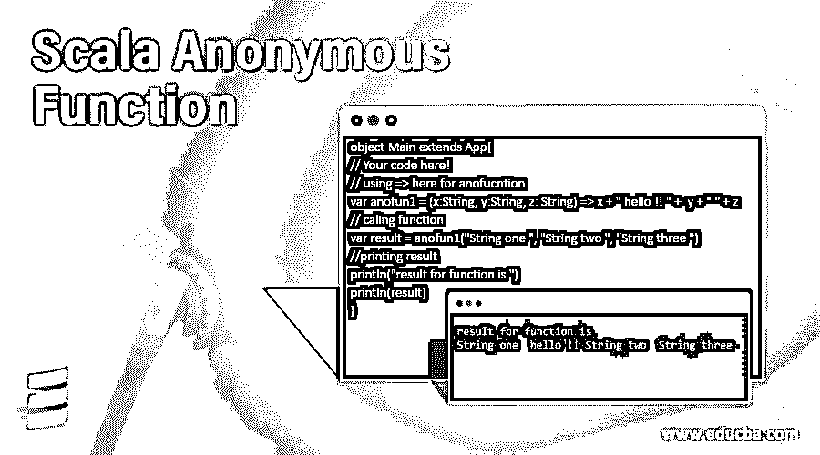
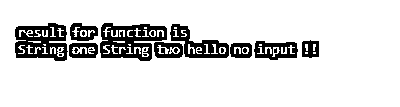

# Scala 匿名函数

> 原文：<https://www.educba.com/scala-anonymous-function/>

## Scala 匿名函数介绍

不包含任何名字的函数或者没有名字的函数在 scala 中被称为匿名函数。这个匿名函数也称为函数文字。在匿名函数内部，我们可以编写我们的逻辑并定义我们的函数。通过使用匿名函数，我们可以创建一个非常轻量级的函数，如果我们可以创建一个内联函数。

**语法**

<small>网页开发、编程语言、软件测试&其他</small>

下面你可以找到定义匿名函数的语法，我们用箭头(= >)来定义函数体。这个箭头本身代表一个匿名函数。为了更好地理解下面的函数，我们还将看到一个初学者的练习示例；

`(variable_name: Data_type) =>  Our logic goes here..`

**举例:**

`(a: String) => a + "Hello !!"`

在上面的代码行中，我们将一个字符串变量传递给函数，并通过使用匿名函数附加一些其他的字符串。所以这是在 scala 中定义和使用函数的非常轻量级的语法。

### Scala 中的匿名函数是如何工作的？

正如我们所知，匿名函数也被称为函数字面量，这些函数字面量和它们的对象被称为函数值。在使用 scala 匿名函数时，我们使用箭头(= >)符号，这个符号是函数中的一个转换器。这个转换器负责将参数从左侧传输到右侧，在那里我们可以对输入执行任何操作，因此我们在这里评估参数。它根据我们在右边定义的逻辑或表达式，在右边产生一个新的结果。

我们可以用两种方式定义匿名函数，下面我们逐一讨论。

**1)使用' _':** 我们也可以使用通配符' _ '来定义匿名函数。该字符代表只出现一次的参数。

**语法:**

`(_:Double)*(Double)`

**2)使用' =【T2]':**这是定义匿名函数最常见的方式。这个箭头在这里可以说是一个回调函数，它也负责将参数传递给逻辑，并对它们进行求值，然后向我们提供结果。

**语法:**

`(a: String) => a + "Hello !!"`

scala 中有 lambda 函数，它们是匿名函数，我们可以看看它们，它们的工作细节如下:

Scala lambda 函数是匿名函数。它们减少了代码行，使函数更易读、更便于定义。我们也可以重复使用它们。我们可以使用这个 lambda 函数来迭代我们的集合数据结构，并对它们执行各种操作。

**举例:**

`var list = List(100, 200, 345, 67, 267, 195)
var result = list.filter((a: Int) => a % 5 == 0)`

在上面几行代码中，我们创建了一个整数列表。之后，我们应用过滤方法，并在其中传递一个匿名函数。因此，列表中能被 5 整除的每个元素都将被保留，并作为新列表返回到结果变量中。这样，我们就可以使用它们，并在任何函数内部传递它们。假设我们想对集合元素进行某种转换，我们有一个名为 map()的方法。通过使用这种方法，我们可以在 scala 中转换集合数据结构的每个元素。这将为我们返回带有修改值的新元素列表。让我们看一个例子，让初学者更好地理解，见下文；

**举例:**

`val list = List(100, 200, 345, 67, 267, 195)
val result  = list.map( (a:Int) => a + 10 )`

在上面几行代码中，我们在 scala 中创建了一个整数列表，后跟 map 函数。通过使用 map()方法，我们正在转换集合数据结构的元素，并将列表中的每个元素增加 10。这将为我们返回一个包含修改后的元素的新列表。我们还可以定义匿名函数，并将该函数传递给映射函数，这并不是强制性的，我们必须只在映射中定义。

匿名函数有以下两种类型:

**1)不带参数的匿名函数:**我们可以定义不带参数的匿名函数，并将一个函数传递到另一个函数中。

**2)带参数的匿名函数:**在这里，我们可以在匿名函数中传递任意数量的参数。

### Scala 匿名函数的例子

下面举几个例子:

#### 示例#1

在这个例子中，我们使用一个转换来定义我们的匿名函数。

**代码:**

`object Main extends App{
// Your code here!
// using => here for anofucntion
var anofun1 = (x:String, y:String, z: String) => x + " hello !! " +  y + " " + z
// caling function
var result = anofun1("String one ", "String two ", "String three ")
//printing result
println("result for function is ")
println(result)
}`

**输出:**

#### 实施例 2

在这个例子中，我们使用通配符来定义我们的匿名函数。

**代码:**

`object Main extends App{
// Your code here!
// using wildcard here for anofucntion
var anofun1 = (_:String) + (_:String) + "hello " + (_:String)
// caling function
var result = anofun1("String one ", "String two ", "no input !!")
//printing result here
println("result for function is ")
println(result)
}`

**输出:**

#### 实施例 3

在这个例子中，我们展示了如何在 scala 中使用无参数匿名函数。

**代码:**

`object Main extends App{
// Your code here!
// using wildcard here for anofucntion
// here we are calling a anonymus function withutparameer
var anofun1 = () => {
println("This is withput parameter function in scala. ,..!!")
}
// printing result here.
println("result is  :: ")
println(anofun1())
}`

**输出:**

### 结论

匿名函数为我们提供了定义函数的轻量级语法。我们可以用两种方式定义匿名函数，带参数的和不带参数的。此外，我们有 lambda 函数，它也是 scala 中的匿名函数，它们也为开发人员提供了一种优化和可读的方式。

### 推荐文章

这是一个 Scala 匿名函数的指南。在这里，我们讨论了匿名函数在 Scala 中是如何工作的，并给出了代码和输出。您也可以看看以下文章，了解更多信息–

1.  [Scala 类](https://www.educba.com/scala-class/)
2.  [Scala Singleton](https://www.educba.com/scala-singleton/)
3.  [Scala 列表](https://www.educba.com/scala-list/)
4.  [Scala 试抓](https://www.educba.com/scala-try-catch/)

