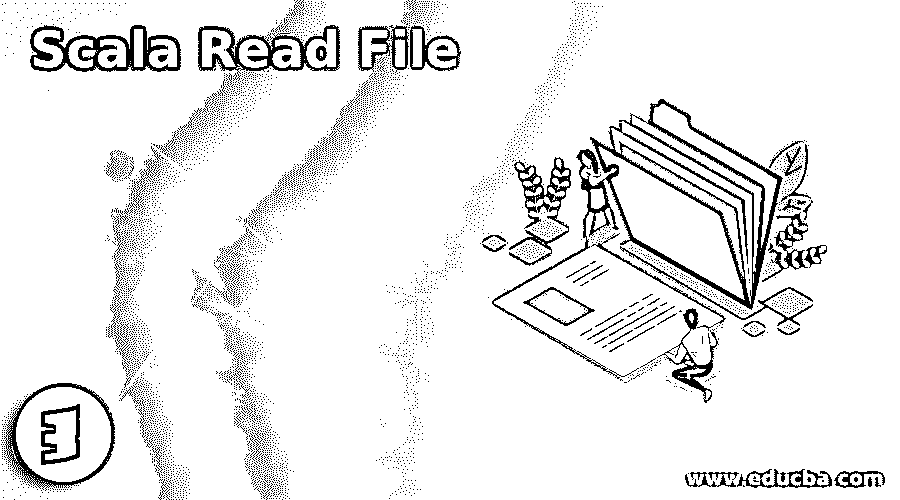
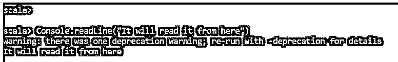
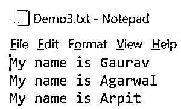
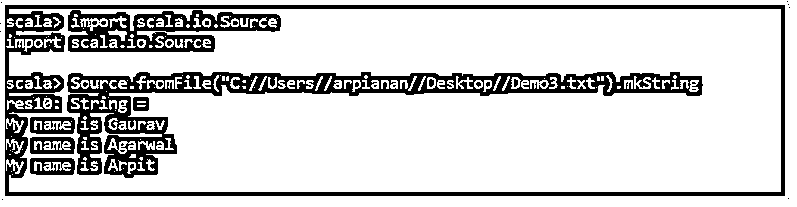
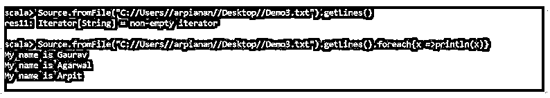
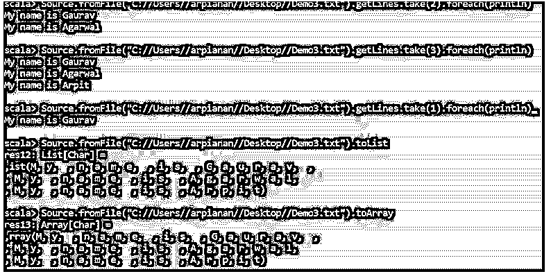

# Scala 读取文件

> 原文：<https://www.educba.com/scala-read-file/>

## Scala 读取文件简介

Scala 文件 I/O 是 Scala 中文件处理的一个重要概念。当我们在进一步读取文件后操作它时，它提供了读取文件所需的所有本地库和依赖项。它从各种文件格式中读取数据。txt，。csv，阅后做操作。Scala.io.Source 类负责读取文件的方法以及与之相关的各种操作。

**语法:**

<small>网页开发、编程语言、软件测试&其他</small>

要使用 Scala Read 文件，我们需要导入 Scala.io.Source，它有读取文件的方法。

`Import scala.io.Source
Source.fromFile(“Path of file”).getLines  // One line at a Time
Source.fromFile(“Path of File”).getLines.toList  // File to List
Console.readline //used to read the File from the console only.`

### 用示例读取 Scala 中的文件

我们可以从本地系统的位置读取 Scala 中的各种文件，并对文件 I/O 进行操作。

让我们看看如何通过 Scala 读取文件的一些方法:

#### 1.从控制台读取 Scala 文件

我们可以从控制台读取文件，检查数据，并在那里做某些操作。

**举例:**

Console.readline 方法用于从控制台读取它。

只要在 readline 中写下这一行，它就会从那里读取它。

**代码:**

`scala> Console.readLine("It will read it from here")
warning: there was one deprecation warning; re-run with -deprecation for details
It will read it from here`

**输出:**

#### 2.从输入文件加载它

我们可以从文件系统中加载数据，并对文件进行操作。Source.fromfile 将从文件中加载数据，并对文件进行操作。

**举例:**

我们有一个名为 Demo.txt 的文本文件，我们将从 scala 中加载它，一次读取一行数据。

**代码:**

`scala> import scala.io.Source
import scala.io.Source
scala> Source.fromFile("C://Users//arpianan//Desktop//Demo3.txt").mkString
res10: String =
My name is Gaurav
My name is Agarwal
My name is Arpit`

我们使用 mkstring 方法生成一个字符串，并打印它的值。

**Demo3.txt**

**输出:**

但是假设我们要处理每一行而不是整个文件，可以用。getLines()函数。

该方法逐行读取文本文件中的值，并对其进行操作。

**举例:**

如果我们使用方法的话。它将首先是一个字符串数据类型的非空迭代器，然后遍历将把元素打印到一边。

**代码:**

`scala>
Source.fromFile("C://Users//arpianan//Desktop//Demo3.txt").getLines()
res11: Iterator[String] = non-empty iterator
scala> Source.fromFile("C://Users//arpianan//Desktop//Demo3.txt").getLines().foreach{x =>println(x)}
My name is Gaurav
My name is Agarwal
My name is Arpit`

**输出:**

take()函数从读取文件中获取我们想要读取的行元素。

**举例:**

**代码:**

`scala>
Source.fromFile("C://Users//arpianan//Desktop//Demo3.txt").getLines.take(1).foreach(println)
My name is Gaurav
scala> Source.fromFile("C://Users//arpianan//Desktop//Demo3.txt").getLines.take(2).foreach(println)
My name is Gaurav
My name is Agarwal
scala> Source.fromFile("C://Users//arpianan//Desktop//Demo3.txt").getLines.take(3).foreach(println)
My name is Gaurav
My name is Agarwal
My name is Arpit`

因此，take(1)、(2)、(3)将从文件中提取元素，并相应地打印出来。

.如果我们希望对文件中的特定行切片进行操作，也可以使用 slice 方法来获取行切片。这可以使用 slice 函数来完成，该函数获取从到的范围。

**举例:**

在上面的例子中，如果我们想对一个文件的两行进行操作，我们可以使用。切片功能开始于:

**代码:**

`scala>
Source.fromFile("C://Users//arpianan//Desktop//Demo3.txt").getLines.slice(0,2).foreach(println)`

这占用了两行并给出了运算结果。

我叫高拉夫

我叫阿加瓦尔

**输出:**

通过使用方法，我们还可以在读取文件后将其更改为 List 或 array。toList 和。重新排列代码。

**举例:**

**代码:**

`scala> Source.fromFile("C://Users//arpianan//Desktop//Demo3.txt").toList
res12: List[Char] =
,ist(M, y,  , n, a, m, e,  , i, s,  , G, a, u, r, a, v,  ,
, M, y,  , n, a, m, e,  , i, s,  , A, g, a, r, w, a, l,
, M, y,  , n, a, m, e,  , i, s,  , A, r, p, i, t)`

将其转换为列表

将其转换为数组

`scala> Source.fromFile("C://Users//arpianan//Desktop//Demo3.txt").toArray
res13: Array[Char] =
,rray(M, y,  , n, a, m, e,  , i, s,  , G, a, u, r, a, v,  ,
, M, y,  , n, a, m, e,  , i, s,  , A, g, a, r, w, a, l,
, M, y,  , n, a, m, e,  , i, s,  , A, r, p, i, t)`

**输出:**

还需要释放或关闭一个文件，因为它会占用 JVM 的内存。所以。close 方法用于在对文件的操作完成后关闭文件。甚至对于自动关闭，我们可以使用。方法，以便为进一步的操作释放所需的空间。

**代码:**

`Scala> val b = Source.fromFile("C://Users//arpianan//Desktop//Demo3.txt")
b: scala.io.BufferedSource = non-empty iterator`

所以一旦操作完成，这个缓冲源必须关闭。所以我们使用。关闭方法来执行相同的操作。

**scala > b.close**

由此我们看到了如何在 scala 中读取文件并对其进行操作。

### 结论

从上面的文章中我们看到了如何在 Scala 中使用各种方法来读取文件。我们还看到了 Scala.io.Source 如何提供在 Scala 中读取文件并对其执行操作的方法。借助各种例子，我们看到了使用不同方法阅读文件的不同方面和优点。

### 推荐文章

这是一个 Scala 读取文件的指南。这里我们讨论 Scala 读取文件的介绍，如何读取文件分别用例子说明。您也可以看看以下文章，了解更多信息–

1.  [Scala 集合](https://www.educba.com/scala-set/)
2.  [Scala Singleton](https://www.educba.com/scala-singleton/)
3.  [Scala 平面图](https://www.educba.com/scala-flatmap/)
4.  [Scala 试抓](https://www.educba.com/scala-try-catch/)

