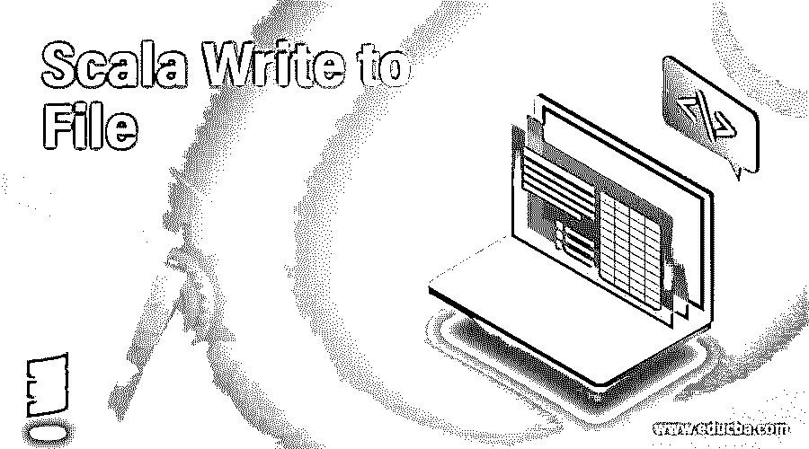
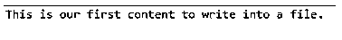
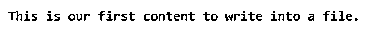

# Scala 写入文件

> 原文：<https://www.educba.com/scala-write-to-file/>

## Scala 写入文件简介

存档的目的是当需要时，我们可以方便地从文件中存储和检索我们的数据。像其他编程语言一样，scala 也为我们提供了处理文件的方法。通过使用它，我们可以在 scala 中写、读、打开和创建一个文件。但是在 scala 中我们使用 java 库来写文件，因为 scala 不提供写文件。所以我们可以从 java 库中导入 java.io._ package 写入一个文件，因为 scala 标准库不包含任何要写的类。如果需要，我们也可以先导入 java.io.File 或 java.io.PrintWriter。

**语法:**

<small>网页开发、编程语言、软件测试&其他</small>

为了写入文件，我们将使用 java.io 包中的 PrintWriter。要使用它，我们必须在里面传递我们的文件对象。之后，我们可以使用 PrintWriter 对象写入文件。让我们来看一个简单的写文件的语法。见下文；

`valvariable_name = new PrintWriter("name_of_file")
variable_name.write("Text here!")`

在上面的文件中写入语法。首先，我们必须创建一个变量来保存 PrintWriter 类的对象，在这个变量中，我们必须传递我们的 file 对象。在对象创建之后，我们可以立即调用 write()方法，并在那里提供我们想要写入文件的文本。下面你可以看到一个语法，便于初学者更好地理解。

**举例:**

`val pw = new PrintWriter(file_name)
pw.write("My text !! Hello world!! My first example to write in a file.")`

### 如何在 Scala 中写入文件？

Scala 没有提供任何可以写入文件的类。为此，我们必须使用现有的 java 库，因为我们知道 scala 非常灵活，可以使用任何 java 对象。因此，为了在文件中写入，我们使用 java 库中的 print writers 类。如果我们想在我们的程序中使用它，那么我们需要包含导入 java.io._ 或 java.io.PrintWriter 包，然后只有我们可以创建它的对象，否则它会给我们编译时错误。但是 scala 为我们提供了从文件中读取的支持，为此我们可以在程序中使用 scala.io.Source 包。

现在我们将看到一个在 scala 中写文件的练习例子，以便更好的理解，并且将理解它的流程，细节见下文；

**举例:**

`importjava.io.PrintWriter
importjava.io.File
object WriteDemo
{
def main(args:Array[String])
{
val file = new File("myfile.txt )
val pw = new PrintWriter(file)
pw.write("My text here!! hello !!")
pw.close()
}
}`

在上面的例子中，我们首先创建文件的对象，这个文件对象将创建 myfile.txt。如果系统中不存在，我们也可以给出系统中现有文件的路径，但是这个路径应该是准确的，否则我们将收到一个异常，说“文件未找到异常”。成功创建文件后，我们正在创建 PrintWriter 对象，并在其中传递我们的文件对象的引用。

我们可以用另一种方式来做，如下所示:

`val pw = new PrintWriter(new File("myFile.txt"))`

紧接着我们调用 write()方法写入我们的文件，最后我们关闭 PrintWriter 的对象。它帮助我们防止我们的数据被外部使用。

它包含下面提到的一些方法:

*   String getAbsolutePath():获取绝对路径
*   booleancanExecute()
*   booleanexists():文件存在
*   booleancanWrite():写
*   booleandelete():删除
*   booleanequals(Object obj):比较两个对象
*   booleancanRead():读取

以下是与将文本写入文件相关的一些信息；

| 操作 | 创造 | 写 | 书写方法 |
| 写 | 新文件() | 版画作者 | PrintWriter.write() |

**需要记住的要点:**在 Scala 中，我们没有任何库来支持在文件中写入的功能。为此，我们需要使用 java.io. File 来创建和写入文件。此外，我们可以使用打印机写入文件。

### Scala 写文件的例子

下面是一些例子:

#### 示例#1

在本例中，我们创建、解析并写入一个文件。

**代码:**

`import java.io.File
import java.io.PrintWriter
object Main extends App{
// Your code here!
// Creating a file
valmyfile = new File("I:\\demo.txt" )
// Creating printwriter object to parse file
valmyPrintWriter = new PrintWriter(myfile)
// writing data to file
myPrintWriter.write("This is our first content to write into a file.")
// close
myPrintWriter.close()
}`

**输出:**

#### 实施例 2

在本例中，我们将读取最近创建的文件，但不是一行一行地读取，也不是一次全部读取。这里我们也使用了 getLines()方法，它可以在 scala 源码包中找到，用来逐行读取文件，而不是一次读取所有文件。

**代码:**

`import java.io.File
import java.io.PrintWriter
import scala.io.Source
object Main extends App{
// Your code here!
// mentioning file name from which we need to read.
valfileName = "myfile.txt"
//passing file object here
valfileSourec = Source.fromFile(fileName)
println(“pitting the line by line from file !!”)
//using getLines method to print the line by line .
for(textLines<-fileSourec.getLines)
{
println(textLines)
}
// closing the source object to prevent from external use
fileSourec.close()
}`

**输出:**

#### 实施例 3

在本例中，我们正在读取之前创建的文件。请导入 scala.io 工作。这是我们阅读程序本身的一种方式。

**代码:**

`import java.io.File
import java.io.PrintWriter
import scala.io.Source
object Main extends App{
// Your code here!
// mentioning file name from which we need to read.
valmyfile = "demo.txt"
// making instance of iterable.
valsrc = Source.fromFile(myfile)
while (src.hasNext)
{
println(src.next)
}
// closing file after read
src.close()
}`

**输出:**

### 结论

为了在 scala 中写入文件，我们从 java.io 包中导入 java 库。Scala 支持从文件中读取。因此，为了处理文件，我们首先创建一个文件，然后写入文件，最后从文件中读取，或者通过提供完整路径从系统中读取现有文件。

### 推荐文章

这是一个 Scala 写文件的指南。在这里，我们还将讨论 scala 的简介以及如何用不同的例子和代码实现来写文件。您也可以看看以下文章，了解更多信息–

1.  [Scala 类](https://www.educba.com/scala-class/)
2.  [Scala 类构造函数](https://www.educba.com/scala-class-constructor/)
3.  秤尾
4.  [Scala 平面图](https://www.educba.com/scala-flatmap/)

