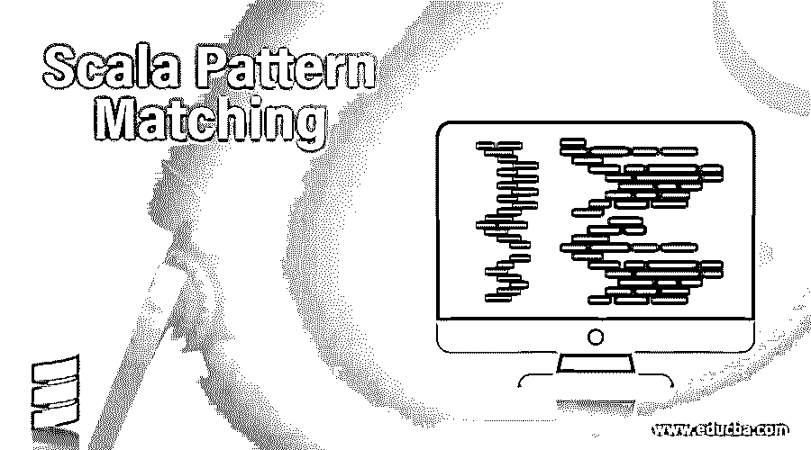
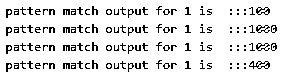
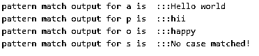
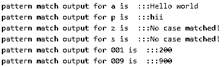

# Scala 模式匹配

> 原文：<https://www.educba.com/scala-pattern-matching/>

## Scala 模式匹配简介

在 scala 模式匹配中，我们匹配字符串序列中的特定模式或传递的输入参数。它的工作原理与 java 中的 switch 语句相同，但这里的关键字不同。在 Scala 中，我们使用 match 关键字来检查序列，所以我们可以说这是一种根据传递的输入参数检查指定模式的技术。

**语法**

<small>网页开发、编程语言、软件测试&其他</small>

`def method_name(variable_name:data_type): return_type = variable_passes match {
case 0 => "your_output1"
case 1 => "your_output1"
case _ => "your_output1"
}`

在上面的语法中，我们用 data_type 和 return 类型定义我们的方法，并匹配关键字。在其中，我们定义自己的案例以获得期望的输出。如果传递的变量与大小写匹配，那么将执行特定的代码块。

为了更好的理解，我们可以看下面的练习语法；

`def dmeo(s:String): String = s match {
case A => "hello”
case B => "bye”
case C => "world"
case _ => "not now.!!"
}`

如果传递的变量匹配，则打印消息。该箭头符号用于分隔消息和模式。

### Scala 中模式匹配是如何工作的？

java 中 switch 语句增强版的 scala 中的模式匹配。它根据传递的值匹配特定的模式。我们必须在比赛中至少有一个案例。

让我们举一个例子来理解它在 scala 中的工作。

**代码:**

`object Demo {
def main(args: Array[String]) {
println(matchDemo("D"))
println(matchDemo(1))
println(matchDemo("Z"))
println(matchDemo("B"))
}
def matchDemo(obj: Any): Any = obj match {
case "A" => "first case executed"
case  1 => "second  case executed"
case "D" => "third case executed"
case "Z" => "fourth case executed"
case 10 => "fourth case executed"
}
}`

在上面的例子中，我们制作了一个方法名匹配演示程序，它接受任何类型的变量，可以是字符串、整数、浮点等等。如果传递的值与 case 语句匹配，那么将执行特定的语句。我们使用箭头操作符来分隔消息和模式。它在这里起到回调的作用。

在这种情况下，我们的匹配函数应该至少包含一个 case 语句，否则它将生成一个错误。这个匹配关键字是在 scala 的根类中定义的，因此它可以用于所有其他类。

在使用下面提到的匹配模式时，我们应该记住一些要点；

*   在模式匹配中，我们也有一个默认的 case 语句“_”是这样表示的。如果我们向 match 关键字传递任何模式，并且如果它没有与提到的任何 case 匹配，那么这个默认 case 将被执行。这在 scala 中也被称为“无所不包”。
*   在 scala 模式匹配中，我们应该至少有一种情况。
*   我们也可以有多个模式匹配，为此我们可以使用管道“|”。
*   我们的模式匹配函数应该总是返回一些值。它可以是任何东西。
*   就像在 java 中我们有一个 break 语句，但是在 scala 中，模式匹配没有 break 语句。
*   在匹配函数 case 中应该包含一些模式，而不是一个语句。

### 实现 Scala 模式匹配的例子

下面是提到的例子:

#### 示例#1

一个例子将一个整数值作为模式匹配，它也将返回一个整数。我们不能传递整数以外的参数，否则会出错。

**代码:**

`println( "pattern match output for 1 is  :::"  +matchDemo(1))
println( "pattern match output for 1 is  :::"  +matchDemo(100))
println( "pattern match output for 1 is  :::"  +matchDemo(3))
println( "pattern match output for 1 is  :::"  +matchDemo(9))
// match function return integer
def matchDemo(x: Int): Int= x match {
case 1 => 100
case 2 => 200
case 4 => 300
case 9 => 400
case 10 => 500
case _ => 1000
}
}`

**输出:**

#### 实施例 2

此示例仅将值作为字符串数据类型。

**代码:**

`println( "pattern match output for a is  :::"  +matchDemo("A"))
println( "pattern match output for p is  :::"  +matchDemo("P"))
println( "pattern match output for o is  :::"  +matchDemo("O"))
println( "pattern match output for s is  :::"  +matchDemo("S"))
// match function return Stirng
def matchDemo(x: String): String= x match {
case "A" => "Hello world"
case "C" => "bye world"
case "Z" => "not now world"
case "P" => "hii"
case "O" => "happy"
case _ => "No case matched!"
}
}`

**输出:**

#### 实施例 3

在这个例子中，我们可以传递任何类型的模式。

**代码:**

`println( "pattern match output for a is  :::"  +matchDemo("A"))
println( "pattern match output for p is  :::"  +matchDemo("P"))
println( "pattern match output for z is  :::"  +matchDemo("O"))
println( "pattern match output for s is  :::"  +matchDemo("S"))
println( "pattern match output for 001 is  :::"  +matchDemo(001))
println( "pattern match output for 009 is  :::"  +matchDemo(009))
// match function return Any
def matchDemo(x: Any): Any= x match {
case "A" => "Hello world"
case "C" => "bye world"
case "Z" => "not now world"
case "P" => "hii"
case 001 => 200
case 002 => 003
case 009 => 900
case _ => "No case matched!"
}
}`

**输出:**

| **Scala 中模式匹配的类型** |

| 元组模式 | 提取模式 | 序列模式 | XML 模式 | 正则表达式模式 |
| 打字模式 | 图案活页夹 | 文字模式 | 模式选择 | 中缀操作模式 |
| 可变模式 | 稳定标识符模式 | 构造器模式 | 无可辩驳的模式 |  |

**Note:** If you want to prepare a match function then it should contain two keywords in it with proper definition; match keyword and case clause.

### 结论

Scala 模式匹配比 Java 中的 switch 更加强大。Scala 中，我们使用 match 关键字来匹配我们传递的输入。它应该包含返回类型和至少一个匹配的内部案例。它还在 scala 的根类中声明，使它对其他类可用。

### 推荐文章

这是 Scala 模式匹配的指南。在这里，我们讨论了 Scala 模式匹配和适当语法的介绍，以及模式匹配是如何和相应的例子一起工作的。您也可以浏览我们的其他相关文章，了解更多信息——

1.  [Scala 中的构造函数](https://www.educba.com/constructors-in-scala/)
2.  [Scala 版本](https://www.educba.com/scala-versions/)
3.  [Scala 抽象类](https://www.educba.com/scala-abstract-class/)
4.  [Scala for 循环](https://www.educba.com/scala-for-loop/)

