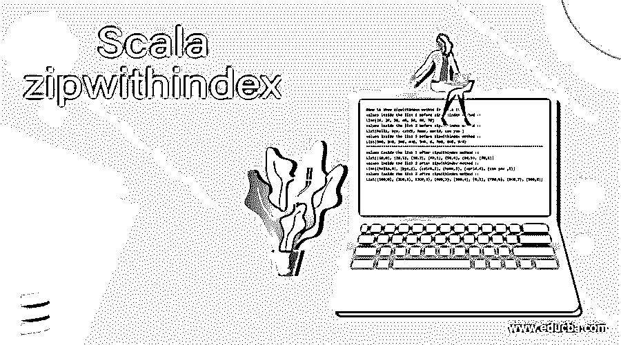
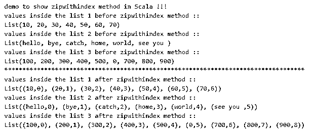

# 合并 zipwithindex

> 原文：<https://www.educba.com/scala-zipwithindex/>

## **Scala zip within index 的定义**

scala 中的 zipwithindex 用于将元素与某个计数器绑定。顾名思义，当我们想为 scala 中的元素列表建立索引时，可以使用“zipwithindex”。简而言之，我们可以说 zipwithindex 用于将列表中的所有元素与某个特定的索引绑定在一起。在 scala 中，ziptwithindex 总是返回一个新的集合，而且 ziptwithindex 可以用于两种类型的列表，即不可变和可变集合。zipwithindex 方法总是像 scala 中的数组一样返回 tuple2 集合。在下一节中，我们将看到如何在编程中使用这种方法。

**语法:**

<small>网页开发、编程语言、软件测试&其他</small>

zipwithindex 方法可以直接用在 scala 中的不可变集合和不可变集合上，这个方法会给我们一个新的 tuple，其中集合的所有元素都与 index 绑定。

让我们看看 zipwithindex 方法的语法，我们如何在编程中使用它，见下文；

1)在这里，我们使用 zipWithIndex 调用 foreach 方法，但是我们在开始时也提到了集合。

`collection.zipWithIndex.foreach {
// our logic goes here for program.
}`

2)在此语法中，我们还通过调用集合上的 ziptwithindex 来创建 ziptwithindex。

`val myzicollection: Seq[(String, Int)] = collection_name.zipWithIndex`

在下一节中，我们将看到一个实践示例，展示如何在编程中使用它来维护 Scala 集合数据结构中的索引。

### zipwithindex 方法在 Scala 中是如何工作的？

正如我们现在所知道的，zipwithindex 方法用于处理列表元素的索引。这个方法帮助我们在 Scala 中创建和生成可变和不可变集合的索引。在这些方法的帮助下，集合中的每个元素都与一个索引相关联。这也可以通过使用它们的索引来访问元素。关于 zipwithindex 方法更重要的一点是，它总是在 Scala 中返回一个新的集合，而不修改我们调用它的现有集合。

众所周知，通过使用索引，搜索和访问元素变得很容易，因此也提高了程序的性能。现在我们将详细讨论这个方法的完整签名，它看起来如何以及它返回什么。为了更好地理解，让我们看下面。

**1)def ziptwithindex:**Iterable[(A，Int)]:这是 Scala 文档给出的 Scala 中 ziptwithindex 方法的签名。这个方法是 Scala 中 zipWithIndex 类的成员函数，它有多个超类型，如下:

*   抽象视图
*   视角
*   可迭代的
*   IterableOnce
*   IterableOps
*   IterableOpsOnce
*   AnyRef
*   任何的

现在让我们看看如何通过对集合使用 zipWithIndex 方法来创建一个新的元组，见下文:

例如:

`val mylist = List("hello", "bye", "catch", "dog", "ele", "fan", "pink")
val zipWithIndexMyList = mylist.zipWithIndex`

这是在我们的程序中使用 zipWithIndex 为我们的集合创建索引的基本示例。这里我们创建了一个包含一些元素的列表。我们可以在列表中分配任意数量的元素。在此之后，我们试图将这些元素与索引绑定在一起，但这并不是一件容易的事情，如果我们没有可用的 zipWithIndex 方法，我们需要编写这么多行代码来实现这一功能。但是在 Scala 中，我们有可用的 ziptwithindex 方法，所以我们可以直接在集合上调用这个方法，你可以在下一行看到我们用集合变量名调用 ziptwithindex。因此，一旦我们打印出输出，我们将看到它会为列表中的每个元素创建一个索引。例如，示例输出如下所示:

例如:`(hello, 0),(bye, 1),(catch, 2),(dog, 3),(ele, 4),(fan, 5,(pink, 6)`

在上面的输出中，你可以看到它用列表元素创建了一个额外的变量。以这种方式，它在 Scala 中工作，通过使用它，我们可以直接访问列表元素，而不需要迭代。它将返回新的元组，而不修改 Scala 中的现有集合。

在 Scala 中使用 zipwithindex 方法时需要记住的几点；

*   此方法用于创建元素的索引。
*   该方法可用于两种类型的集合数据结构，即不可变和可变。
*   顾名思义，它将使用新创建的索引压缩列表中的所有元素，并返回一个新的集合以供使用。

### 例子

1)在这个例子中，我们在 Scala 中创建了不同类型的列表，之后，我们调用 ziptwithindex 方法为列表元素创建索引，这将是 Scala 中 ziptwithindex 方法返回的一个新列表。它包含了字符串列表，整数列表等等，适合初学者。

#### 示例#1

**代码:**

`object Main extends App{
// Your code here!
println("demo to show zipwithindex method in Scala !!!")
//creating list of different types
val list1 = List("10", "20", "30", "40", "50", "60", "70")
val list2 = List("hello", "bye", "catch", "home", "world", "see you ")
val list3 = List(100, 200, 300, 400, 500, 00, 700, 800, 900)
//printing them for output
println("values inside the list 1 before zipwithindex method ::")
println(list1)
println("values inside the list 2 before zipwithindex method ::")
println(list2)
println("values inside the list 3 before zipwithindex method ::")
println(list3)
println("***********************************************************************************")
// calling zipWithIndex method to create new list and index for each element
val zip1 = list1.zipWithIndex
val zip2 = list2.zipWithIndex
val zip3 = list3.zipWithIndex
// printing the result after zipWithIndex method called.
println("values inside the list 1 after zipwithindex method ::")
println(zip1)
println("values inside the list 2 after zipwithindex method ::")
println(zip2)
println("values inside the list 3 aftre zipwithindex method ::")
println(zip3)
}`

**输出:**

### 结论

ZipwithIndex 方法用于在已经创建的集合中创建索引，这个集合在 Scala 中可以是可变的或不可变的。调用此方法后，集合中的每个元素都将与从 0、1、2 等开始的索引值相关联。这就像 Scala 中的数组类型结构，用它的索引来表示值。

### 推荐文章

这是一个 Scala zipwithindex 的指南。这里我们也讨论一下定义以及 zipwithindex 方法在 Scala 中是如何工作的？还有例子。您也可以看看以下文章，了解更多信息–

1.  [Scala groupBy](https://www.educba.com/scala-groupby/)
2.  [Scala 减少](https://www.educba.com/scala-reduce/)
3.  [Scala 同步](https://www.educba.com/scala-synchronized/)
4.  Scala 中的[数组](https://www.educba.com/array-in-scala/)

