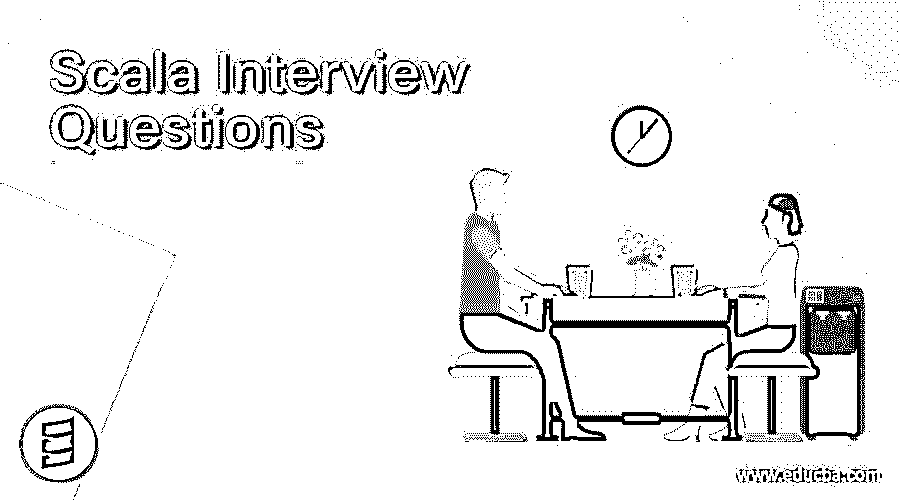

# Scala 面试问题

> 原文：<https://www.educba.com/scala-interview-questions/>

## Scala 面试问答介绍

[Scala 是一种](https://www.educba.com/what-is-scala/)通用编程语言，为函数式编程和强大的静态类型系统提供支持。我是由马丁·奥德斯基设计的，它于 2004 年 1 月 20 日首次出现。文件扩展名是 scala 或. sc。Scala 在一种简洁的高级语言中结合了面向对象和函数式编程。Scala 的静态类型有助于避免复杂应用程序中的错误，其 JVM 和 JavaScript 运行时允许您构建高性能系统，轻松访问庞大的库生态系统。它运行在 Java 平台上。

### 例子

Scala 中的 Hello，world 程序会这样写:
**<u>程序</u> :**
对象 HelloWorld 扩展 App {
println("Hello，World！")
}
**<u>进行编译:</u>**scalac hello world . Scala

<small>网页开发、编程语言、软件测试&其他</small>

**<u>运行</u>** : scala HelloWorld。

所以如果你找的是和 Scala 相关的工作，你需要准备 2022 年的 Scala 面试问题。尽管每个 Scala 面试都是不同的，工作范围也是不同的，但我们可以帮助你解决顶级 Scala 面试问题和答案，这将帮助你迈出这一步，让你在面试中获得成功。

下面是面试中最常被问到的 Scala 面试问题；这些问题分为两部分:

*   [第一部分——Scala 面试问题(基础)](#1)
*   [第二部分——Scala 面试问题(高级)](#2)

### 第 1 部分——Scala 面试问题(基础)

这第一部分涵盖了基本的 Scala 面试问题和答案。

#### 1.什么是 Scala？

答案:
Scala 代表可伸缩语言。它是一种多范例编程语言。它支持面向对象和函数式编程语言。它为 JVM(Java 虚拟机)运行。

#### 2.Scala 的主要优势是什么？

回答**:**
Scala 语言的主要优势是:非常精确的代码，灵活的语法，支持所有 OOP 特性，更多可重用的代码，高生产力。

#### 3.举几个 JVM 语言的例子？ **T2】**

回答 **:**
Java、Scala、Groovy、closure 对于 [JVM 语言](https://www.educba.com/what-is-jvm/)来说是非常流行的。

#### 4.Scala 中所有类的超类是什么？

答案**:**
“Any”类是 Scala 中所有类的超类。

#### 5.Scala 中默认的访问修饰符是什么？ **T2】**

答案**:**
**Public**是 Scala 中默认的访问修饰符。****

 ****#### 6.Scala Int 和 Java 的 java.lang.integer 有什么相似之处？ **T2】**

答案 **:**
都是用来定义整数的，都是类，都是 32 位有符号整数。

#### 7.Scala 中什么是 Null？

答案 **:**
Null 是 Scala 中的一种类型。它在 scala 包中以“Scala”的形式提供。空”。

让我们转到下一个 Scala 面试问答。

#### 8.Scala 中的单位是什么？

答案 **:**
在 Scala 中，用一个单位来表示“没有价值”或者“没有使用价值”。在软件包中，它被定义为“scala”。单位”。

#### 9.scala 中的 val 和 var 是什么？

答案:
Var 代表变量，Val 代表数值。Var 用来定义。可变变量和值可以在创建后重新分配。Val 用于定义不可变变量，这意味着值一旦创建就不能被重新分配。

#### 10.Scala 中的 REPL 是什么？

答:
REPL 代表阅读评估印刷循环。一般我们称之为“涟漪”。它是一个从命令提示符执行 scala 代码的解释器。

#### 11.什么是 Scala“如果..否则"？ **T2】**

答案:
Scala“如果。Else”是一种表达方式。我们可以把它赋给一个变量。例如:
val year = if(count = = 0)2014 else 2015

#### 12.Scala Map 是什么意思？ **T2】**

答案:
这是在面试中被问到的基本 Scala 面试问题。 [Scala map 是一个键-值对的集合](https://www.educba.com/scala-operators/),其中映射中的值使用一个键来检索。映射中的值不是唯一的，但键是唯一的。
地图有两种:[可变和不可变](https://www.educba.com/mutable-vs-immutable-java/)。

#### 13.你对 Scala 中的闭包有什么理解？ **T2】**

答:
闭包是尺度函数，函数的返回值依赖于一个或多个在函数外部定义的变量。

### 第 2 部分——Scala 面试问题(高级)

现在让我们来看看高级 scala 面试问题。

#### 14.Scala 中的 Option 是什么意思？ **T2】**

答:
用于对缺失值进行换行。

#### 15.什么是 Scala Trait？ **T2】**

答:
这是一种特殊的允许多重继承的。例如:
**trait MyTrait {**

**deff()
}**

#### 16.举几个 Scala 中的包的例子。 **T2】**

答案:
郎，斯卡拉，斯卡拉。PreDef 是 Scala 中的包。

让我们转到下一个 Scala 面试问答。

#### 17.Scala 中的元组有什么用？ **T2】**

答:
Scala tuple 是用来把定数的项组合在一起的。元组是不可变的，可以保存不同类型的对象。例如: **Val myTuple = (1，" element "，10.2)**

#### 18.Scala 中的单子是什么？ **T2】**

答案:
单子是 Scala 中包装另一个对象的对象。

#### 19.在 Scala 中，你将如何格式化一个字符串？ **T2】**

答案:
通过以下方式: **T3】Val formatted = " % s % I "。格式(mystring.myInt)**

#### 20.什么是 Scala 标识符？ **T2】**

答:
Scala 标识符有四种:字母数字标识符
运算符标识符
混合标识符
文字标识符

#### 21.Scala 中有哪些不同类型的文字？ **T2】**

答:
scale 中的文字量如下:
整数文字量
浮点文字量
布尔文字量
符号文字量
字符文字量
字符串文字量
多行字符串

#### 22.Scala 的最新版本是什么？ **T2】**

答案:
Scala 2.12，需要 Java 8。

让我们转到下一个 Scala 面试问答。

#### 23.Scala 中用哪个关键字定义函数？ **T2】**

答:
def 关键字用于定义 Scala 中的函数。

#### 24.Scala 中区分对象和类？ **T2】**

答:
一个对象是类的单例实例。它不需要由开发者发起。

#### 25.Scala 中的 Akka 是什么意思？ **T2】**

答:
Akka 是 Scala 中的一个并发框架，它使用基于 ****角色的模型来构建 JVM 应用。****

**26。如何编译运行一个 scala 程序？** 

答:
Scala 编译器 **scalac** 编译 Scala 程序和运行它的 Scala 命令。

### 推荐文章

这是 Scala 面试问答列表的指南。在这里，我们涵盖了一些常见的面试问题及其详细的答案，以帮助候选人轻松应对面试。您也可以阅读以下文章，了解更多信息——

1.  [Windows Server 面试问题](https://www.educba.com/windows-server-interview-questions/)
2.  [Java 面试问题](https://www.educba.com/java-interview-questions/)
3.  [星火面试试题](https://www.educba.com/spark-interview-questions/)
4.  [软件工程面试问题](https://www.educba.com/software-engineering-interview-questions/)

****