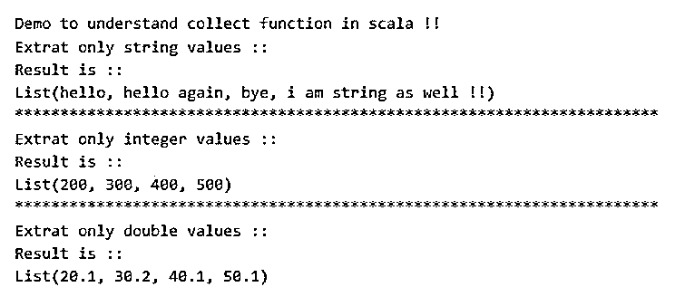
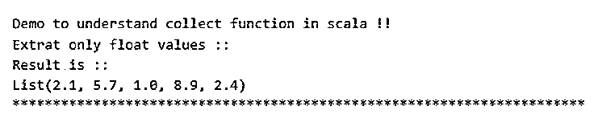

# Scala 收集

> 原文：<https://www.educba.com/scala-collect/>

## Scala collect 简介。

Collect 函数用于从给定的集合中收集元素。Collect 函数可以与集合数据结构一起使用，以提取满足给定条件的一些元素。Collect 函数可以和 scala 中的可变和不可变集合数据结构一起使用。它总是返回给我们包含所有满足条件的元素的新集合；这种情况被称为部分功能。这意味着它接受部分函数，并将其应用于给定集合中的所有值。

**语法:**

<small>网页开发、编程语言、软件测试&其他</small>

我们知道它是 Scala 中可用的函数，它将部分函数作为参数，并将应用于它内部存在的所有变量，并返回满足条件的元素。

让我们看看这个函数的语法。

这是 scala 文档中的语法:

`def collect[B](pf: PartialFunction[A, B]): Traversable[B] mylistName.collect(Your_partial_function)`

正如您在上面几行代码中看到的，我们可以在集合对象上调用这个函数，方法是将其中的一个分部函数指定为参数。所以在计算完值之后，它将返回一个新的集合，其中包含结果值。

### Scala 中的 collect 函数是如何工作的？

我们知道 scala 中的 collect 函数从同类型的集合中收集元素。我们可以在任何集合类型上调用这个函数，不管它是可变的还是不可变的。作为给定集合元素的结果，它将总是返回新的集合。

**方法签名:**

def collect[B](pf:partial function[A，B]): Traversable[B](根据 scala 文档)

#### 1.部分功能

collect 函数将分部函数作为参数。这个部分函数将负责对集合的每个元素执行操作。它将从给定的集合中挑选出满足部分函数的所有元素。

**语法:**

`case var_name: Data_type => var_name`

在上面几行代码中，我们可以定义一个分部函数，它将获取什么以及它将返回什么。这是简单的使用和可读的。

下面是它在 scala 中用法的详细语法:

`val demo: PartialFunction[String, String] = {
case "some string" => "return string"
}`

在上面几行代码中，我们创建了一个分部函数，它接受字符串参数并返回字符串。这样，我们可以从给定的集合中指定我们想要的类型。

#### 2.返回类型

Collect 函数将总是返回新的集合，它将包含给定集合数据结构中的所有元素。

**举例:**

`object Main extends App{
val mysequence: Seq[Any] = Seq("hello", "hello again", 40, "bye", 60, 80, 100, "i am strinf as well !!")
val result: Seq[String] = mysequence.collect{ case mystr: String => mystr }
}`

这只是一个简单的程序，我们在其中用 scala 创建了一个“任意”类型的序列；此外，我们在其中指定了不同类型的元素，例如 string 和 integer。但是我们只想从集合中提取字符串元素，所以我们调用 collect 方法并传递我们的部分函数来只匹配字符串。这样，我们就可以在 scala 中使用 collect 函数了。

**在 scala 中使用 collect 函数时需要记住的几点:**

*   这可以与可变和不可变集合数据结构一起使用。
*   该函数以部分函数作为参数；这个函数将计算并选取满足给定条件的元素。它总是以包含所有元素的新集合的形式返回结果。

### Scala collect 的例子。

下面是 Scala collect 的例子:

#### 示例#1

在这个例子中，我们创建一个任意类型的序列集合。使用 collect 函数，我们试图从 scala 中给定的集合数据结构中提取整数、字符串和双精度值。

**代码:**

`object Main extends App{
// Your code here!
println("Demo to understand collect function in scala !!")
println("Extrat only string values ::")
val mysequence1: Seq[Any] = Seq("hello", "hello again", 40, "bye", 60, 80, 100, "i am string as well !!")
val result1: Seq[String] = mysequence1.collect{ case mystr: String => mystr }
println("Result is ::")
println(result1)
println("***********************************************************************")
println("Extrat only integer values ::")
val mysequence2: Seq[Any] = Seq("Amit", 200, 20.1, "sumit", 300, 30.2, "Geet", 400 , 40.1, "vinit", 500, 50.1)
val result2: Seq[Integer] = mysequence2.collect{ case myrollno: Integer => myrollno }
println("Result is ::")
println(result2)
println("***********************************************************************")
println("Extrat only double values ::")
val mysequence3: Seq[Any] = Seq("Amit", 200, 20.1, "sumit", 300, 30.2, "Geet", 400 , 40.1, "vinit", 500, 50.1)
val result3: Seq[Double] = mysequence3.collect{ case myrollno: Double => myrollno }
println("Result is ::")
println(result3)
}`

**输出:**

#### 实施例 2

在这个例子中，我们试图从收集数据结构中获取浮点值。这里我们也使用 collect 函数从集合中提取元素。此外，我们没有使用任何库；这是 scala 中的一个内置函数。

**代码:**

`object Main extends App{
// Your code here!
println("Demo to understand collect function in scala !!")
println("Extrat only float values ::")
val mysequence1: Seq[Any] = Seq(2.1f, "test 1", "test2", 5.7f, "test 3", "test 4", "tets 5", 8890, 1.0f, 8.9f, 2.4f)
val result1: Seq[Float] = mysequence1.collect{ case mystr: Float => mystr }
println("Result is ::")
println(result1)
println("***********************************************************************")
}`

**输出:**

### 结论

通过使用 collect 函数，我们可以很容易地从集合中提取相同类型的数据。此外，我们可以将这个函数用于任何可变和不可变的集合数据结构，这使得它更容易使用，也更方便。

### 推荐文章

这是一个 Scala collect 的指南。这里我们讨论引言；scala 中的 collect 函数是如何工作的？和示例。您也可以看看以下文章，了解更多信息–

1.  [Scala 日期函数](https://www.educba.com/scala-date-function/)
2.  [合并字节](https://www.educba.com/scala-byte/)
3.  [合并 zipwitwithindex](https://www.educba.com/scala-zipwithindex/)
4.  [Scala 对象](https://www.educba.com/scala-object/)

