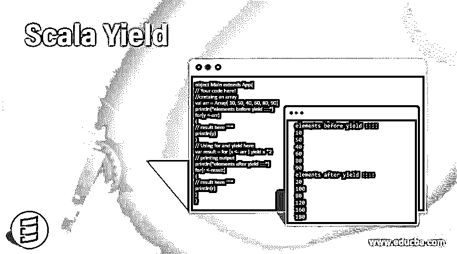
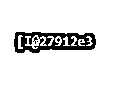
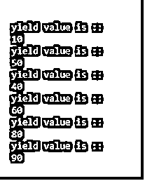
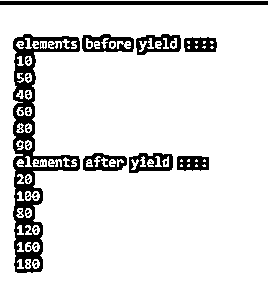
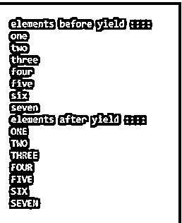

# 标量产量

> 原文：<https://www.educba.com/scala-yield/>




## 标量收益的定义

Scala yield 与 foreach、withFilter、map、FlatMap 和 Filter 等序列理解一起使用。Yield 是 scala 中的一个关键字，用在循环的末尾。我们可以对集合元素执行任何操作，例如，如果我们想将集合的值增加 1。这将使我们回到新系列。For 循环维护一个缓冲区来存储结果元素，当操作完成时，它只从缓冲区产生结果。它总是返回我们用来迭代的相同类型的集合，例如:如果我们迭代一个列表，它将产生列表，如果我们有 Map，它将只返回 Map，等等。

**语法:**

<small>网页开发、编程语言、软件测试&其他</small>

```
var variable_name  = for{ var value <- List}
yield value
```

在上面的语法中，我们使用 for 循环，最后，我们使用 yield 关键字返回结果。

```
var finalResult = for{ varobj<- List}
yield obj + 1
```

在这个例子中，我们在列表集合的成功迭代之后获得 obj。最后，我们只是在集合元素上加 1。因此，为了使用它，我们只需要使用 yield 关键字，后跟我们想要执行的逻辑。

### Yield 关键字在 Scala 中是如何工作的？

Scala yield 与 python 和 ruby 等其他语言有很大不同。在 scala 中，它与 comprehensions 一起使用。在 yield 之前，我们面临的一个问题是通过使用现有的集合或使用算法转换元素来创建新的集合。因此，溶液的产量就成了问题。这个 yield 关键字创建了我们的算法，帮助我们从现有的集合中创建一个新的集合。因此，我们可以通过产生集合的元素来创建集合的副本，而无需使用任何算法。见下文；

```
for (r <- list) yield r
```

所以在这种情况下，这将产生列表集合中的所有元素。我们还可以对产生的结果执行操作，就像我们可以将集合中的所有元素制作两次，或者为此，我们需要在产生后编写我们的逻辑，如下所示；

```
for (r <- list) yield r * 2
```

因此，这里我们将每个元素乘以 2，使它从原来的两倍。我们不仅可以对整数使用，也可以对字符串使用，就像在元素迭代结束时，我们可以将集合的元素转换成小写字母或大写字母，这取决于需求。

所以我们一起使用 for 循环和 yield，我们称这种组合为序列理解或 scala 中的理解。所以这个 yield 关键字只是从原始集合中返回一个新集合。所以我们可以说，它们维护一个临时桶来保存 for 循环的结果，一旦 for 循环迭代完集合中的所有元素，它们就产生结果。

它们将总是返回我们正在迭代的同一个集合，例如，如果我们使用 ArrayBuffer，那么产生后的结果将是 ArrayBuffer only，这同样适用于所有集合。

```
object Main extends App{
// Your code here!
//cretaing an array
val arr = Array( 10, 50, 40, 60, 80, 90)
// Using for and yield here
var result = for (x <- arr ) yield x
println(result)
}
```




在这个例子中，我们创建了一个整数数组。在这个数组中，我们将对 for 循环应用 yield 关键字。因此，在下一行中，我们在这个数组上同时应用和 yield，并将结果保存到“result”变量中。这个结果变量也将是一个包含所有产生元素的数组。

所以最后我们只是打印结果，或者我们也可以在这里应用 foreach 来打印。

### Scala 产量示例

这将是一个简单的程序，初学者用 for 循环定义 yield。

#### 示例#1

**代码:**

```
object Main extends App{
// Your code here!
//cretaing an array
val arr = Array( 10, 50, 40, 60, 80, 90)
// Using for and yield here
var result = for (x <- arr ) yield x
// printing output
for(r <-result)
{
// result here ''''''
println("yield value is ::")
println(r)
}
}
```

**输出:**




#### 实施例 2

在这个例子中，我们修改了集合中的所有元素。我们把它们的价格提高到原价的两倍。

**代码:**

```
object Main extends App{
// Your code here!
//cretaing an array
val arr = Array( 10, 50, 40, 60, 80, 90)
println("elements before yield ::::")
for(y <-arr)
{
// result here ''''''
println(y)
}
// Using for and yield here
var result = for (x <- arr ) yield x *2
// printing output
println("elements after yield ::::")
for(r <-result)
{
// result here ''''''
println(r)
}
}
```

**输出:**




#### 实施例 3

在这个例子中，我们正在创建一个 sting 列表，并通过在 scala 中使用 yield with toUpperCase()方法将集合中的所有元素转换为大写。

**代码:**

```
object Main extends App{
// Your code here!
//cretaing an array
val list1 = List( "one", "two", "three", "four", "five", "six", "seven")
println("elements before yield ::::")
for(l1 <-list1)
{
// result here ''''''
println(l1)
}
// Using for and yield here
var result = for (x <- list1 ) yield x.toUpperCase
// printing output
println("elements after yield ::::")
for(r <-result)
{
// result here ''''''
println(r)
}
}
```

**输出:**




### 优势

一些优点是:

*   它不会修改原始集合
*   它将总是返回与我们操作的集合类型相同的值。
*   最后，我们可以轻松地修改集合元素，而无需使用任何算法。

### 结论

Scala yield 与 for 循环、for each、map 等一起使用。这与其他语言的产量有很大不同。这种结合在 scala 中被称为理解。它在集合元素迭代后的循环结束时使用。

### 推荐文章

这是一个 Scala Yield 的指南。这里我们也讨论 yield 关键字在 scala 中的定义和工作原理。以及不同的示例及其代码实现。您也可以看看以下文章，了解更多信息–

1.  [Scala Singleton](https://www.educba.com/scala-singleton/)
2.  秤尾
3.  [Scala 平面图](https://www.educba.com/scala-flatmap/)
4.  [Scala 试抓](https://www.educba.com/scala-try-catch/)


