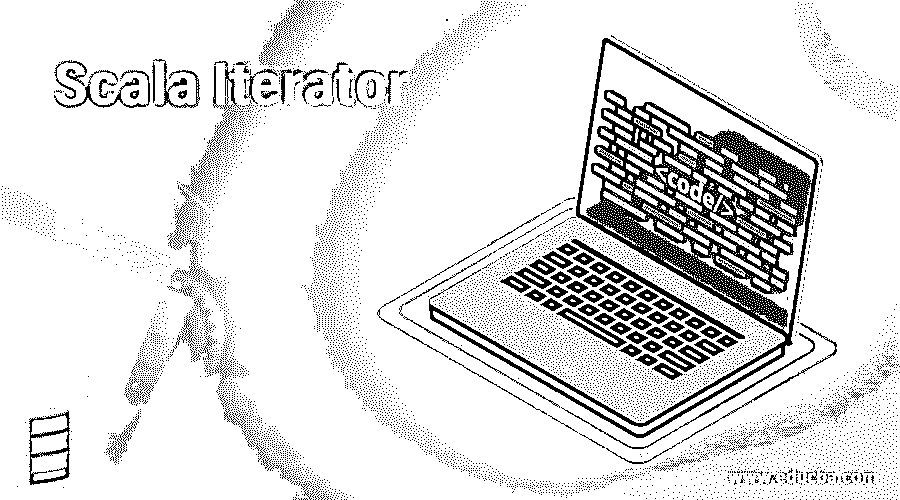
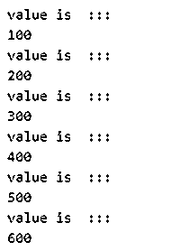
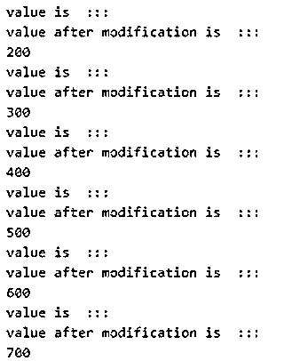
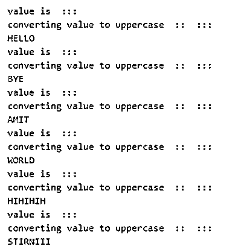
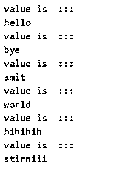
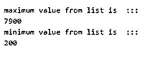

# Scala 迭代器

> 原文：<https://www.educba.com/scala-iterator/>




## Scala 迭代器的定义

迭代器用于迭代元素，使用它我们可以单独访问集合中的元素并执行操作。迭代器与集合非常不同，或者我们可以说它不是一个集合，而是我们用它来继承集合中的元素。它有两个方法使我们无法访问集合中的下一个元素。此外，iterate 不会一次加载整个集合，因此它在内存利用率方面与大量大数据一起使用。它为我们提供了 hasNext()和 Next()方法来处理集合元素。

**语法:**

<small>网页开发、编程语言、软件测试&其他</small>

在 scala 中定义迭代的基本语法如下:

```
valiterate_name = Iterator(value1, value2, value3, so on ....)
```

**举例:**

```
val iterate1 = Iterator(100, 200, 300, 400, 500, 600)
```

这样，我们可以在 scala 中定义一个 iterate。我们使用 var 关键字来定义 iterate 变量，后跟包含逗号分隔值的 iterator 对象。我们将在下一节详细讨论它们。在 scala 中使用其方法访问元素的语法如下:

*   访问下一个元素:while(iterate1.hasNext)
*   打印下一个元素:println(iterate1.next)

### Scala 中迭代器是如何工作的？

迭代器我们可以说是一种允许我们迭代集合的数据结构。迭代器在 scala 中是用来逐个迭代集合元素的，它的工作方式和 java 一样。它包含两个方法 hasNext 和紧挨着操作符的集合元素。迭代器本质上是可变的，这意味着我们可以在赋值后改变元素的值。

*   **hasNext:** 这个方法我们用来访问集合的下一个元素。我们通常在 while 循环或任何其他可用的循环中使用这个方法。此方法检查集合中是否存在下一个元素。此方法基于找到的元素返回布尔值 true 或 false。
*   **next:** 这个方法返回集合中的下一个元素。如果下一个元素不存在，我们试图调用下一个方法，它将抛出一个异常，说；NoSuchElementExaception。
    它既包含抽象值成员，也包含具体值成员。现在我们将讨论迭代器的扩展、超类型和已知子类，如下所示；

1.scala 中可用的扩展类；

*   IterableOnce
*   iterableoncops[A，迭代器，迭代器[A]]

2.scala 中可用的超类型；

*   iterableoncops[A，迭代器，迭代器[A]]
*   阿努雷夫
*   任何的
*   IterableOnce

3.scala 中可用的已知子类；

*   抽象迭代器
*   缓冲指示器
*   分组运算符
*   缓冲数据源
*   来源
*   线性转子
*   匹配迭代器

让我们看一个简单的程序，让初学者理解它的工作；

```
object Main extends App{
// Your code here!
// creating array and assigning values to iterate
val ite1 = Array(100 , 200, 300, 400, 500, 600)
//calling iterator
val result = ite1.iterator
//using methods here to access elements!!
while (result.hasNext) {
println("value is  :::")
println(result.next)
}
}
```

在上面的例子中，我们创建了一个数组并初始化了它的值。稍后将使用该数组进行迭代。之后，我们在数组对象上调用迭代器方法来迭代数组的元素。在 while 循环中，我们调用 hasNext()方法来检查元素是否存在，如果是，它将进入循环，否则，如果 hasNext()方法返回 true，那么我们使用 Next()方法来访问当前元素并打印它。

### Scala 中的迭代器方法及实例

下面是一些例子:

#### 示例#1

这个例子将展示使用 hasNext 和 Next 方法的迭代器的简单工作。

**代码:**

```
object Main extends App{
// Your code here!
// creating array to iterate
val ite1 = Array(100 , 200, 300, 400, 500, 600)
//calling iterator
val result = ite1.iterator
//using methods here to access elements!!
while (result.hasNext) {
println("value is  :::")
println(result.next)
}
}
```

**输出:**




#### 实施例 2

在这个例子中，我们使用迭代器方法迭代列表集合，并对元素进行修改。

**代码:**

```
object Main extends App{
// Your code here!
// creating array to iterate
val ite1 = List(100 , 200, 300, 400, 500, 600)
//calling iterator
val result = ite1.iterator
//using methods here to access elements!!
while (result.hasNext) {
println("value is  :::")
varnum = result.next + 100
println("value after modification is  :::")
println(num)
}
}
```

**输出:**




#### 实施例 3

在这个例子中，我们使用 scala 中的迭代器将字符串列表转换成大写。

**代码:**

```
object Main extends App{
// Your code here!
// creating array to iterate
val ite1 = List("hello", "bye", "amit", "world", "hihihih", "stirniii")
//calling iterator
val result = ite1.iterator
//using methods here to access elements!!
while (result.hasNext) {
println("value is  :::")
varnum = result.next.toUpperCase
println("converting value to uppercase  ::  :::")
println(num)
}   }
```

**输出:**




#### 实施例 4

在这个例子中，我们使用 for 循环来访问 scala 中的 iterate 对象。

**代码:**

```
object Main extends App{
// Your code here!
// creating array to iterate
val ite1 = List("hello", "bye", "amit", "world", "hihihih", "stirniii")
//calling iterator
val result = ite1.iterator
//using methods here to access elements!!
//using for loop
for(obj<- result) {
println("value is  :::")
println(obj)
}    }
```

**输出:**




#### 实施例 5

在这个例子中，我们使用 max 和 min 方法来查找迭代器中的最大和最小元素。

**代码:**

```
object Main extends App{
// Your code here!
// defining iterator
val itr1 = Iterator(500, 1500, 200, 900, 560, 3457, 7900)
val itr2 = Iterator(500, 1500, 200, 900, 560, 3457, 7900)
//using max min
var max = itr1.max
var min = itr2.min
//printing result ::
println("maximum value from list is  :::")
println(max)
println("minimum value from list is  :::")
println(min)
}
```

**输出:**




### 结论–Scala 迭代器

迭代器用于迭代集合中的元素。当谈到内存利用时，它们非常有效，因为它们处理大数据，因为它们不像 scala 中的 collection 那样一次加载所有数据。此外，当我们试图访问一个不存在的元素时，它会抛出一个异常。

### 推荐文章

这是一个 Scala 迭代器的指南。这里我们也讨论了 scala 中迭代器的介绍和工作原理。以及不同的示例及其代码实现。您也可以看看以下文章，了解更多信息–

1.  [Scala 散列表](https://www.educba.com/scala-hashmap/)
2.  [Scala 伴随对象](https://www.educba.com/scala-companion-object/)
3.  [Scala 类构造函数](https://www.educba.com/scala-class-constructor/)
4.  [Scala Singleton](https://www.educba.com/scala-singleton/)


