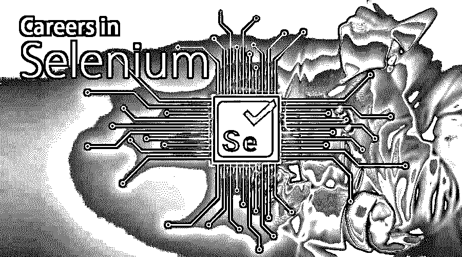

# 硒的事业

> 原文：<https://www.educba.com/career-in-selenium/>

## 硒职业介绍

为了在 Selenium 中形成一条崭新而光明的职业道路，一个人拥有测试流方面的知识和工作经验，以及在测试所有类型的软件应用程序和产品方面的广泛实践是非常重要的。随着技术朝着自动化和人工智能的方向发展，在 Selenium 中建立职业生涯可以确保软件行业的乐观未来。角色层次和成长与其他测试角色非常相似，从助理测试员、测试执行专业高级测试员、测试经理/架构师开始。

在这篇关于 selenium 的文章中，我们将讨论从事 Selenium 技术工作的职业前景。

<small>网页开发、编程语言、软件测试&其他</small>

### 硒职业所需的教育

通常，从事技术项目，如软件开发或测试，需要一个 B. Tech 学位。然而，有很多来自其他背景的人从事软件测试工作。计算机应用学士、计算机应用硕士、理学学士(IT)等。也是对这类工作给予考虑的一些学位。通常，这种职业不需要 M. Tech 或 MS，但拥有更高学历的人通常会被优先考虑晋升或担任团队领导或经理等职位。

如今，许多公司也向那些没有计算机科学或相关领域正式学位的人提供工作。如今，[软件工程学科](https://www.educba.com/software-engineering-interview-questions/)的生态系统正变得民主化，唯一重要的标准是拥有合适的技能和对特定主题工作的热情。许多公司不再重视学历或分数。

### 硒的职业道路

硒测试工作实际上是一份初级工作，大多数人都只有零到不到五年的工作经验。通常，在招聘后，公司会对员工进行几个月的技术培训，然后在团队中给他们一些小而简单的任务。慢慢地，人们开始捡起来，然后他们被分配更大更复杂的任务。通常，经过 2-3 年的工作经验，个人被分配独立的任务，很少或没有监督。在此期间，候选人需要在没有太多指导的情况下执行任务，并发展领导技能和独立思考能力。通常在工作 5-6 年后，他们会被提升为团队领导、高级软件测试员、scrum master 等。

### 工作职位或应用领域

大多数职位都是从零经验开始的，通常的称呼是助理软件工程师或助理见习工程师之类的。工作确认后，有时可能会被指定为初级软件工程师或助理测试员。类似的高级软件测试员和 scrum master 或团队领导的称号是由相关的经验和工作经验的年数给出的。

这个领域的应用是巨大的，因为几乎所有的软件开发都需要软件测试。所有的组织，无论大小，都使用软件测试人员来测试他们的代码的质量和功能。 [Selenium 是最著名的测试工具之一，因此该领域的应用和需求非常有前景。](https://www.educba.com/selenium-tools/)

### 薪水

在印度，入门级工资在 25 万卢比到 40 万卢比之间。对于国际市场，可以根据市场和国家进行适当调整。例如，美国和欧洲国家的工资通常较高。我们将在这里讨论印度的情况。在初级职位之后，初级和高级开发人员通常获得大约 50-80 万卢比的工资。超过 100 万卢比的期望值很难达到，除非候选人知道一种以上的技术，并且非常擅长这些技术。一旦有人成为团队领导或 scrum master 或达到类似的职位，那么工资可能会大幅增长。

因为市场上已经有了大量的软件测试人员，但是已经饱和了，没有那么多的工作机会或者新的招聘。正因为如此，最近 3-4 年的工资趋势也是不变的。

为了获得更好的前景，候选人应该努力掌握多种技能。除了 Selenium 之外，如果他们也有使用其他测试工具的经验，找到一份薪水更高的更好工作的机会会大大增加。

### 硒的职业前景

从事 Selenium 工作的优势在于，它不要求某人在编程方面非常出色。即使是非计算机科学的候选人也可以在这个领域找到工作，编写代码并不是工作的主要部分。因此，它吸引了许多来自工程相关领域但对[编程或编码](https://www.educba.com/coding-vs-programming/)了解不多的候选人。它很容易学习，非常直观和有趣的工作。

这些是软件工程工作之一，如果求职者务实并对其充满热情，它们将永远不会供不应求。即使技术发生了变化，出现了一些新的工具，聪明而勤奋的候选人也能很快掌握新技术，并很快进入市场。

### 结论

在这篇硒职业的文章中，我们讨论了硒职业的前景。本文详细分析了工作机会、需求、薪资趋势以及长期职业前景。预计候选人已经获得了足够的视角来了解该领域的就业市场，因此当他们获得该领域的工作机会时，他们将做出务实的选择。

候选人也被建议与他们的朋友、同事和导师交谈，以了解更多关于这一技术的细节，它的应用和在这一领域的职业发展。有第一人称的观察总是好的。

如果有人对 selenium 的技术方面、其功能和应用没有足够的了解，那么应该遵循任何在线教程，或者他们也可以参加课堂培训来学习足够的知识，以便他们能够通过面试并毫不费力地获得工作。

### 推荐文章

这是硒的职业指南。在这里，我们讨论了 Selenium 的简介、教育、所需技能以及工作职位、工资和职业前景。您也可以阅读以下文章，了解更多信息——

1.  [软件测试职业](https://www.educba.com/careers-in-software-testing/)
2.  [信息领域的职业](https://www.educba.com/careers-in-informatica/)
3.  [区块链职业](https://www.educba.com/careers-in-blockchain/)
4.  [SAS 职业生涯](https://www.educba.com/career-in-sas/)

