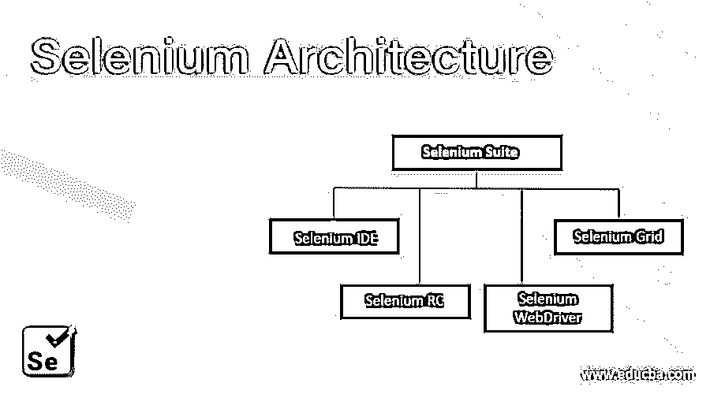
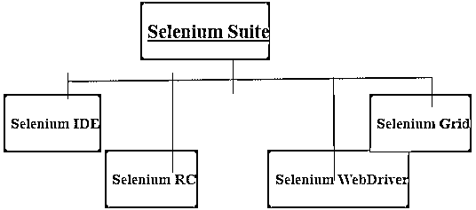

# 硒建筑

> 原文：<https://www.educba.com/selenium-architecture/>

## Selenium 架构概述

用于 web 应用程序测试的 Selenium 自动化框架由四个组件组成，即 Selenium IDE、Selenium RC、Selenium WebDriver 和 Selenium Grid。这些组件中的任何一个或组合都可以用于在基于 web 的应用程序、任何浏览器应用程序上实现自动化测试过程。测试流程是通过使用编程语言编写测试用例脚本来执行的，该语言应包括所有功能，如获取数据、捕获 web 元素、处理链接文本、在 web 应用程序中导航等。

### 硒建筑

下面列出了 Selenium 的四种主要架构

<small>网页开发、编程语言、软件测试&其他</small>

*   硒 IDE
*   硒 RC
*   Selenium Webdriver
*   硒栅

### 

#### 1.Selenium IDE 或集成开发环境

它可以作为 Firefox 的扩展来实现。在 IDE 中编写测试脚本不需要编程逻辑，因为它允许您简单地记录作为您与浏览器交互的结果而发生的事件，以及回放、编辑和[测试调试功能](https://www.educba.com/what-is-debugging/)。所有的记录和回放都允许在实际环境中运行。

生成的脚本可以在以后手工编辑。据信它提供了一个理想的环境来创建 Selenium 测试脚本，而不考虑您喜欢的测试方式。确实，使用 Selenium IDE 不需要任何编程语言知识，但是在使用像 runScript 等 Selenese 命令时，以前的 JavaScript 基础知识将是有用的。Selenium IDE 的一个局限是，作为一个 Firefox 插件，它只支持一种浏览器，即 Mozilla Firefox。

#### 2.硒遥控器

它是一个自动化测试工具，允许您使用任何支持 JavaScript 的浏览器，用任何编程语言为 web 应用程序创建测试脚本。基本上，Selenium RC 有两个主要组件——服务器和客户端库。

服务器在这里的作用是启动和终止浏览器，接收和验证浏览器和被测应用程序之间的 HTTP 请求，解释和执行测试程序传递的 Selenese 命令，还充当 HTTP 代理。然而，客户端库充当 Selenium RC 服务器和所使用的不同编程语言之间的接口。

RC 的客户机-服务器体系结构的方法论，在自动化套件和 AUT(被测应用程序)之间有 Selenium RC，使得脚本的执行更慢。这由 Selenium Webdriver 负责，因为它直接与 AUT 通信，并利用浏览器对自动化的自然兼容性，而不需要任何服务器。

#### 3.Selenium WebDriver

它是硒中最受欢迎和最重要的成分。它是目前几个自动化工程师所依赖的最流行的自动化工具之一。该工具是一个“开源工具”，即:它是免费的。

与 Selenium IDE 不同，WebDriver 是 Selenium RC 的改进版本，它扩展了对不同浏览器和平台的支持。与 Selenium RC 不同，测试脚本的执行不需要启动任何 Selenium 服务器。Selenium Webdriver 基本上是一个基于 web 的测试自动化工具 API，易于理解和使用。它还支持动态网页的测试。Selenium Webdriver 以一种非常简单的方式帮助创建和维护测试脚本，因为它没有链接到任何测试框架或工具。这使得与任何开源工具如 Junit、TestNG 等集成变得容易。，根据我们的知识、要求和用途。

#### 4.硒栅

它是 Selenium 套件的组件之一，支持跨各种不同的浏览器、操作系统或机器执行多个测试脚本。在指定了您选择的操作系统以及浏览器和浏览器版本之后，selenium grid 可以很容易地与 Selenium Remote 连接。这些值只能根据所使用的 Selenium 遥控器的功能来指定。

集线器和节点是它的两个主要组件。为了能够使用 Selenium Grid 工具，要执行的第一步是创建一个 hub。创建集线器后，可以将几个不同的节点连接到该集线器。测试脚本在节点中执行。然而，hub 的功能是确保测试将根据所提供的规范正确结束，例如测试中指定的机器、操作系统和浏览器的详细信息。

### 结论

总之，Selenium 基本上是一套工具，即 IDE，一个允许记录和回放功能的 Firefox 扩展。录制/回放功能是有限的，仅适用于 Firefox，因此第二个工具是以 Webdriver(第三个工具)为扩展的 RC，它提供不同语言的 API 和浏览器兼容性。最后，网格负责使脚本在不同的浏览器和机器上并行执行成为可能。

### 推荐文章

这是关于 Selenium 架构的指南。在这里，我们将讨论 selenium 的 4 大架构组件。您也可以浏览我们推荐的其他文章，了解更多信息——

