# 如何安装 Selenium

> 原文：<https://www.educba.com/install-selenium/>

## Selenium 安装简介

对于 Selenium 的工作，首先，我们需要安装三个主要项目:集成开发环境(IDE)的 Eclipse、Java 开发工具包(JDK)的高级版本，当然还有 Selenium jar 包。然后打开 Eclipse 并加载 Selenium Jar 文件，以包含来自 Selenium 库文件的 API 类。现在，在最新的 JDK 下创建一个新的 java 项目，它位于项目工作区。下一步是在先前创建的源下创建一个新的包和类，命名包和类，选择 main 方法、接口、访问修饰符等。，最后单击构建路径，然后单击 configure build path 来加载外部 selenium jar。

### 如何在电脑上安装 Selenium？

下面给出了安装 Selenium 所需的步骤:

<small>网页开发、编程语言、软件测试&其他</small>

**第一步:** [通过下载 JDK zip 文件或者来自 Oracle 官方网站的 exe 文件。](https://www.educba.com/install-jdk/)

官方网站的网址如下:

[https://www.oracle.com/](https://www.oracle.com/java/technologies/downloads/)

安装 JDK 是安装 Selenium 的最低要求。Selenium jars 可以添加到项目中，该项目位于现有的 Java 运行时库之上。

**第二步:**Java 开发包可以从官网下载，由于是开源的，任何人都可以使用，所以是免费的。点击下载按钮，如下图所示。下载文件后，需要使用 Windows 程序安装程序进行安装。

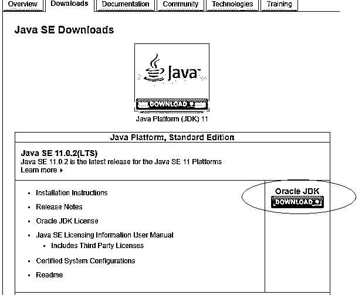

**第 3 步:**点击下载按钮后，选择接受许可协议，然后选择各自的操作系统(在本例中为 Windows)用于. exe 文件或。zip 文件。必须接受许可协议，才能继续下载不同操作系统的不同版本的库。

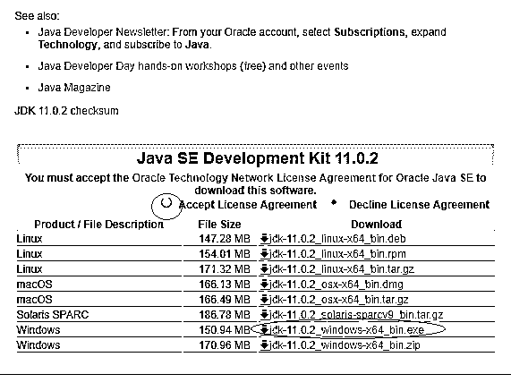

**第四步:**下载上述文件后，安装程序，出现如下窗口。单击下一步，如下面的安装窗口所示。

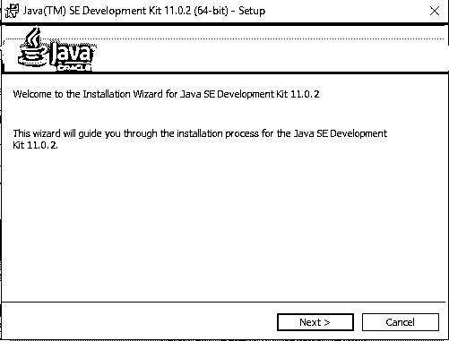

**第 5 步:**点击下一步后，出现如下窗口。可用的选项可以保留为默认值，无需进行任何其他更改。

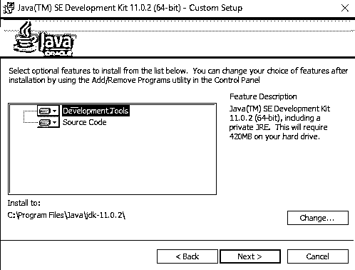

**步骤 6:** 再次点击下一步>，出现如下安装状态窗口。完成安装过程需要几秒钟时间。

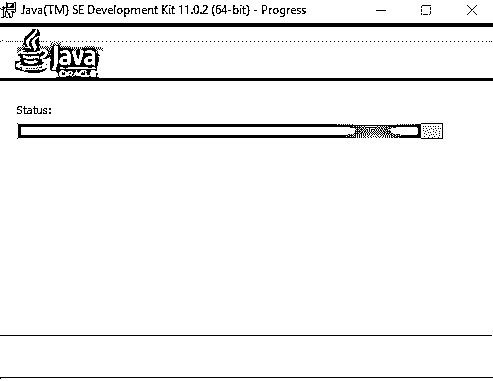

**步骤 7:** 安装完成后，会出现如下窗口，显示如下成功消息。

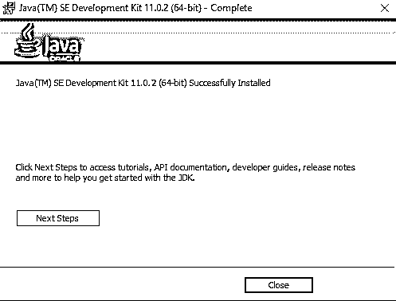

**第八步:**点击关闭；安装完成，可以从 c 盘查看安装的目录，JDK-11.0.2 文件夹如下图所示。安装后，JDK 文件夹将在 c 盘中创建，正如安装时提到的，这是默认的。该驱动器位置或安装位置可在安装期间根据需要进行更改。

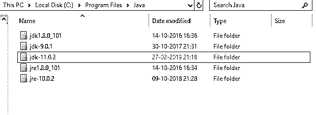

**第九步:**现在从硒官方网站【https://www.selenium.dev/downloads/ T2】下载硒罐如下图:下面是硒软件的官方网站。对于支持跨平台应用程序使用 Selenium 的不同语言，有不同的客户端版本。这些将是与 Selenium 框架相关的库，有许多类型的应用程序可以使用。

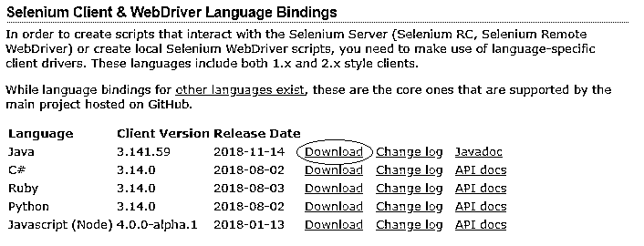

**步骤 10:** 点击下载按钮，如上图所示，下载 Java 相关的 Selenium jars。上面选择的选项适用于上述发布日期的客户端版本 3.1.41.59 的 Java 编程语言。相应的 Javadoc 可以在下载按钮的右侧找到。

**步骤 11:** 下载上述 jar 后，打开 Eclipse IDE，新建一个项目，将上述 jar 加载到项目构建路径中，使用 Selenium 库中的 API 类。

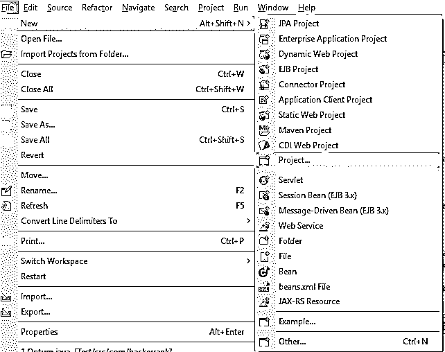

**第 12 步:**点击文件菜单，选择新建，然后选择项目。该选项将允许开发人员在打开 Eclipse IDE 时选择的特定工作区中创建新项目，或者可以在以后根据需求更改工作区，然后出现下面的窗口。

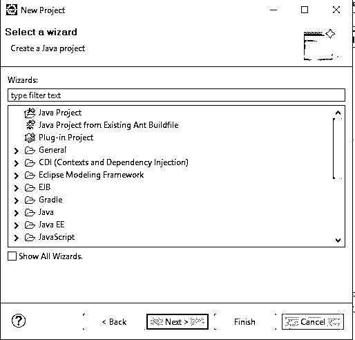

**步骤 13:** 选择 Java 项目，然后点击下一步>，出现如下窗口。该选项将使用户能够专门创建一个 Java 项目。

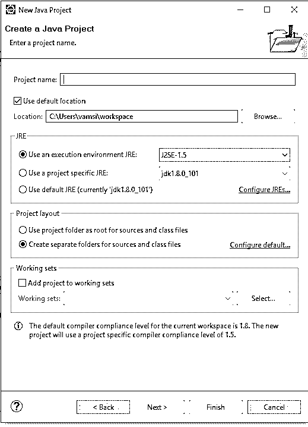

**步骤 14:** 输入项目名称和最新的 JDK (Java 开发工具包)版本；JDK 版本可以是 JDK 8.0 或以上，点击下一步>，如下图所示。任何其他最新的 JDK 版本也可以根据需求和项目开发所需的功能来选择。

**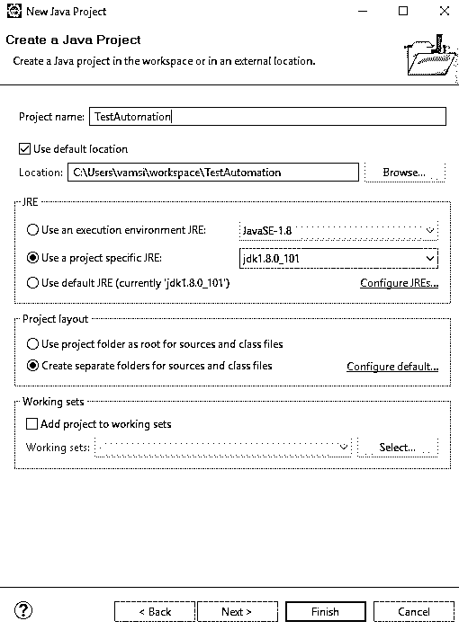

** 

**第 15 步:**点击下一步按钮，出现如下窗口:

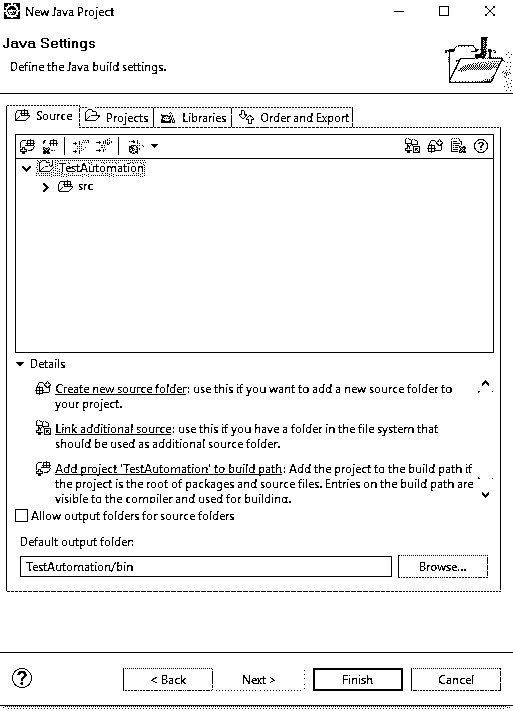

**步骤 16:** 现在点击 finish 以完成项目创建。现在，项目结构中有一个名为 src 的空源文件夹。现在在 source 文件夹下创建一个新的包和新的类，如下所示。

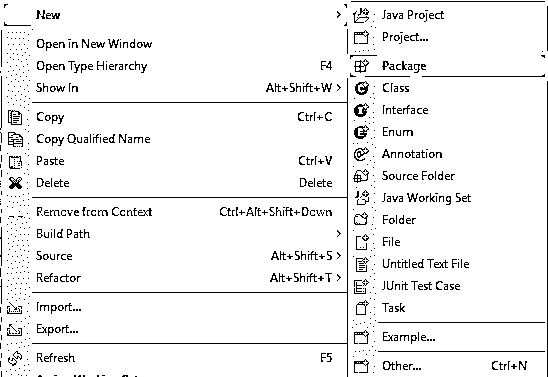

**步骤 17:** 现在出现下面的窗口，输入包名和类名，然后点击 Finish 创建。在创建类本身时，还有其他选项来选择访问修饰符、要添加的接口和其他存根来创建默认的 main 方法、构造函数或继承的抽象方法。

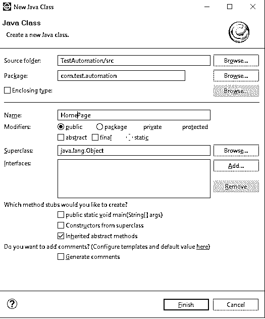

**步骤 18:** 现在项目设置已经准备好了，可以加载 jar 来构建安装 Selenium 的路径。

**步骤 19:** 现在右键单击项目，选择构建路径，然后选择构建路径选项下的配置构建路径选项，如下所示。

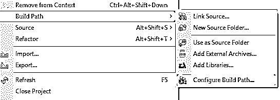

**步骤 20:** 现在出现如下窗口，如下图所示:

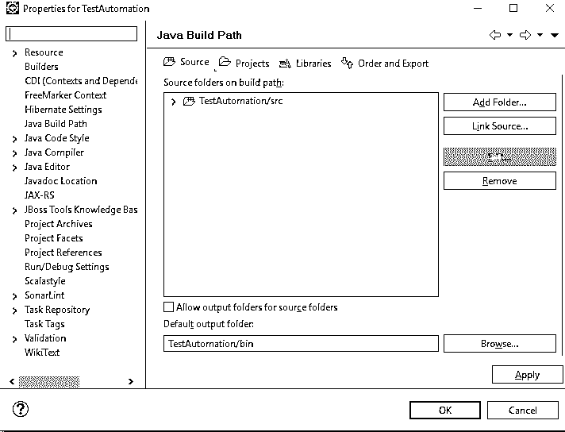

**步骤 21:** 现在点击 libraries 选项卡，然后点击 Add External Jars，将 Selenium jars 添加到项目构建路径中。

现在窗口出现如下:

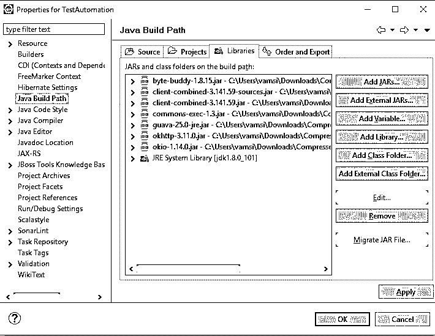

**步骤 22:** 上述罐子在 Selenium Jars 文件夹中可用。其他需要的 jar 也可以添加到支持任何其他库的构建路径中。

**步骤 23:** 现在可以根据业务需求在项目中进行剩余的代码开发。

### 推荐文章

这是如何安装 Selenium 的指南。这里我们讨论了 Selenium 的介绍以及在 windows 中安装 Selenium 的不同步骤。您也可以阅读以下文章，了解更多信息——

1.  [硒命令](https://www.educba.com/selenium-commands/)
2.  [硒业](https://www.educba.com/career-in-selenium/)
3.  [硒的用途](https://www.educba.com/uses-of-selenium/)
4.  [Selenium IDE 命令](https://www.educba.com/selenium-ide-commands/)

