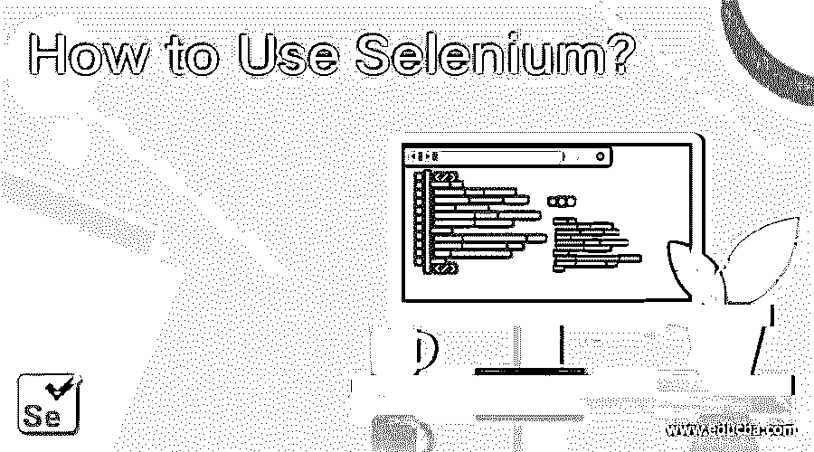
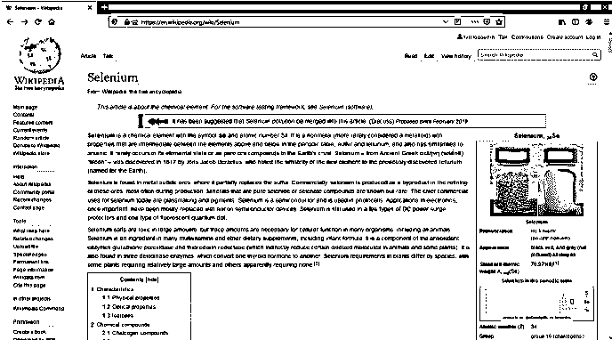
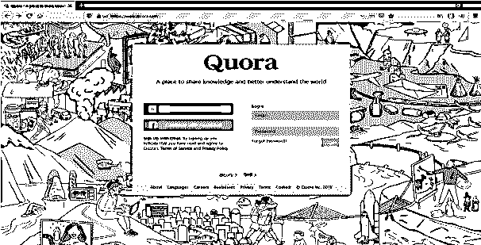
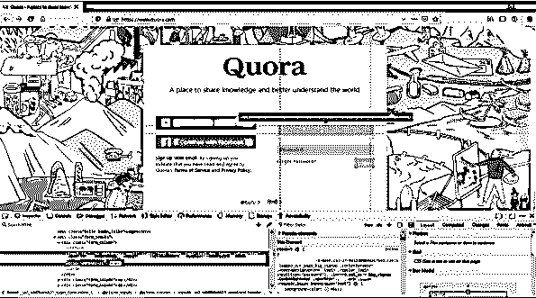
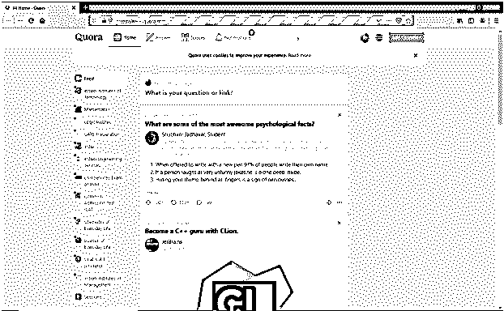

# 硒怎么用？

> 原文：<https://www.educba.com/how-to-use-selenium/>

## Selenium Webdriver 简介

Webdriver 是一个 web 自动化框架，使我们能够使用编程语言在不同的 web 浏览器中执行脚本，如 Google Chrome、Mozilla Firefox、Microsoft Edge 等。它从操作系统层面控制浏览器。它只需要运行一个脚本和一个网络浏览器。Selenium web driver 支持不同的编程语言，如 Java、Python、Ruby、Perl、PHP 等。网等。

**要求:**

<small>网页开发、编程语言、软件测试&其他</small>

*   **Selenium package** :可以使用以下命令安装。

`pip install selenium`

*   **驱动**:不同的浏览器会有不同的驱动，需要下载后才能使用。
*   **对于 chrome**:chrome 驱动，从以下链接下载。

[https://sites . Google . com/a/chromium . org/chrome driver/downloads](https://sites.google.com/a/chromium.org/chromedriver/downloads)

*   **对于 Firefox** : Gecko 驱动，从以下链接下载。

[https://github.com/mozilla/geckodriver/releases](https://github.com/mozilla/geckodriver/releases)

*   **对于 Microsoft Edge**:internet explorer 驱动程序，请从以下网址下载:

[https://developer . Microsoft . com/en-us/Microsoft-edge/tools/web driver/](https://developer.microsoft.com/en-us/microsoft-edge/tools/webdriver/)

*   **对于 safari** : Safari 驱动程序，请从以下网址下载:

[https://WebKit . org/blog/6900/web driver-support-in-safari-10/](https://webkit.org/blog/6900/webdriver-support-in-safari-10/)

*   对于 windows 用户，下载所需的驱动程序后，解压文件。
*   将文件放在一个目录中，并将路径保存到该目录。
*   将环境变量中的路径添加为路径，并保存该路径以备后用。

### Selenium WebDriver 的使用

*   我们需要从 selenium 包中导入 web 驱动程序，这可以通过以下方式完成:

`from selenium import webdriver`

*   使用以下代码创建一个驱动程序:

`driver = webdriver.Firefox(‘path to geckodriver’)`

例如，我在 firefox 浏览器中使用了 geckodriver，你可以用任何东西来代替。

*   选择一个 web 驱动程序必须指向的 url，并将该 url 放入 driver.get()方法中，该方法会自动将驱动程序指向该 url。例如，让我们使用 url 在维基百科中搜索 selenium。

`driver.get(‘https://en.wikipedia.org/wiki/Selenium’)`

*   要在打开浏览器后自动关闭它，请在代码末尾使用 driver.quit()。
*   总结以上所有步骤，下面是 python 脚本，

`from selenium import webdriver
driver = webdriver.Firefox(‘path to geckodriver’)
driver.get(‘https://en.wikipedia.org/wiki/Selenium**’**)
driver.quit()`

*   运行上面的脚本后，上面的 web 页面会打开，但是由于 driver.quit()选项，页面会自动关闭，所以我们可以将它作为可选选项。
*   这个 selenium web 驱动程序还支持用于无头浏览的 HtmlUnit 浏览器，这意味着可以在不打开 web 浏览器的情况下访问网页，方法如下。
*   从 selenium 导入选项为:

`from selenium.webdriver.firefox.options import Options`

*   将选项设置为 headless，然后将其与驱动程序的路径包括在一起，如下所示:

`options = Options()
driver = webdriver.Firefox('path to geckodriver',options = options)`

*   Web 驱动程序提供了许多方法来通过 xpath 从网页中找到元素，如名称、css_name、css_selector 等。
*   定位元件可以如下使用，

`driver.find_element_by_xpath(‘xpath value’)`

通过检查网页可以找到定位元素的所有值。

让我们考虑另一个使用定位元件的例子，

*   在这里，我们将为一个名为 Quora 的网站实现登录自动化。
*   首先，让我们获取 Quora 网站的 URL 路径，并将其包含在 driver.get()中
*   那么页面可能看起来像这样，

*   现在，通过右键单击元素并选择 inspect element 选项来检查每个元素，以找到元素的值，如下所示。

*   复制定位元素的值，并根据所选的值使用以下代码，

`Email = driver.find_element_by_id(id = ‘value of id’)`

*   在上面给出的网站中，必须输入电子邮件 id 和密码的值，

`Email.send_keys(‘enter the email id’)`

*   类似地，输入所有必需的字段，然后我们必须按登录按钮来完成此操作，检查登录按钮的值，然后编写以下代码。

`Button = driver.find_element_by_id(id = ‘value of login button’)
Button.click()`

*   然后，网站会自动重定向到如下所示的帐户。

*   总结以上所有步骤，python 脚本如下。

`from selenium import webdriver
driver = webdriver.Firefox('C:\\geckodriver')
driver.get('https://www.quora.com/')
email = driver.find_element_by_name("email")
email.send_keys('enter the email id')
password = driver.find_element_by_name('password')
passsword.send_keys('enter the password')
button = driver.find_element_by_xpath('//*[@id="__w2_wQpenGLD21_submit_button"]')
button.click()`

### 用硒定位元素:

有不同的方法来定位网页中的元素。以下是定位元素的不同方法。

#### 示例#1:通过 id 查找元素

当我们知道一个元素的 id 属性时，我们可以使用这个方法。假设我们有一个如下的页面源。

**代码:**

`<html>
<body>
<form id="loginForm">
<input name="username" type="text" />
<input name="password" type="password" />
<input name="continue" type="submit" value="Login" />
</form>
</body>
<html>`

**我们可以找到下面的表格**

`login_form = driver.find_element_by_id('loginForm')`

#### 示例 2:按名称查找元素

当我们知道一个元素的名称属性时，我们可以使用这个。考虑以下来源。

**代码:**

`<html>
<body>
<form id="loginForm">
<input name="username" type="text" />
<input name="password" type="password" />
<input name="continue" type="submit" value="Login" />
<input name="continue" type="button" value="Clear" />
</form>
</body>
<html>`

我们可以像这样提取用户名和密码。

`username = driver.find_element_by_name('username')
password = driver.find_element_by_name('password')`

#### 示例 3:通过 XPath 查找元素

对于 XPath，考虑页面源代码如下。

**代码:**

`<html>
<body>
<form id="loginForm">
<input name="username" type="text" />
<input name="password" type="password" />
<input name="continue" type="submit" value="Login" />
<input name="continue" type="button" value="Clear" />
</form>
</body>
<html>`

元素可以这样定位。

`login_form = driver.find_element_by_xpath("/html/body/form[1]")
login_form = driver.find_element_by_xpath("//form[1]")
login_form = driver.find_element_by_xpath("//form[@id='loginForm']")`

#### 示例#4:通过 line_text 查找元素

我们可以如下定位带有链接文本的超链接。如下考虑页面源。

**代码:**

`<html>
<body>

Are you sure you want to do this?

<a href="continue.html">Continue</a>
<a href="cancel.html">Cancel</a>
</body>
<html>`

**继续链接可以这样定位。**

`continue_link = driver.find_element_by_link_text('Continue')
continue_link = driver.find_element_by_partial_link_text('Conti')`

#### 示例 5:通过 CSS 选择器定位元素

该方法允许您通过类属性名称来定位元素。下面是出处。

**代码:**

`<html>
<body>

Click Here

</body>
<html>`

我们可以如下定位 css 部门。

`get_div = driver.find_element_by_css_selector('div.round-button')`

#### 例#6: **通过标记名**定位元素

该方法允许您通过指定标记名来查找 web 元素。

**代码:**

`<html>
<body>
<title>Hello Python</title>

Learn test automation using Python

</body>
<html>`

上面的代码有一个标题标签和一些文本。您可以使用下面的代码找到它。

`get_div = driver.find_element_by_tag_name('title')`

**你可以在下面找到参考链接。**

`https://selenium-python.readthedocs.io/installation.html#introduction`

### 推荐文章

这是如何使用硒的指南？.在这里，我们还将讨论 Webdriver 的介绍，以及 Selenium WebDriver 的不同用法。您也可以看看以下文章，了解更多信息–

1.  [硒中断言](https://www.educba.com/assertions-in-selenium/)
2.  [硒软件](https://www.educba.com/selenium-software/)
3.  [硒的成分](https://www.educba.com/components-of-selenium/)
4.  [Selenium 中的 XPath 是什么？](https://www.educba.com/what-is-xpath-in-selenium/)

