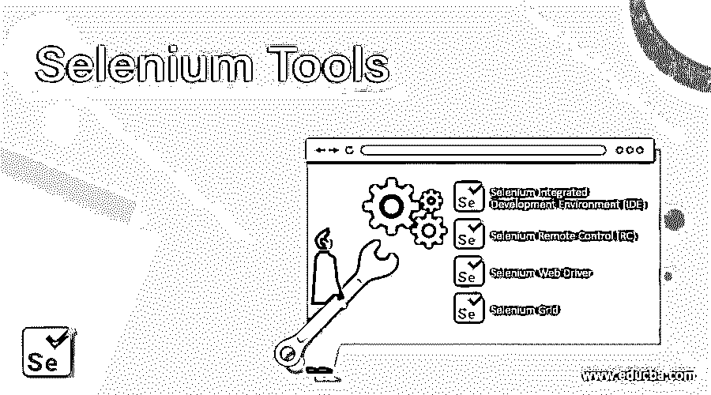

# Selenium 工具

> 原文：<https://www.educba.com/selenium-tools/>

## Selenium 工具概述

Selenium 是一个基于 web 的测试自动化套件，它由四个工具组件组成。集成开发环境是作为 Firefox 插件开发的第一个自动化功能测试工具。然后是 Selenium Remote Control，它是为使用任何编程语言编写的测试脚本测试 web 应用程序而开发的。Selenium Web Driver 是下一个发布的 Selenium 工具，同时发布的还有针对所有主流浏览器的 Web 驱动。最后，推出了 Selenium Grid 来与 web driver 一起工作，其中网格充当服务器/集线器，来自浏览器的驱动程序充当节点。

### Selenium 工具

Selenium 有 4 个工具:

<small>网页开发、编程语言、软件测试&其他</small>

1.  Selenium 集成开发环境(IDE)
2.  硒遥控器(遥控)
3.  selenium webdriver
4.  硒栅

#### 1.Selenium IDE(集成开发环境)

*   作为 Mozilla Firefox 扩展实现，Selenium IDE 提供了测试脚本的记录和回放功能。
*   Selenium IDE 还为测试人员提供了测试用 R Spec、Python、Java、HTML、Ruby、C#、J Unit 和 Test NG 编写的脚本的可信度。
*   Selenium IDE 的可变范围非常小，并且通过 selenium IDE 生成的测试脚本不是非常可行、健壮和可移植的。selenium IDE 支持所有的浏览器。Selenium 1 支持 Firefox 3、2、3.x 等浏览器。也支持 Safari 2，3，4 和 Opera 8，9，10。它被实现为 Firefox 插件和 Chrome 扩展。它还提供了自动完成支持和快速移动命令的能力。

#### 2.硒遥控器

*   selenium RC 已被 Selenium 正式否决，它允许手动测试人员用任何脚本语言或支持的编程语言为 web 或移动应用程序 UI 测试或自动化测试编写代码。
*   它还将任务交给代理 HTTP 服务器，该服务器允许知道来自由[代理服务器提供的域的被测试应用程序可用于在网络浏览器中被测试。](https://www.educba.com/types-of-proxy-servers/)

它还带有两个组件，分别是:

*   包含你的编程语言代码的库，例如 Selenium RC 客户端。
*   它还充当 web 请求的 HTTP 代理，可以整合为 Selenium RC 服务器。

Selenium RC 在测试基于 ajax 的复杂 web 用户界面和持续集成系统下的体验时，一直处于更加高效和有效的趋势。Selenium RC 的好处包括能够使用远程浏览器，并且不需要将每一行代码移植到越来越多的语言中。

#### 3.Selenium WebDriver

*   Selenium Web Driver 是 Selenium 套件中最有效和最重要的部分。
*   它提供了基于编程或脚本的界面来创建和运行测试用例。测试脚本(最有可能是 web 测试)是为了识别 web 组件而编写的，然后为 web 页面或门户上的这些元素的操作制定所需的任务。
*   Selenium web 驱动程序的生产率要高得多，因为可以直接调用 web 浏览器，而不需要任何中介。Web 驱动程序直接在不同的浏览器或编译器上执行操作，因此每次我们都为每个浏览器提供最相同的驱动程序。

一些最广泛的 selenium suite web 驱动程序包括:

*   HTML 单元驱动程序
*   Safari 驱动程序
*   歌剧司机
*   Internet Explorer 驱动程序
*   谷歌浏览器驱动程序
*   Mozilla Firefox 驱动(Gecko 驱动)

#### 4.硒栅

*   [Selenium Grid](https://www.educba.com/selenium-grid/) 也是 Selenium 套件中最重要的[组件之一，它使我们能够在不同的机器或服务器上进行测试，而不是在并行世界机制或并行环境中使用不同或独特的浏览器。](https://www.educba.com/components-of-selenium/)
*   换句话说，我们可以说，我们可以在不同的机器或运行在不同操作系统和浏览器上的虚拟机上的并行环境中编译和运行我们的脚本测试。

### Selenium 工具的优势

到目前为止，我们一定已经详细了解了 selenium 工具及其核心原理和组件。现在是时候了解一下它的优点和缺点了。

下面是 Selenium 工具的一些优点:

*   它是开源的
*   它没有前期费用，所以是免费的
*   它可以在多种浏览器下运行
*   Selenium 脚本是通过使用在浏览器中运行的测试中的 [web 应用程序](https://www.educba.com/what-is-web-application/)来记录动作而创建的，这对于测试人员和测试环境来说是非常有用的属性。
*   它不约束 QA 对构建系统、报告工具或测试框架的任何其他方面的选择。
*   它与流行的测试工具集成得很好，如 Hudson、Sauce Labs、Selenium-Grid、Q Metry 等。
*   支持使用 JavaScript 和 AJAX 技术在浏览器中实现部分功能的 web 应用程序。
*   Selenium 支持各种编程语言编写程序。
*   Selenium 支持并行测试执行。
*   Selenium 使用的硬件资源更少。

### 硒工具的缺点

以下是一些缺点。

*   没有内置的报告功能。
*   没有用于测试管理的测试工具集成。
*   新功能可能无法正常工作。
*   对图像测试的有限支持。
*   与 UFT、RFT、Silk Test 等供应商工具相比，很难设置测试环境
*   难以使用需要更多的时间来创建测试用例。
*   它只支持基于 Web 的应用程序。
*   没有任何可靠的技术支持。

了解了这么多关于 selenium 工具的知识后，我可以说，在它对 web 开发人员免费和开源之前，它是市场上测试 web 或基于移动设备的用户界面的最佳和最有效的测试工具。

### 推荐文章

这是 Selenium 工具的指南。这里我们讨论了 Selenium 工具的简介、组件、优点和缺点。您也可以浏览我们推荐的其他文章，了解更多信息——

1.  [硒测试](https://www.educba.com/selenium-testing/)
2.  [硒是什么？](https://www.educba.com/what-is-selenium/)
3.  [硒的用途](https://www.educba.com/uses-of-selenium/)
4.  [硒 vs QTP](https://www.educba.com/selenium-vs-qtp/)

