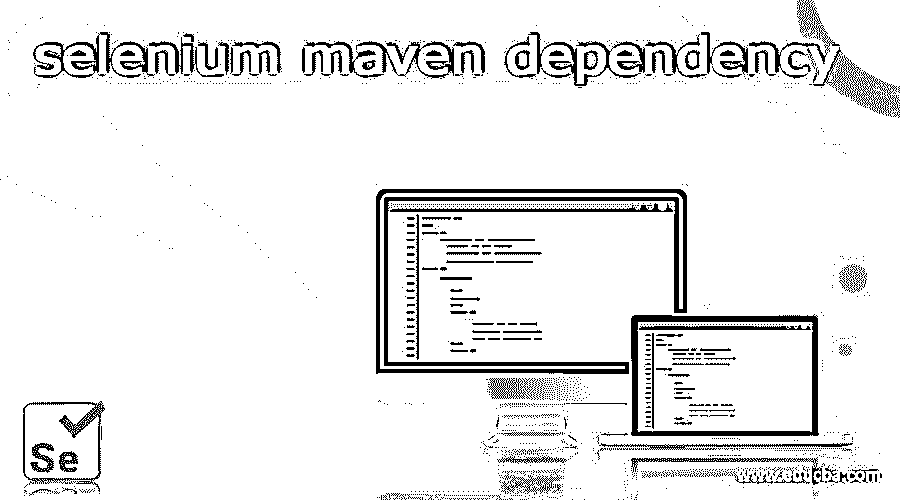
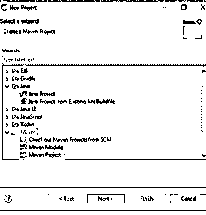
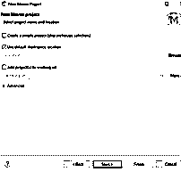
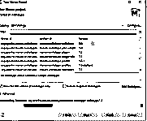

# 硒 maven 依赖性

> 原文：<https://www.educba.com/selenium-maven-dependency/>

## selenium maven 依赖性介绍

maven 有一个新的特性可以支持这种依赖性，它用于在运行测试用例之前从世界各地获取依赖的 jar，如互联网传输，我们还可以使用命令行运行测试脚本，而不需要使用 eclipse 这样的框架。这要感谢 maven，它总是为框架提供文件夹结构。maven 允许访问 pom 中的数据，包括单元测试结果、电子邮件列表、依赖性列表和其他交叉引用的源。它将被识别并添加到 selenium 中的内置测试项目中。

### 如何安装 selenium maven 依赖？

我们需要安装第一个 java 最新版本来访问系统中的 java 文件。它确保安装了 Java(最新版本)，并且按照说明设置了 JDK 和 JAVA HOME 环境变量。然后，我们可以转到所需的 Maven 下载页面，下载二进制 zip 文件并解压缩，这样安装过程就完成了。接下来，我们可以在环境变量中配置 Maven_Home 路径集，并赋予直到 bin 文件夹的访问路径权限。

<small>网页开发、编程语言、软件测试&其他</small>

此外，我们可以打开系统的控制面板选择系统链接，以及从左侧面板的设置选项卡中选择高级系统，然后导航到高级选项卡，选择环境变量并在的系统变量中添加 Maven_Home 变量，以访问 Maven bin 文件夹的路径，以便在保存操作后执行操作。我们设置环境变量并添加用于设置环境变量的 Maven_Home 选择开始菜单并编辑环境变量选择系统属性、环境变量和系统变量设置 Maven_Home 路径。我们需要使用命令提示符来验证是否安装了 Maven 我们可以执行类似 mvn-version 的命令，然后按回车键，它应该会返回 maven 版本。

项目中的 Maven 依赖文件夹，

我们还使用 pom.xml 添加了依赖性，

### 创建 Maven 项目

用户将基于期望的依赖项创建一个 Maven 项目，这增加了所有特定的需求。

首先，我们可以打开 IDE 并选择创建一个 Maven 项目，

打开表单后，选择项目并选择“下一步”按钮继续。

它将显示所有的 maven 组 id，工件 id。

然后按 enters 键，它将安装软件包并创建项目。创建项目后，我们可以预定义文件夹结构，如 pom.xml。自动创建打开 xml，导航到底部的 pom.xml 选项卡，并添加 pom.xml 中的不同插件。

`<build>
<plugins>
<plugin>`

您定制的插件取决于项目需求

`</plugin>
</plugins>
</build>`

使用项目目录添加指定的 jar 后，选择构建路径->配置构建路径

使用 Libraries 选项卡导入 jar，并选择“Add External JARs”选项，它将添加所有需要的 jar。我们可以在项目部分添加 jar，用于搜索特定的 jar 文件，并添加 Maven 存储库依赖项。我们将以此为例，在特定的项目中尝试 selenium 依赖关系；selenium 版本添加在 maven 依赖项之后，用于项目中。我们可以尝试在项目中添加 selenium 依赖；为了导航到 Maven 代码，单击依赖项，它将被复制到剪贴板。

### 硒 Maven 依赖过程

Maven 就像一套工具，用于创建和维护基于 java 的项目，它部署在途中，就像管理 java 项目中的依赖关系的机制。它将在大型企业应用程序上工作，同时用于构建在项目需求中利用 POMs(页面对象模型)的项目。TestNG 是测试的框架之一；它将在处理过渡 Selenium maven 依赖性的同时组织组并进行测试。依赖关系是如此的相互依赖，以至于它会自动添加所有必需的依赖关系和相关的依赖关系。

假设我们创建新用户来手动添加依赖项，或者在 maven 中有几个相互依赖项的选择。在这种情况下，我们将使用 pom.xml 文件作为 maven dependency 文件夹中的编码选项。它可能会觉得这个特性令人费解，强烈建议阅读 Maven with Apache-based server，以便更好地理解与 Maven dependent 相关的内容。然后，请使用命令提示符命令，如 mvn architect:mvn architect:mvn architect 等，导航到我们要启动项目的文件夹。对于这个需求，groupid 和 artifact id 更常见。构建过程更加简单，并且对于使用文档提供高质量的项目数据更加一致；开发组织依赖项的最佳实践更加简单。此外，它提供了 pom.xml 来配置用户配置，这可能是项目需要的，如使用提供用户信息的类所需的 jar，这些信息由所有项目共享。

maven 允许您在 pom 中提供数据，包括所有的单元测试结果；它包括电子邮件列表、依赖列表和交叉引用源。当我们根据 webdriver 版本使用 Maven 在名为 m2 的本地存储库中获取所有需要的文件时，它有助于创建正确的项目结构以及在项目的构建路径中添加和管理 jar 文件。假设 web 驱动程序的版本后来发生了变化。在这种情况下，它将反映需要更改的 pom.xml 文件，并下载更新的 jar 版本以生成新的构建，并自动将它们保存到本地存储库。

### 结论

通常，我们知道如何在命令行中像使用 eclipse、springtoolsuite(sts)一样使用 Ide 在用户机器中安装 maven。我们也知道如何使用 ide 在 selenium 框架中构造 maven 项目；使用 maven 也是项目入门比较需要的。

### 推荐文章

这是关于 selenium maven 依赖性的指南。这里我们讨论如何在创建 maven 项目的同时安装 selenium maven 依赖项。您也可以看看以下文章，了解更多信息–

1.  [如何使用硒？](https://www.educba.com/how-to-use-selenium/)
2.  [Selenium IDE 命令](https://www.educba.com/selenium-ide-commands/)
3.  [硒中断言](https://www.educba.com/assertions-in-selenium/)
4.  [硒的成分](https://www.educba.com/components-of-selenium/)

