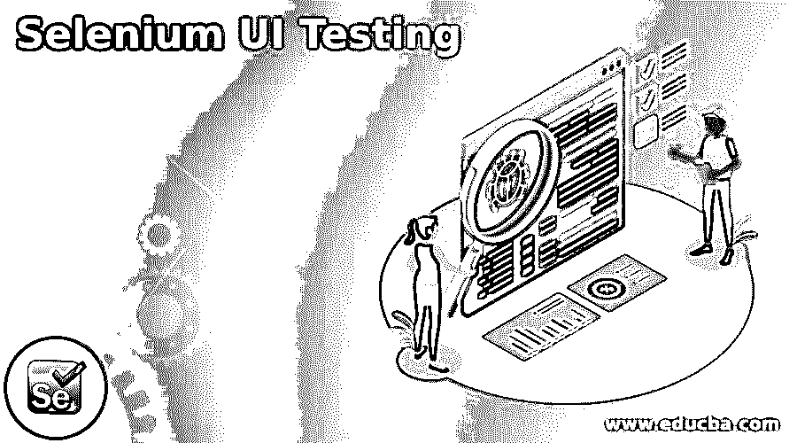
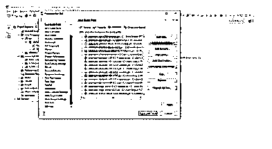
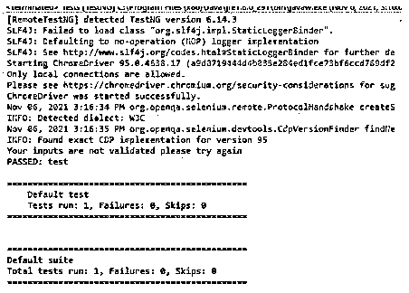
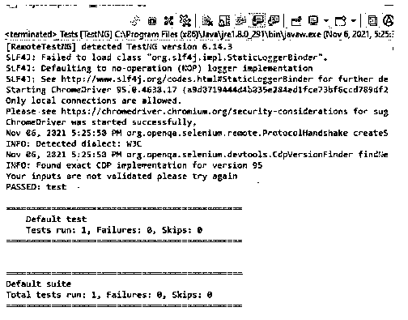

# Selenium UI 测试

> 原文：<https://www.educba.com/selenium-ui-testing/>

## Selenium UI 测试简介

在 Selenium 中，UI 测试是在编写测试脚本的帮助下执行自动化的 web 浏览器交互，以在 web 应用程序和用户界面上执行各种用户活动，它也是 UI 测试性能活动和跨浏览器脚本测试的理想选择，因为它可以根据需求在不同的浏览器和版本上运行相同的测试。UI 测试也称为 GUI 测试；它可以用任何类型的软件功能进行测试，这些功能可以与用户进行交互以确保符合标准。

### 什么是 Selenium UI 测试？

*   通常，selenium 是最流行的基于 Web 的开源 UI 之一；该用户界面将使测试自动化；因此，它将借助思想工程等内部工具生成触发过程。
*   它是一个基于浏览器的自动化工具，有助于使用各种浏览器、web 和其他平台，包括计算机语言。
*   它可以运行在 selenium 支持的不同的现代 web 浏览器上，包括其他浏览器，如 Internet Explorer、Chrome 和 Safari 等。它还支持自动化功能测试，可以与 Maven、Jenkins & Dockers 和其他 Devops 工具集成。

### 如何进行 Selenium UI 测试？

下面给出了最简单的方法中经常使用的步骤。

<small>网页开发、编程语言、软件测试&其他</small>

*   主要是，在作为用户与 web 应用程序交互时，利用 Selenium IDE 的自动记录器来构建脚本。
*   根据需要调整定位器。
*   确保一切和谐。
*   用验证填空。
*   创建 WebDriver 导出。

以上步骤是使用 selenium automation 执行 UI 测试的基本步骤。根据需求，当在 UI 元素中传递输入时，它会有所不同。

### 如何设置 Selenium UI 测试？

在深入研究如何开发 Selenium UI 测试之前，让我们先看看如何设置 Selenium。首先，特定要求必须满足下列条件。它有一些先决条件；第一步我们需要安装 Eclipse 或 STS ide，然后如果项目需要节点 js，我们可以使用 npm 命令安装 selenium 服务器实用程序。在此之前，我们必须检查并确认节点 js 是否安装了命令。最后，我们必须设置 selenium web 驱动程序和客户端语言绑定。

在上面的截图中，我们应该在项目 java 构建路径中添加外部 selenium jars。

### 定位器的类型

*   通常，selenium 支持 8 种不同类型的定位器，即 Id、name、className、tagName、linkText、partialLinkText、CSS 选择器和 xpath 是 Selenium 支持的八种定位器类型。元素识别的最可靠和快速的技术之一是使用 id。我们也可以使用其他定位器，但是使用 ID 更容易识别和检索 web 数据。有时名称、类名也经常用于访问数据。
*   xpath 是最常见的技术，可以轻松地获取并突出显示 web 页面中的特定 html web 元素。

### Selenium UI 测试的最佳实践

通过以下调整，Selenium 脚本可以变得更快:

*   首先，我们可以利用快速选择。
*   第二个是减少你使用的定位器数量。
*   第三，我们可以构建原子测试。
*   第四，我们不能两次测试同一个特性。
*   第五，我们可以创建高质量的测试。
*   第六件事是只使用显式等待。
*   然后我们就可以利用谷歌 Chrome 驱动了。
*   另外，对于无头浏览器，使用驱动程序。

实践的每一步都将考虑 selenium 自动化更有帮助，并且需要减少时间消耗。

### 创建 Selenium UI 测试

通常，selenium 将有助于在基于 web 的应用程序中创建自动化测试。因此，它可以减少测试次数并构建更复杂的应用程序。

我们可以看到下面的例子来执行 UI 操作。

#### 示例#1

**代码:**

`import org.openqa.selenium.By;
import org.openqa.selenium.WebDriver;
import org.openqa.selenium.chrome.ChromeDriver;
import org.testng.annotations.Test;
public class Tests {
@Test
public void test() throws InterruptedException {
System.setProperty("webdriver.chrome.driver", "C:\\Users\\Kripya-PC\\Downloads\\chromedriver_win32 (1)\\chromedriver.exe");
WebDriver dr = new ChromeDriver();
dr.manage().window().maximize();
dr.get("https://accounts.google.com/signin/v2/identifier?continue=https%3A%2F%2Fmail.google.com%2Fmail%2F&service=mail&sacu=1&rip=1&flowName=GlifWebSignIn&flowEntry=ServiceLogin");
dr.findElement(By.id("identifierId")).sendKeys("ramansiva57@gmail.com");
Thread.sleep(1000);
dr.findElement(By.className("VfPpkd-vQzf8d")).click();
Thread.sleep(1000);
String a = dr.getTitle();
String b = "welcome";
dr.close();
if(a.equalsIgnoreCase(b))
{
System.out.println("Your inputs are validated successfully");
}
else
{
System.out.println("Your inputs are not validated please try again");
}
}
}`

**输出:**

在上面的例子中，我们想要测试名为 gmail.com 的输入 url。我们希望通过并验证不同场景的测试用例。我们已经在 eclipse STE 中安装了 TestNG 工具，这样我们就可以在代码的帮助下自动运行测试用例，比如来自 Selenium java 代码的验证条件。在此之前，我们应该在 IDE 中安装 Junit，并尝试从提到的脚本中触发自动化。

#### 实施例 2

**代码:**

`import org.openqa.selenium.By;
import org.openqa.selenium.WebDriver;
import org.openqa.selenium.chrome.ChromeDriver;
import org.testng.annotations.Test;
public class Tests {
@Test
public void test() throws InterruptedException {
System.setProperty("webdriver.chrome.driver", "C:\\Users\\Kripya-PC\\Downloads\\chromedriver_win32 (1)\\chromedriver.exe");
WebDriver dr = new ChromeDriver();
dr.manage().window().maximize()
dr.get("https://www.facebook.com/");
dr.findElement(By.id("email")).sendKeys("ramansiva57@gmail.com");
dr.findElement(By.xpath("//button[@name='login']")).click();
String a = dr.getTitle();
String b = "welcome";
if(a.equalsIgnoreCase(b))
{
System.out.println("your email is validated please enter the password");
}
else
{
System.out.println("Your inputs are not validated please try again");
}
}
}`

**输出:**

在第二个例子中，我们在 TestNG 特性的帮助下测试了脸书登录。我们还使用了相同的循环条件，这已经在第一个例子中出现过；在这里，测试结果最初是通过的，然后它失败了，因为它需要一个密码来将用户请求提交给相应的 web 服务器。

### 结论

在 selenium 框架中，我们使用了许多特性来实现和执行应用程序中的自动化操作。它支持所有的用户任务操作，并用指定的用例验证与项目需求相对应的条件。它需要支持所有的网络和移动浏览器。

### 推荐文章

这是 Selenium UI 测试指南。这里我们讨论一下入门，如何进行 selenium UI 测试？定位器的类型和创建。您也可以看看以下文章，了解更多信息–

1.  [Selenium IDE 命令](https://www.educba.com/selenium-ide-commands/)
2.  [如何使用硒？](https://www.educba.com/how-to-use-selenium/)
3.  [硒面试问题](https://www.educba.com/selenium-interview-questions/)
4.  [Selenium Webdriver 命令](https://www.educba.com/selenium-webdriver-commands/)

