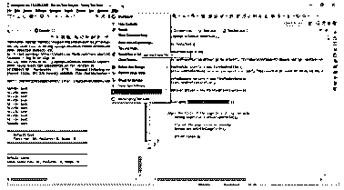
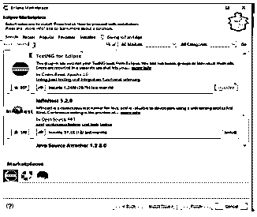
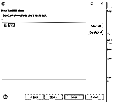
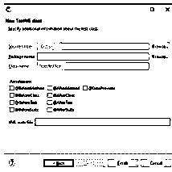
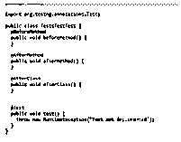
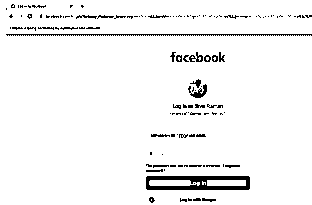
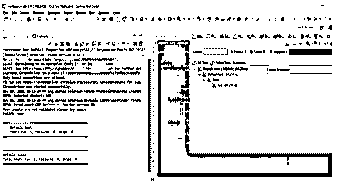

# 硒与测试

> 原文：<https://www.educba.com/selenium-with-testng/>

## 用 TestNG 介绍硒

selenium with testing 是开源自动化测试框架之一，类似于 JUnit 和 NUnit 工具的开发，它能够使 selenium 测试更容易理解报告生成，因为 selenium 没有任何内置框架，如内部和外部框架来完成测试报告，并且更容易简化用户测试要求，包括功能测试、回归测试和其他属于端到端案例测试的用例，它可以放入 java 编程语言的测试方法中。

### 带测试的硒概述

TestNG 是一个基于 Java 的开源测试自动化平台。它基于与 JUnit 和 NUnit 相同的原则。TestNG 有一些高级和有用的特性，这些特性使它成为比竞争对手更健壮的框架。NG 在 TestNG 中代表“下一代”。由于它使用大量注释、分组、依赖、优先级和参数化特征的简单性，它在测试用例构造中被开发人员和测试人员更普遍地使用。

<small>网页开发、编程语言、软件测试&其他</small>

Selenium 中主要有两种测试框架:

1.Junit
2。测试

### 为什么要将 TestNG 与 Selenium 一起使用？

我们可以使用 testng 工具在 Selenium 中创建测试结果，这样测试人员首选的工具就是 TestNG。因为它的主要优势，大多数 Selenium 用户更喜欢 Junit 工具。它可以通过使用 testng(一种类似于跨浏览器测试的工具)在多个 web 浏览器上运行。一些测试工具，如 TestNG Maven、Jenkins 和其他工具，可以很容易地与 TestNG 框架链接起来。这些工具有助于识别用例，并且已经被配置到 web 应用程序的测试框架中。默认的 Selenium 测试不会以一致的方式产生测试结果。我们可以使用 TestNG 报告工具在 Selenium 中创建测试结果。

### 带 TestNG 框架的 Selenium

Selenium TestNG 框架主要帮助生成报告，这些报告包含关于执行的测试用例数量的有用信息，包括通过、失败和跳过的测试用例。使用 TestNG 工具，在不同的 web 浏览器上运行许多测试用例是一种简单的方法。Web 驱动程序通常缺乏生成数据报告的本地机制，但是 TestNG 工具可以生成可理解格式的报告。TestNG 框架描述了如何以指定的格式编写测试和测试用例，并且它能够处理未识别的异常和其他相关数据，而不会过早地考虑终止测试执行。当我们创建一个具有指定数量的测试用例的报告时，必须在通过和失败的测试用例的数量中运行，还包括在正确的执行中跳过的测试用例的数量。

同时将几个测试用例转换成 testng.xml 配置文件，这有助于以更简单的方式对它们进行分组。我们可以设置测试用例应该首先运行的优先级。然后根据顺序，通过使用诸如“调用计数”之类的关键字，指定的测试用例可以无循环地运行几次，并且通过使用 testng(与跨浏览器测试相关的工具)可以在多个 web 浏览器上运行大量测试用例。通过使用这种自动化，诸如 TestNG Maven、Jenkins 等指定的工具可以很容易地与 TestNG 框架相链接，以便为指定的应用程序执行用户测试用例。

### 带 TestNG 设置的 Selenium:

1.首先我们必须在机器上安装和配置 java，然后我们导航到 Help ->Eclipse Marketplace

2.它将显示下面的表单，

3.并在搜索框中搜索 testNG，会显示如上截图
4 的结果。安装后，我们可以在文件选项卡中检查它，

5.导航到文件->新建->其他选项卡，如下图所示，
6。我们可以选择 TestNG 文件夹并在 TestNG 类上选择它，选择 Next

7.然后它会显示为 test()这样的方法，如果我们想启用这个方法，我们可以启用它，否则就不要使用它。

8.源文件夹和类名被自动添加到指定的文本框标签上，
9。如果需要，我们还可以添加包名，如果需要，我们还可以选择任何注释。一旦选择完成，它将创建如下。java 文件

### 通过测试创造硒

我们已经完成了上面描述的测试，首先，我们将能够在 Eclipse 控制台中或者在 test-output 文件夹中的 TestNG 报告下看到结果，这是当您在项目目录中运行第一个测试时自动创建的。我们可以把下面的例子作为参考，

**举例:**

`import org.openqa.selenium.By;
import org.openqa.selenium.WebDriver;
import org.openqa.selenium.chrome.ChromeDriver;
import org.testng.annotations.Test;
public class Tests {
@Test
public void test() throws InterruptedException {
System.setProperty("webdriver.chrome.driver", "C:\\Users\\Kripya-PC\\Downloads\\chromedriver_win32 (1)\\chromedriver.exe");
WebDriver dr = new ChromeDriver();
dr.manage().window().maximize();
dr.get("https://www.facebook.com/");
dr.findElement(By.id("email")).sendKeys("ramansiva57@gmail.com");
dr.findElement(By.xpath("//button[@name='login']")).click();
String a = dr.getTitle();
String b = "welcome";
if(a.equalsIgnoreCase(b))
{
System.out.println("your email is validated please enter the password");
}
else
{
System.out.println("Your inputs are not validated please try again");
}
}
}`

**样本输出:**

在上面的例子中，我们想测试一个像脸书这样的应用程序，通过 testNG 来执行和验证测试用例。在默认 testNG 中，报告将存储在测试输出文件夹中。

### 带有 TestNG 断言的 Selenium:

它表示已执行验证，以查看应用程序的条件是否符合预期。TestNG 给出的 Assert 类将用于在应用程序中创建断言。它有两种类型的断言，像硬断言和软断言。断言是应用程序的验证或检查点。

`Assert.assertEquals(actual result, expected result);
Assert.assertTrue(boolean condition)`

这些是一些硬断言，当我们转到软断言时，它不会抛出任何异常，如果断言失败，它将继续到断言语句的下一步。

### 结论

在 selenium 框架中，它有 n 个工具，如 Junit、TestNG，用于在应用程序中执行用户验收测试。它还将在验证用户条件后创建并制作报告来存储输入和输出。根据要求，它会检查不同的浏览器。

### 推荐文章

这是一个使用 TestNG 的 Selenium 指南。在这里，我们将讨论简介、概述以及为什么要将 TestNG 与 Selenium 一起使用？代码实现示例。您也可以看看以下文章，了解更多信息–

1.  [Selenium IDE 命令](https://www.educba.com/selenium-ide-commands/)
2.  [硒面试问题](https://www.educba.com/selenium-interview-questions/)
3.  [如何使用硒？](https://www.educba.com/how-to-use-selenium/)
4.  [Selenium Webdriver 命令](https://www.educba.com/selenium-webdriver-commands/)

