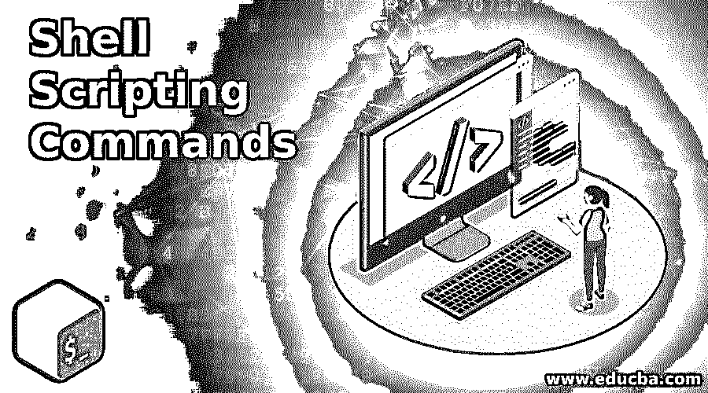
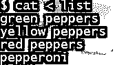
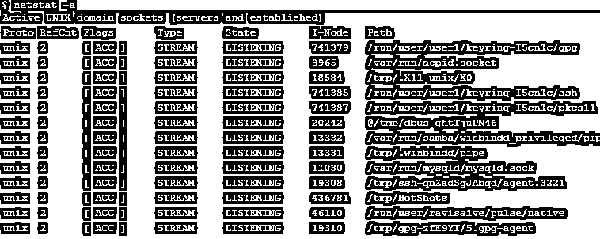
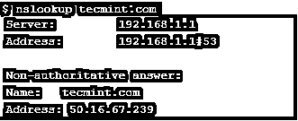
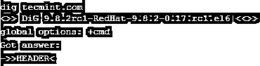
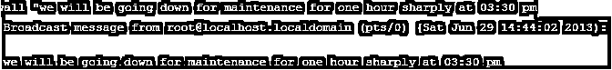
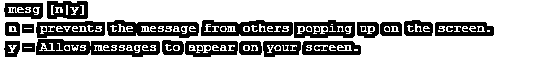
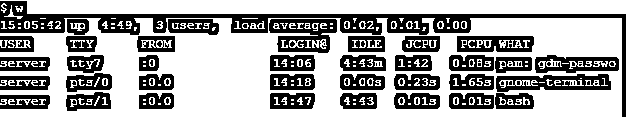
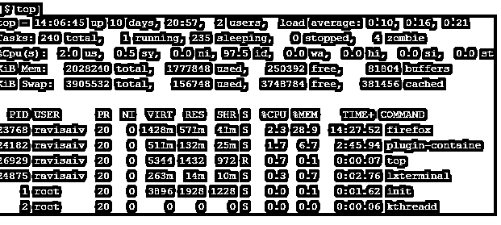

# 外壳脚本命令

> 原文：<https://www.educba.com/shell-scripting-commands/>

## Shell 脚本命令简介

你一定读过很多关于基于 UNIX 的系统在我们日常生活中有多重要的文章。你应该更喜欢基于 Unix 的系统而不是基于 Window 的系统，尤其是如果你属于技术领域的话。Linux 一直是一个非常流行的操作系统，因为它有高效的文件系统，健壮的结构，并且不容易受到攻击。操作系统主要由两部分组成内核和外壳。让我们稍微谈谈 [shell 脚本](https://www.educba.com/what-is-shell-scripting/)。在本文中，我们将详细讨论 shell 脚本命令。

外壳脚本是要执行的命令集，以便外壳可以执行它们。据说它是将长的、可重复的命令序列组合成一个脚本，以便在需要时执行。创建 shell 脚本的主要目的是减轻最终用户的负担。让我们借助一个例子来理解 shell 脚本。假设我们必须在一个特定的脚本中使用参数，那么我们只需要从#开始创建一个 shell 脚本！/bin/bash，然后通过用$符号参数化来回显您想要打印的文本。参数的数量可以写成$1、$2 等形式。

<small>网页开发、编程语言、软件测试&其他</small>

### 基本 Shell 脚本命令

基本的 shell 脚本命令有:

*   **回显命令**:回显命令用于打印。

*   **使用变量:**变量用来存储某个值，这样整个值就不需要重复，取而代之的是变量就可以使用了。

*   **Cat:** 这个 Shell 脚本命令用于显示文件内容。它是 Linux 中使用的非常重要的命令之一。

*   Grep: 另一个非常重要的命令，用于搜索文件中的特定文本，并为您生成与匹配的模式相关的输出。

*   **大于号(> ):** 如果您想将写在控制台上的文本保存到文件中，则使用此选项。

*   **Ls** :顾名思义，Ls 命令负责列出特定目录中的文件夹和文件。这个 shell 脚本命令通常会附加其他命令，如–ltr 或–lrt 等。这取决于需要。

*   **Piping ( | ):** 这是基于 Linux 的操作系统的另一个非常基本的命令，用于将从一个命令接收到的输出直接提取到另一个命令中。这个称为管道的符号通常与 grepping 命令一起出现。在某些地方，这种管道也可以说是链条。

*   **小于符号(< ):** 如果您希望直接从文件中获取输入，那么将使用<符号。

*   Pwd: 这是另一个非常基本的 Linux 命令，用于告知当前的工作目录，因此得名 Pwd。当你需要知道你在一个文件夹的哪个子文件夹时，这是非常重要的。

*   **Mkdir 和 cd:** 这两个命令齐头并进。一方面，Mkdir 负责创建或制作一个目录，另一方面，cd 用于通过遍历目录来改变目录。这些命令仅适用于目录/文件夹，不适用于文件。

### 中间外壳脚本命令

中间命令是:

*   **Ifconfig:** 用于了解网络基于内核的接口。该命令主要在引导时使用，以便在必要时了解和设置接口。否则，ifconfig 命令只有在需要进行一些系统调优或调试时才会发挥作用。

*   Netstat :这是 shell 脚本命令列表中最重要的一个命令。Netstat 用于显示网络相关信息，如路由表、网络连接、伪装连接、接口统计、多播成员等。下面截图中的后缀–a 用于列出所有网络端口。

*   **Nslookup** :这个 shell 脚本命令主要由基础架构管理人员和 [techOps/DevOps 团队](https://www.educba.com/itil-vs-devops/)使用，因为他们需要处理深层网络。这是一个基于网络实用程序的命令，显示互联网服务器的信息。它查询[域名服务器](https://www.educba.com/what-are-the-types-of-dns-servers/)，从而获取与服务器名称信息相关的结果。

*   **Dig** :这是另一个中间命令，用于查询域名服务器，并提供有关主机地址、名称服务器、邮件交换等信息。相关信息。它主要用于查询单个给定的主机。

### 高级 Shell 脚本命令

高级命令包括:

*   正常运行时间(Uptime):这是一个命令，用于跟踪任何可能影响您系统的恶意或异常活动。正常运行时间用于了解服务器无人值守时实际发生了什么。

*   **Wall:** 这是最基本的 shell 脚本命令之一，尤其是对于管理员来说，因为它可以用来向 n 个人广播消息，向所有那些 mesg 权限设置为 yes 的人广播消息。然后，该消息作为墙的参数提供，或者也作为墙的标准输入发送。

*   **Mesg:** 该命令允许您通过提供选项 y|n 来控制人们是否可以使用“write”

*   **w:** 这个命令虽然只是一个字母的命令，但却可以创造奇迹，因为它是 who 和 uptime 命令的组合，这些命令按顺序一个接一个地给出。

*   **top:** 用于显示一个 CPU 的所有进程。该命令最为人所知，因为它会自我刷新，并持续显示在某个时间点启动并运行的所有 CPU 进程，直到发出中断命令。

*   **重命名:**顾名思义，这个命令用来重命名一个文件名。

### 要使用的提示和技巧

使用 shell 脚本命令的技巧是，应该在操作是多余的地方使用它，这样它就可以自动化，因为创建一个 [shell 脚本](https://www.educba.com/shell-scripting-interview-questions/)的主要思想是减轻最终用户的负担。另一个技巧是在编写命令时使用 Tab 键来完成命令。

### 结论

Unix 中可能有无穷无尽的命令用于 shell 脚本编写，要掌握所有这些命令是不可能的。重点应该是加强基本的命令，并在时间允许的情况下与其他人合作。通过每天的练习，你一定会记住所有这些命令，甚至更多。我希望你喜欢这篇文章，继续阅读我们的文章。

### 推荐文章

这是一个 shell 脚本命令指南。这里我们已经详细讨论了基本和高级命令以及一些即时 shell 脚本命令。您也可以阅读以下文章，了解更多信息——

1.  [外壳脚本参数](https://www.educba.com/shell-script-parameters/)
2.  [用于 Shell 脚本中的循环](https://www.educba.com/for-loop-in-shell-scripting/)
3.  [Unix 中的 SED 命令](https://www.educba.com/sed-command-in-unix/)
4.  [外壳脚本的使用](https://www.educba.com/uses-of-shell-scripting/)

