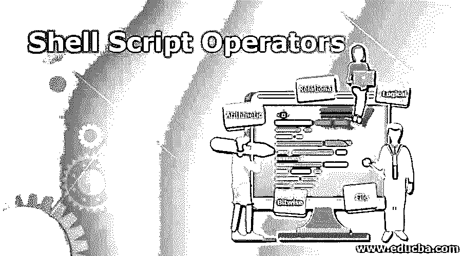
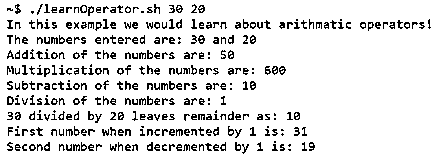
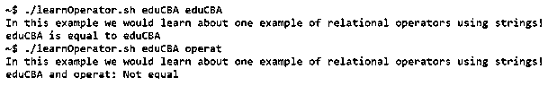

# 外壳脚本操作符

> 原文：<https://www.educba.com/shell-script-operators/>

## Shell 脚本运算符简介

在开始理解 shell 脚本操作符时，让我们听一个类似的故事，并开始构建一个相关的场景，以便更容易理解 shell 脚本中的操作符。在数学中，我们经常会遇到加法、减法、乘法和除法。这些是对两个或更多元素进行的一些非常基本的操作。在高阶中，我们也可能对单个操作数使用操作符。因此，扩展相同的用法和相似的概念，我们在 shell 脚本中有操作符。这些操作符不仅仅局限于数学中的数字或变量，甚至可以扩展到字符串、字符甚至文件。

### 外壳脚本运算符的类型

这些操作符被分为 5 种不同的类型，现在是时候一个一个地详细查看它们了。

<small>网页开发、编程语言、软件测试&其他</small>

#### 1.算术运算符

在第一类运算符中，我们有一个算术运算符。这被认为是我们在数学中使用的算子的扩展。我们已经很清楚这些操作符，但为了列出我们拥有的不同操作符，我们只列出了:

*   **加法运算符(+):** 该运算符用于两个操作数的相加。
*   **减法运算符(-):** 该运算符用于两个操作数的减法运算
*   **乘法运算符(*):** 该运算符用于两个操作数的乘法运算
*   **除法运算符(/):** 该运算符用于两个操作数的除法运算。它只给出商。
*   **模数运算符(%):** 该运算符用于估算一个操作数除以另一个操作数时的余数。
*   **递增运算符(++):** 该运算符用于将操作数的值递增 1。
*   **递减运算符(–):**该运算符用于将操作数的值递减 1。

#### 2.关系运算符

顾名思义，这些运算符致力于确定两个操作数之间的关系。在关系操作符的情况下，不管我们将使用哪种类型的操作符，输出要么为真，要么为假。这些关系运算符包括:

*   == '操作符:该操作符通过使两个操作数相等来计算它们，如果相等则处理输出为 true，否则处理输出为 false。这些运算符可以用于整数，也可以用于字符串。对于字符串，可以将它与[[一起用于模式匹配。
*   '!= '操作符:该操作符通过检查两个操作数是否相等来计算它们的值，如果相等则输出 true，否则输出 false。同样，对于这个操作符，可以将它用于整数和字符串。本质上，对于字符串，如果字符串不匹配，该操作符将返回 true。

*   < = '运算符:该运算符检查第一个操作数的值是否小于或等于第二个操作数的值，如果是，则返回 true，反之，则返回 false。这对于字符串是不存在的。
*   >'运算符:该运算符检查第一个操作数的值是否大于第二个操作数的值，如果是，则返回 true，反之则返回 false。不太广泛用于弦乐。
*   > = '运算符:该运算符检查第一个操作数的值是否大于或等于第二个操作数的值，如果是，则返回 true，反之则返回 false。此选项不适用于字符串。

#### 3.逻辑算子

这组运算符用于分析 2 组或更多组条件，并根据每组条件返回 true。

*   逻辑 AND 操作符:只有在两个条件都为真的情况下，这个操作符才会处理真，否则为假。
*   逻辑 OR 操作符:在任一边的任一条件为真的情况下，该操作符也将输出 true。
*   NOT 操作符:该操作符反转来自条件的输出，并将其显示为输出。

#### 4.按位运算符

这些操作符与逻辑操作符非常相似，只是这些操作符处理的是位模式。需要记住的一件重要事情是，<< or >>不是小于或大于，而是下面解释的东西。

一些运算符是不言自明的，它们是:

*   和(&)
*   或者(|)
*   异或(^)
*   致意
*   向左移动(<
*   向右移动(>>)

#### 5.文件运算符

难题的最后一部分是文件操作符，主要用于测试文件属性:

*   -b:检查文件是否是块特殊文件。
*   -c:检查文件是否是字符特殊文件。
*   -d:检查目录名是否存在。
*   -e:检查文件是否存在
*   -r:检查文件是否具有“读取”权限。
*   -w:检查文件是否有“写”权限。
*   -x:检查文件是否有“执行”权限。
*   -s:检查文件大小，如果大于 0，则返回。

### Shell 脚本操作符的示例

在这一节中，我们将最终理解我们在上一节中谈到的一些操作符的用法。考虑到您在本文中所花费的时间，我们将通过两个例子来说明，一个是整数，另一个是字符串，这样就可以清楚地了解运算符的用法。

#### 示例#1

**代码:**

`echo "In this example we would learn about arithmetic operators!"
a=$1
b=$2
echo "The numbers entered are: $1 and $2"
echo "Addition of the numbers are: $(($1 + $2))"
echo "Multiplication of the numbers are: $(($1 * $2))"
echo "Subtraction of the numbers are: $(($1 - $2))"
echo "Division of the numbers are: $(($1 / $2))"
echo "$1 divided by $2 leaves remainder as: $(($1 % $2))"
((++a))
echo "First number when incremented by 1 is: $a"
((--b))
echo "Second number when decremented by 1 is: $b"`

**输出:**

#### 实施例 2

**代码:**

`echo "In this example we would learn about one example of relational operators using strings!"
x=$1
y=$2
if [[ "$x" == "$y" ]];
then
echo "$x is equal to $y"
else
echo "$x and $y: Not equal"
fi`

**输出:**

### 结论

总之，操作符在确定一些子句条件时起着重要的作用，并且只允许根据具体情况执行一组命令。这组规则在与其他 shell 脚本功能产生共鸣时会带来奇迹，成为解决复杂问题的终极工具，并且只需少量编码！尝试使用整数的例子 2。会很好玩的！

### 推荐文章

这是一个 Shell 脚本操作符指南。这里我们讨论 5 种类型的 Shell 脚本操作符，并举例说明，以便更好地理解。您也可以阅读以下文章，了解更多信息——

1.  [外壳脚本参数](https://www.educba.com/shell-script-parameters/)
2.  [什么是 Shell 脚本？](https://www.educba.com/what-is-shell-scripting/)
3.  [外壳脚本命令](https://www.educba.com/shell-scripting-commands/)
4.  [Linux 中的 Bash Shell](https://www.educba.com/bash-shell-in-linux/)

