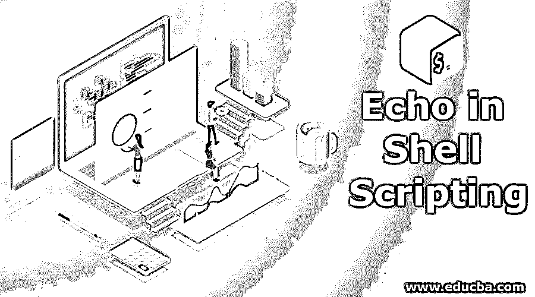

# Shell 脚本中的回显

> 原文：<https://www.educba.com/echo-in-shell-scripting/>

## Shell 脚本中的 Echo 简介

Echo 是 shell 脚本中的一个命令，它是一个内置命令，用于显示变量、表达式的结果、字符串、数字、文本、编程中的任何有用信息等。可以在 shell 脚本中使用 echo 命令显示。它在大多数编程语言中都可以使用，并且最常用于 [shell 脚本](https://www.educba.com/uses-of-shell-scripting/)中，其中 bash 和 c shell 是最常用的。这个命令也可以用来显示发送给 shell 程序的命令或参数。我们可以用 echo 命令做很多事情，比如显示特殊字符、换行符等。

**语法:**

<small>Hadoop、数据科学、统计学&其他</small>

`echo [option] [string]`

在上面的 echo 语法中，方括号中的 option 和 string 是可选参数，并不一定要提供给 echo 命令。方括号中的选项语句用于提供一个选项列表，通过它我们可以使用 echo 命令做更多的事情，而字符串是一系列字符(如数字、字符、符号、特殊字符)或单词等。

当我们在没有任何选项或字符串的情况下使用 echo 命令时，echo 命令将显示一个新行，因为我们在 echo 后按 enter 命令，所以它将转到新行。如果我们执行一个 echo 命令，后面跟着一个单词序列，那么所有的单词将按照我们输入的顺序显示。

### Echo 在 Shell 脚本中是如何工作的？

echo 命令用于显示变量、文本、字符串、数字或单词列表，后跟 echo 命令、传递给 shell 脚本的参数，因此所有内容都将显示在控制台上。echo 命令也用于显示一个我们已经赋值的变量。如果我们没有为 echo 命令提供任何选项或字符串，它将显示一个新行，同样，如果我们有单词列表，后跟 echo 命令，然后输入它，它将按相同的顺序显示所有单词，没有必要使用单引号或双引号提供单词列表，它不会显示在屏幕上。

当我们想使用 echo 命令显示一个变量时，我们需要输入 echo 命令，后跟一个$变量名，在$和变量名之间有空格或空白，这样 shell 就会知道它需要替换为存储在变量中的实际值。我们可以使用 echo 命令来显示系统上的环境变量，在环境变量名称前使用$如下所示:

`x = 5
echo $x
echo $PATH (here PATH is an environment variable on any system)`

我们可以为 echo 命令提供选项，比如–e，这将使 echo 解释 q 换行符、特殊字符等的附加实例。以便考虑额外的换行符、制表符或特殊字符，并在更改后格式化字符串并显示在控制台上。我们也可以打印所有的文件。txt 扩展名，在扩展名前面使用特殊字符*，这样 echo 将列出当前工作目录中具有给定扩展名的所有文件。例子是 echo”列表。txt 文件" *。文本文件（textfile）

### Shell 脚本中的回显示例

到目前为止，我们已经了解了什么是 shell 脚本中的 echo 命令，它的语法，以及它如何在 shell 脚本中工作。现在，让我们分别通过示例和解释来看看如何在不同的场景中使用 echo 命令。

#### 示例# 1–在控制台上显示文本或字符串

`echo hello, this is world`

在上面的示例中，我们在标准输出或终端或控制台上显示文本“hello，this is world ”,使用 echo 命令，后跟与上面示例类似的文本或字符串。

**输出:**
T3】

#### 示例 2–在控制台上显示变量值

`x = 20
echo $x`

在上面的例子中，我们声明了一个变量，并给它赋值 20。现在我们想在控制台上显示变量值，方法是使用 echo 命令后跟$和变量名，它将在控制台或标准输出上显示 20。

**输出:**

#### 示例 3–删除给定字符串中的空格并显示在控制台上

`echo -e  “This \bis \bnew \bworld”`

在上面的示例中，我们使用选项–e 来解释特殊字符，如\b，它是一个反斜杠，后跟 backspace，用来删除给定字符串中的所有空格，echo 命令并排显示所有单词，不带任何空格。

**输出:**

#### 示例# 4–在控制台上显示由垂直制表符分隔的字符串

`echo –e “\vThis \vis \vnew \world”`

在上面的例子中，我们再次使用了选项和特殊字符 v，前面加了反斜杠，这将告诉 shell 使用 options 命令来解释，以在控制台上显示由垂直制表符分隔的给定字符串。

**输出:**

#### 示例# 5–打印当前目录中的所有文件或文件夹

`echo *`

在上面的示例中，我们试图显示当前目录中的所有文件、文件夹和任何其他类型的内容，其中*是一个特殊字符，它将获取当前目录的所有详细信息并显示在控制台上。

**输出:**

我们有如此多的参数可以和选项一起使用，以实现不同的事情，例如-n 用于如果我们不想打印尾随换行符，\r 是一个回车符，它使得在回车符之前的句子被丢弃，\t 是一个水平制表符，它使得给定字符串的格式在水平方向上有一个制表符空间，等等。

### 推荐文章

这是 Shell 脚本中 Echo 的指南。在这里，我们用不同的例子讨论基本概念、语法、echo 如何在 shell 脚本中工作。您也可以看看以下文章，了解更多信息–

1.  [用于 Shell 脚本中的循环](https://www.educba.com/for-loop-in-shell-scripting/)
2.  [批量脚本命令](https://www.educba.com/batch-scripting-commands/)
3.  [外壳脚本参数](https://www.educba.com/shell-script-parameters/)
4.  [什么是 Shell 脚本？](https://www.educba.com/what-is-shell-scripting/)

