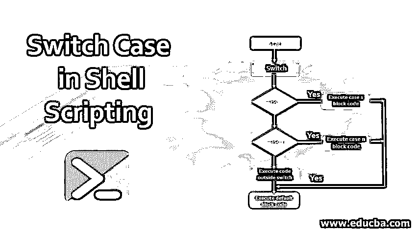
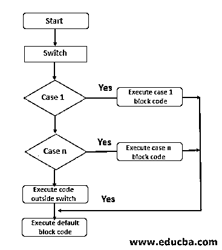
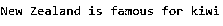
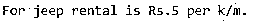
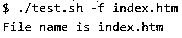

# Shell 脚本中的切换大小写

> 原文：<https://www.educba.com/switch-case-in-shell-scripting/>

## Shell 脚本中切换大小写的介绍

当我们需要执行多级检查时，我们可以使用多个 if 和 else 条件或嵌套的 if-else 分支，但当我们需要对特定变量执行所有条件操作时，最好使用 switch case。在[外壳脚本](https://www.educba.com/what-is-shell-scripting/)中，使用关键字 case 和 esac 表示开关情况，这将进行多级分支，并以比多个 if-else 条件更好的方式进行检查。Switch case 将需要一个表达式，它需要对该表达式求值，并且需要根据表达式的结果执行多个操作。因此，当我们想要对单个表达式的结果执行不同的操作时，我们将使用 switch case 条件语句。

### Shell 脚本中切换大小写的语法

shell 脚本中 switch case 的语法可以用两种方式表示，一种是单模式表达式，另一种是多模式表达式。现在让我们来看看。

<small>Hadoop、数据科学、统计学&其他</small>

#### 第一语法方法

现在，我们将看看具有单一模式的 switch case 条件语句的语法。

**语法:**

`case $var in pattern) commands to execute;;
pattern1) commands to execute;;
pattern2) commands to execute;;
pattern3) commands to execute;;
*)
Default condition and commands to execute;;
esac`

在上面的 switch case 语法中，模式中的$var 是一个条件表达式，如果它的计算结果为 true，则执行与之对应的命令，就像它将检查所有条件模式一样，如果没有满足或计算结果为 true，则执行默认条件下的命令。默认条件是可选的，但最好有它。当一个条件匹配时，则”；;"指示控制需要转到 switch case 语句的末尾。

#### 第二语法方法

现在，我们将看看具有多种模式的 switch case 条件语句的语法。

**语法:**

`case $var in pattern|pattern1|pattern2) list of commands need to execute;;
pattern3| pattern4| pattern5) list of commands need to execute;;
pattern6) commands need to execute;;
*)
Default condition and statements need to execute
esac`

在上面的 switch case 语法方法中，我们使用 or 条件将单个$var 与多个模式进行比较。如果其中一个条件匹配且评估为真，则相应的语句将执行，直到“；;"它指示该条件语句的结束。*)表示缺省条件和需要执行的语句的开始，esac 表示开关情况的结束[。我们可以在模式中包含通配符、正则表达式。条件检查将持续进行，直到找到模式，否则将执行默认语句。](https://www.educba.com/python-switch-case/)

### 开关箱流程图

shell 脚本中开关情况的流程图如下，我们也将通过一个简单的例子来解释。下面解释了 switch case 语句的一个示例。

**代码:**

`fruit = “kiwi”
case $fruit” in “apple”) echo “apple is tasty”;;
“banana”) echo “I like banana”;;
“kiwi”) echo ”Newzeland is famous for kiwi”;;
*)
Echo “default case”;;
esac`

**流程图:**

在上面的 switch 案例中，我们有一个值为 kiwi 的变量，我们有 3 种模式。它在前两个条件语句中不满足或计算为 true，在第三个条件语句中计算为 true，然后执行该语句，控制到达 switch case 语句的末尾。在上面的例子中，首先，条件模式是 apple，它不等于 kiwi，所以它的计算结果为 false，第二个是 banana，它也不匹配，计算结果为 false，第三个语句是 kiwi，它匹配，如果它也不匹配，那么它将在 switch 情况下执行 default 语句，最后它到达 switch 情况的末尾。

**输出:**

### Shell 脚本中的 Switch Case 是如何工作的？

我们已经讨论了什么是开关情况，它的语法是什么。现在，我们将详细了解它如何在 shell 脚本中工作。最初，我们用一个表达式或值初始化一个变量，条件语句检查它是否满足任何条件，如果是，那么它将执行相应的命令，直到找到；;其指示该条件的命令的结束。它将检查条件，直到它满足，否则它将退出开关盒。如果有一个默认案例，那么它将执行其中的命令，而不是退出开关案例。让我们举一个简单的例子，看看它是如何工作的，如下所示:

让我们举一个简单的例子，看看它是如何工作的，如下所示:

**代码:**

`mode = “jeep”;
case $mode in “lorry") echo "For $mode, rent is Rs.40 per k/m.";;
"jeep") echo "For $mode, rent is Rs.30 per k/m.";;
*) echo "Sorry, I cannot get a $mode rent for you!";;
esac`

在上面的例子中，变量 mode 用 jeep 初始化，它检查 switch case 中的所有条件，执行它满足的命令，然后退出 switch case 语句。在这种情况下，它满足 jeep 条件，执行带有显示消息的命令，并从 switch case 语句中出来。

**输出:**

### Shell 脚本中的 Switch Case 示例

让我们来看看开关案例的不同之处，以及它们是如何工作的，每个例子试图做什么，解释如下。

#### 示例#1

在本例中，我们试图告诉计算机它需要根据日期进行备份。

**代码:**

`NOW=$(date +"%a")
case $NOW in Mon) echo "Full backup";;
Tue|Wed|Thu|Fri) echo "Partial backup";;
Sat|Sun) echo "No backup";;
*) ;;
esac`

在上面的例子中，我们现在分配了一个日期，我们正在检查语句，这里日期是动态分配的，所以这个程序的输出将根据您执行这个程序的日期而改变。在这种情况下，它将显示部分备份作为输出。

**输出:**

#### 实施例 2

在本例中，我们试图根据车辆的类型(如自行车、吉普车、自行车、汽车等)来了解车辆的费用。

**代码:**

`mode = “bike”;
case $mode in "sportscar") echo "For $mode, rent is Rs.20 per k/m.";;
"lorry") echo "For $mode, rent is Rs.50 per k/m.";;
"sumo") echo "For $mode, rent is Rs.30 per k/m.";;
"bicycle") echo "For $mode, rent is Rs. 5 per k/m.";;
*) echo "Sorry, I can not get a $mode rent for you!";;
esac`

在上面的例子中，我们在变量中有一辆自行车，并检查所有条件，但不幸的是，我们没有找到任何匹配的条件。所以它会执行交换机的默认命令并退出。在这种情况下，它会显示一条抱歉消息。

**输出:**

#### 实施例 3

在上面的例子中，让我们试着给 shell 脚本传递一个参数，这个参数将与条件进行比较。

**代码:**

`option="${1}"
case ${option} in -f) file="${2}" echo "file name is $file" ;;
-d) dir="${2}" echo "dir name is $dir" ;; *)
esac`

在上面的例子中，我们将向 shell 脚本传递一个参数，根据这个参数，它将默认执行文件或目录，并显示 shell 脚本的用法。如果我们传递-f 和 filename，它会显示文件名，等等。

**输出:**

### 结论

最后，它概述了 shell 脚本中的开关情况。到目前为止，我们已经讨论了什么是 switch case，它的语法，它是如何工作的，它的流程使用了流程图和示例，不同的示例显示了 shell 脚本中 switch case 语句的用例。我希望在阅读完这篇文章后，您会对 shell 脚本中的切换情况有更好的理解。

### 推荐文章

这是一个在 Shell 脚本中切换大小写的指南。这里我们讨论 shell 脚本中 switch case 的语法、工作和流程图，以及它的例子和实现。您也可以阅读以下文章，了解更多信息——

1.  [VBScript 是什么？](https://www.educba.com/what-is-vbscript/)
2.  [Linux 应用程序](https://www.educba.com/linux-apps/)
3.  [什么是 Unix Shell？](https://www.educba.com/what-is-unix-shell/)
4.  [PowerShell 操作员](https://www.educba.com/powershell-operators/)
5.  [Shell 脚本在各个领域的 5 大应用](https://www.educba.com/uses-of-shell-scripting/)

