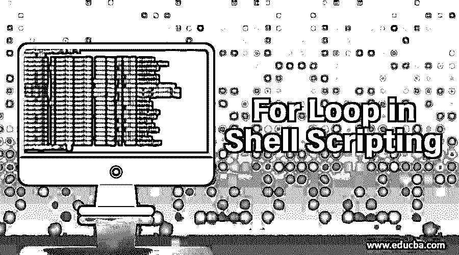
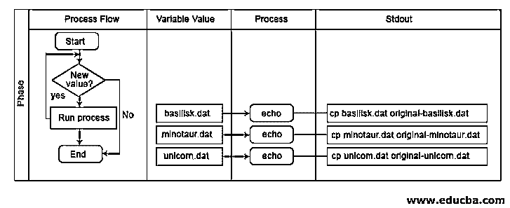
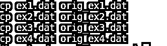
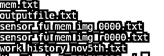
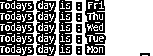
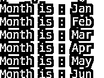
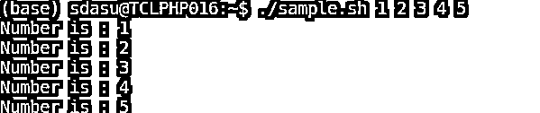

# Shell 脚本中的 For 循环

> 原文：<https://www.educba.com/for-loop-in-shell-scripting/>

## Shell 脚本中的循环概述

[Shell 脚本中的循环，](https://www.educba.com/what-is-shell-scripting/)假设我们想要重复执行一项任务或操作，我们可以多次编写相同的代码，这是一项耗时的任务，效率也不高。为了避免这种情况，我们可以在编程语言中使用类似[的循环。因此，](https://www.educba.com/loops-in-java-programming/) [for loop 用于](https://www.educba.com/for-loop-in-powershell/)执行特定的任务，如加法/乘法或任何其他操作一定次数，直到在任何操作系统中满足终止条件。我们不需要通过使用 for 循环反复编写相同的代码。

### for 循环的语法

shell 脚本中 for 循环的语法可以用以下不同方式表示:

<small>Hadoop、数据科学、统计学&其他</small>

#### 1.第一语法方法

`for var in list
do
command1
command2
done`

在上面的例子中，我们有预定义的关键字或内置关键字，如 for、do、done 和 in。而 list 是变量列表或单词列表或数字列表，var 是迭代过程中的变量名。如果没有提供列表，那么 bash 将接受我们在 shell 中传递的位置参数。在上面的 for 循环中，它将执行 do 和 done 之间的所有命令 n 次，其中 n 是列表的大小。例如，如果列表的大小是具有从 1 到 5 的数字的 5，那么在第一次迭代期间，1 将被存储在 var 中，并且对 var 的操作将由命令所在的 For 循环体来执行。

#### 2.第二语法方法

`for ( ( expr1; expr2; expr3 ))
do
command1
command2
….
done`

在上面的语法中，如果我们观察到这个语法类似于 c 编程语言中 for [循环的语法。在 for 循环中，有三个表达式，第一个表达式用于初始化，第二个用于条件检查，第三个用于更新迭代器。上述 for 循环的执行将像这样开始，在执行第一次迭代 expr1 之前，这意味着将在 do 和 done 之间的操作/命令迭代执行之后进行初始化，直到 expr2 评估为 true，并且在每次迭代之后，expr3 更新迭代器值(计数器),以便对列表、数组或字符串中的下一个元素或值执行操作。](https://www.educba.com/best-programming-languages/)

### 流程图–外壳脚本中的循环

让我们考虑一个 for 循环的例子，并使用流程图讨论它的流程。

`for filename in *.dat
do
echo cp $fname orig_$fname
done`

在上面的流程图中，我们解释了遍历文件名列表的 for 循环的流程，流程中有四个步骤，如流程流、变量值、流程和标准输出。在流程中，解释 for 循环何时开始，迭代器值，检查条件是否满足，然后运行流程，否则结束流程。在变量值中，一次迭代一次迭代，我们将在其中获得一个文件名，如 textfile.dat，在此过程中，它执行 echo 语句，在 stdout 上显示带有旧文件名和新文件名的 copy 语句。这是 for 循环的流程，遍历输入文件名列表。

**输出:**

### Shell 脚本中的 for 循环是如何工作的？

每当 shell 看到关键字时，shell 脚本中的 For 循环以如下方式工作，因为它知道需要对列表中的每个项目重复一组命令。每次迭代运行时，列表中的一项被分配给变量 var，var 通过在进行和完成之间的循环中出现的命令列表被处理，在移动到列表中的下一项或下一次迭代之前被执行。我们将在变量前使用$来访问 var 中的值，这样当 shell 脚本处理它时，var 中的值就会代替它。

**举例:**

`for filename in *.txt
do
ls filename
done`

在上面的程序中，我们传递了一个。txt 文件作为 for 循环的输入，变量名是一个文件名，其中。txt 文件将存储文件名，然后通过列出。txt 文件，然后重复同样的过程，直到所有的。txt 文件处理完毕。

**输出:**

### for 循环的示例

到目前为止，我们已经讨论了 [for loop 如何在 shell 脚本和不同的语法中工作](https://www.educba.com/for-loop-in-matlab/)。现在，让我们来看几个例子，浏览它们，并解释它的每一个例子

#### 示例#1

让我们将静态值列表作为 for 循环的输入，它将如何执行将如下所示:

`for a day in Fri Thu Wed Tue Mon
do
echo “Todays day is $day”
done`

在上面的示例中，我们不应该使用作为分隔符来传递输入值，如果我们传递它，将会认为分隔符也是一个类似“Fri”的值，并且我们不应该使用双引号来列出值。如果我们使用双引号来传递值，shell 脚本将会把所有值视为单个值。

一个 o/p 的例子:今天是:Fri 周四周二周一(如果我们使用双引号)

**输出:**

#### 实施例 2

现在让我们看另一个例子，在输入列表前使用 in with for，如下所示:

`Month = “Jan Feb Mar Apr May Jun”
for mon in $Month
do
echo “Month is $mon”
done`

在上面的例子中，我们执行了与上面例子相同的 for 循环，但是不是使用输入列表，而是使用“In”关键字。在 shell 脚本中，每个变量都需要用双引号来表示，但也有一些例外，例如，如果我们在上面的循环行的$Month 中使用双引号，那么它会将整个单词视为一行。所以我们需要好好照顾它。

**输出:**

#### 实施例 3

现在，我们将在 for loop 语句中编写不带输入列表的 for 循环，它将从位置参数中获取输入到脚本和示例中，如下所示:

让我们将 shell 脚本命名为 sample.sh，其内容如下:

`for num
do
echo “Number is $num”
done
./sample.sh 1 2 3 4 5`

在上面的例子中， [for 循环的输入是从提供给脚本的参数列表中传递的](https://www.educba.com/for-loop-in-unix/),因此对于每个参数，它将处理所有命令并显示输出，直到所有参数都被迭代。

**输出:**

### 结论–外壳脚本中的 For 循环

最后，这都是关于 shell 脚本中的 for 循环。我们已经讨论了什么是 shell 脚本中的 for 循环、for 循环语法、解释 for 循环流程的流程图、for 循环在 shell 中如何工作以及 shell 脚本中 for 循环的示例。我希望你在读完这篇文章后能很好地理解这个循环，如何[在 shell 脚本](https://www.educba.com/uses-of-shell-scripting/)中使用它并执行它。

### 推荐文章

这是 Shell 脚本中 For 循环的指南。这里我们讨论一下简介，for 循环如何在 shell 脚本中工作，流程图和 for 循环的例子。您也可以浏览我们推荐的其他文章，了解更多信息——

1.  [R 中的循环](https://www.educba.com/loops-in-r/)
2.  [Spark SQL 数据帧](https://www.educba.com/spark-sql-dataframe/)
3.  [多维数据库](https://www.educba.com/multidimensional-database/)
4.  [数据可视化的优势](https://www.educba.com/benefits-of-data-visualization/)
5.  [外壳脚本功能指南](https://www.educba.com/function-in-shell-scripting/)
6.  [Shell 脚本中 Echo 的不同示例](https://www.educba.com/echo-in-shell-scripting/)
7.  [什么是 Bash？](https://www.educba.com/what-is-bash/)

