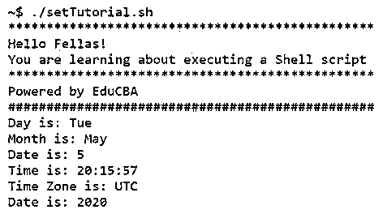
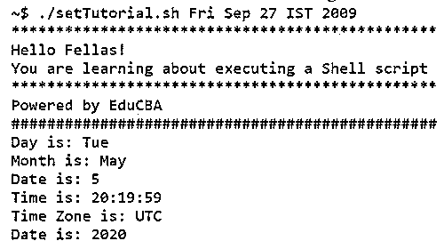
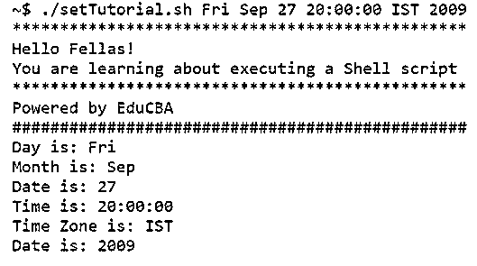

# 外壳脚本集

> 原文：<https://www.educba.com/shell-script-set/>

## Shell 脚本集简介

就设置 cron 作业或执行一些重复的命令集来完成任务而言，Shell 脚本已经成为日常工作的基本工具。在 Linux 操作系统中，shell 脚本也可以作为根用户使用，在系统级别完成所需的操作。操纵文件、执行例行备份、系统监控是每天都要用到 shell 脚本的一些例子。说到设置 shell 参数，总有适合您的。

### 什么是 Shell 脚本集？

在 shell 脚本中，用户可能需要更改 shell 选项或位置参数，或者使用这些选项或参数来帮助显示 shell 变量的名称和值，这是非常需要 set 命令帮助的地方。

<small>网页开发、编程语言、软件测试&其他</small>

**set 命令的语法如下:**

`set [--xvutpnmkhfebaTPHECB][-o <option name>][argument]`

“-”和“-”中的所有选项包括 set 命令的各种灵活性，以执行日常工作中分配给它的各种作业。在随后的段落中，我们将详细介绍 set 命令提供的每个选项，并了解为什么要使用这些选项以及在什么情况下应该使用它们。

让我们从语法的编写顺序开始，从 x 开始:

*   **–x:**使用此选项，用户可以打印简单命令、for 命令、case 命令、select 命令、算术情况下的命令的轨迹及其拥有的参数结构。对于调试来说，这是最有用的特性之一。
*   **–v:**这也是一个用于调试目的的选项，它使脚本能够在执行时读取行。这在脚本中没有广泛使用，因为它不像–x 那样直接追溯到错误的根本原因。
*   **–u:**在 bash 中，当需要参数扩展时，该选项用于将除“@”和“*”以外的任何未设置的参数视为错误。在退出 shell 之前，屏幕上会显示错误消息。
*   **–t:**在极不可能的情况下，只读取单个命令并退出 post，使用该命令。这并没有被广泛使用，因为脚本是为了执行多个命令而编写的，拥有这个选项会扼杀使用 shell 脚本的动机。在脚本中断的情况下，这个选项被频繁使用。
*   **–p:**该选项启用特权模式。特权模式是一种通过限制任何潜在危险操作的执行来增加安全性的方式。它通过给予“低权限”访问来减少攻击的机会，这样任何操作都不能欺骗 linux 来执行一些错误的任务。
*   **–n:**该选项主要用于在实际执行命令之前检查语法。在这个选项中，命令不被执行，只是被读取。
*   **–m:**使用此功能，用户可以启用作业控制。在运行任何进程的情况下，它们在单独的组中执行，使用此选项，用户可以通过暂停一段时间并重新启动来控制作业。
*   **–k:**使用此选项允许将所有赋值语句放置在环境中。
*   **–h:**这是一个默认启用的选项，当命令被查找执行时，命令被定位和记忆。
*   **–f:**此选项允许禁用任何文件名扩展。
*   **–e:**此选项启用任何管道，由单个简单命令或一个列表或一个复合命令组成，已返回非零状态。
*   **–b:**在 shell 脚本中使用此选项会立即报告任何终止的后台作业。
*   **–a:**该选项使用户能够为每个变量或函数赋予导出属性，允许它们被标记为导出，用于环境的后续命令。
*   **–T:**这允许调试和返回中的任何陷阱被 shell 函数或命令继承。
*   **–P:**该选项设置时不允许解析符号链接。例如，使用 cd 执行目录更改时，如果设置了选项，则会使用物理目录。
*   **–H:**该选项允许在'！'中进行历史替换风格。默认情况下，大多数交互式 shell 都有这个设置。
*   **–E:**和–T 一样，这个–E 选项允许 ERR 中的 trap 被 shell 函数继承。
*   **–C:**此选项主要用于避免覆盖任何现有文件，当使用“>”、“>”、“< >”进行输出重定向时。
*   **–B:**这使得壳能够执行支撑扩展。大括号扩展只不过是一种生成任意表达式的机制。

### Shell 脚本集的示例

下面是一些例子:

#### 示例#1

在我们的例子中，我们将主要看到如果用户忘记通过命令行指定任何一个参数，如何使用 set 命令。首先，让我们不要发送任何参数，在脚本中，我们将设置时间，并从日期本身获取所有参数。

在 Linux 中，日期被写成 UTC 2020 年 5 月 5 日星期二 20:12:29。

这里变量的时间顺序是:

1:周二

2:五月

3: 5

4: 20:12:29

5:世界协调时

6: 2020

在第一次执行时，我们不会发送任何参数，系统会自动从我们的脚本中取出变量，并相应地显示出来。

**输出:**

#### 实施例 2

在下一组示例中，我们将提供除时间之外的所有参数，并让我们看看从中得到了什么输出。最终，我们应该得到与上面相同的输出，因为如果参数数量不等于 6，我们的代码将使用 set 命令。

**输出:**

一旦数字等于 6，我们将使用通过命令行传递的参数，输出也将与参数一致。

**输出:**

### 结论

总之，我们现在知道在 shell 脚本的日常执行中有无数的选项可以使用 set 命令，这完全取决于我们要解决的问题。例如，如果脚本要求更高的安全性，人们会更愿意使用–p 选项等等。欢迎您在您的脚本中使用这些命令和选项，并查看 set 命令为您的脚本结果需求带来的奇迹。最后，我们想说的是，这个命令是一个未开发的宝藏，有很多东西可以带到脚本执行的桌面上。

### 推荐文章

这是一个外壳脚本集指南。这里我们讨论一下 shell 脚本的介绍，什么是 Shell 脚本集？并分别举例说明。您也可以看看以下文章，了解更多信息–

1.  [如果在 Shell 脚本中为 Else](https://www.educba.com/if-else-in-shell-scripting/)
2.  [外壳脚本中的变量](https://www.educba.com/variables-in-shell-scripting/)
3.  [Shell 脚本中的 While 循环](https://www.educba.com/while-loop-in-shell-scripting/)
4.  [Shell 脚本中的函数](https://www.educba.com/function-in-shell-scripting/)

