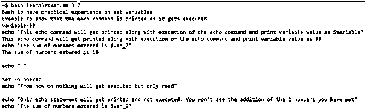

# Bash 设置变量

> 原文：<https://www.educba.com/bash-set-variables/>

## Bash 集合变量简介

因此，首先，让我们从理解 bash 中可用的不同类型的变量开始。其中，一个对应于包括设置命令变量的系列。但是在我们开始之前，变量是一个存储元素，它在赋值时存储值。虽然变量名本身是一个字符串，但它可以存储的值并不一定也是一个字符串。甚至一个整数，任何十进制数，甚至对象都可以存储在变量中。

### Bash 集合变量的类型

有 3 种不同形式的变量:

<small>网页开发、编程语言、软件测试&其他</small>

*   **局部变量:**当一个 bash 进程被创建时，如果一个变量的存在只限于这个进程，而不是 bash 启动的任何子进程，那么这个变量就被称为局部变量。
*   **环境变量:**为了成功执行一个 bash 进程，必须为我们工作的环境设置一些变量，以便子进程可以在执行期间访问这些变量，并且需要在每个单独的子进程中初始化这些变量。
*   **Bash 的变量:**为了 Bash 的顺利执行，可能需要设置一些变量，因此这些变量属于其他类型的变量。

### Bash 设置变量和描述

现在，我们将在讨论 set 命令的同时扩展环境变量，并讨论用于各自指定任务的不同变量。但在此之前，让我们看看语法，这是一个相当简单的记忆和遵循。

**语法:**

`set -o <variable name>`

<>括号中提到的选项表示我们将在下表中列出的不同选项:

| **设置变量** | **使用说明** |
| **全部导出** | 为了构建功能，我们需要将变量导出到环境中，以便任何子流程都可以使用它，我们需要 allexport 的帮助来导入所有变量。如果不启用该选项，变量将不再是环境变量的一部分，因此仅限于进程运行的 bash。 |
| **braceexpand** | 顾名思义，是用来做支架扩张的。大括号扩展只是在执行时扩展字符串的一个花哨名称。例如，在执行大括号扩展后，可以重用文件路径，而不是一次又一次地写它。 |
| **emacs** | 此变量用于启用 emacs 风格的界面，以便在命令行中进行编辑。 |
| **errexit** | 万一 bash 运行的脚本中出现非零状态，bash 会自动出错。 |
| **错误跟踪** | 如果您使用过另一种编程语言，那么当错误发生时，您将有机会查看跟踪列表。这种跟踪使人们能够准确地找出问题所在。 |
| **哈斯哈尔** | 该变量广泛用于在查找执行命令时记住命令的位置。这有助于将它们保存在一个地方，以便更快地执行。 |
| **ignore of** | 同样，在这个变量中，命名解释了一切，它忽略了 EOF，这意味着如果想要使用 Ctrl + D 并保持 bash 工作，那么必须使用 ignoreeof。 |
| **历史** | 命令历史被启用，并帮助您使用向上箭头查看以前使用过的命令。 |
| **监视器** | 该变量使用户能够在执行期间控制作业。 |
| **noexec** 的缩写 | 这也是 bash 中广泛使用的变量之一，它使您可以不执行 bash 中的命令，而是读取它们来查找任何活动的语法错误。这有助于在 bash 脚本出错时不浪费执行时间。 |
| **通知** | 如果想生成一个后台进程状态的报告，这就是你要执行的变量。 |
| **啰嗦** | 当这个变量打开时，输入行在被读取时被打印。这是为了调试的目的，以防有人需要知道在哪一行有错误。 |
| **我们** | 使用最广泛的“vi 风格编辑器”是使用这个变量。 |
| **xtrace** | 顾名思义，这是为了追踪错误的根源，这是通过打印出命令及其参数来实现的。 |

### 实现 Bash 集合变量的示例

以下是 Bash 集合变量的示例:

**代码:**

`#!/bin/bash
echo "Bash to have practical experience on set variables"
var_2=$(($1+$2))
echo "Example to show that the each command is printed as it gets executed"
set -o verbose
variable=99
echo "This echo command will get printed along with execution of the echo command and print variable value as $variable"
echo "The sum of numbers entered is $var_2"
echo " "
set -o noexec
echo "From now on nothing will get executed but only read"
echo "Only echo statement will get printed and not executed. You won't see the addition of the 2 numbers you have put"
echo "The sum of numbers entered is $var_2"`

**输出:**

### 结论

至此，我们已经结束了这篇文章，在 n 中，我们已经讨论了 bash 中最广泛使用的变量。这些变量不仅为您提供了调试、跟踪、语法检查等大量选项，从而简化了 bash 的工作。而且还为程序员提供了一个正式的流程来控制代码流！最后，我们将结束这篇文章，直到我们在学习狂欢系列的另一部分中相遇，并以 EduCBA 的方式 shell！

### 推荐文章

这是 Bash 设置变量的指南。在这里，我们讨论 Bash 集合变量的介绍及其示例和代码实现。您也可以浏览我们推荐的其他文章，了解更多信息——

1.  [如何在 Shell 脚本中声明变量？](https://www.educba.com/variables-in-shell-scripting/)
2.  【While 循环在 Shell 脚本中是如何工作的？
3.  [Shell 脚本中的循环介绍](https://www.educba.com/loops-in-shell-scripting/)
4.  [Shell 脚本的 5 大用途](https://www.educba.com/uses-of-shell-scripting/)

