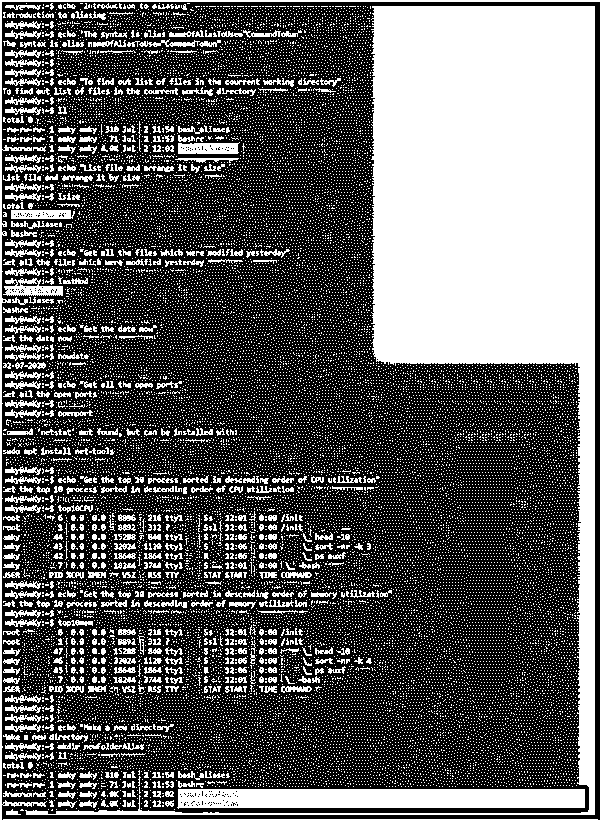

# Bash 别名

> 原文：<https://www.educba.com/bash-alias/>

## Bash 别名介绍

在 bash alias 的文章中，我们将首先研究 bash 中该特性的含义和意图。理解其意图将为理解在现实生活中你将能够在哪里使用特定的特性开辟道路。Bash alias 是一种补充或覆盖特定定制 Bash 命令的方法。这样做的目的是防止我们输入长命令。使用别名，可以很容易地将长命令简化为一个单词。这样做，可以减少反复编写命令的时间和精力。在本文中，我们将研究一些这样的方法，并通过例子来帮助我们达到预期的结果。在这方面，我们也有一些带你经历现实生活场景的例子！

**语法:**

<small>网页开发、编程语言、软件测试&其他</small>

对于 bash 来说，别名声明非常简单。简单来说，我们将语法总结为:

`alias nameOfAliasToUse=“CommandToRun”`

在这里，nameOfAliasToUse 只不过是使用这个名称时需要执行的命令的简化版本。例如，在让它执行 clear 应该做的任务时，使用 cl 而不是 clear 可能是很天真的。在双引号中，需要给出在 bash 终端中输入 nameOfAliasToUse 时期望运行的命令。在我们的例子中，我们可以自信地说，AliasToUse 的名称被 cl 替换，CommandToRun 被 clear 替换。

首先，您需要创建一个名为。bash _ 通过在 touch ~/中键入别名。bash_aliases，然后通过在 bashrc 文件中键入以下命令，确保 bashrc 可以访问这个别名文件:

`if [ -e $HOME/.bash_aliases ]; then
source $HOME/.bash_aliases
fi`

张贴这个确保所有你会使用的别名被放在文件之下。bash _ 别名

### Bash 脚本中的 Alias 是如何工作的？

bash 别名在 bash 中有两种潜在的实现方式，在这一节中，我们将先看一下语法，然后再转到下一节的详细工作。所以，我们开始吧:

#### 1.通过在 Bashrc 文件中更改

当您希望别名在本质上是永久的时，需要使用这种方法。在这些情况下，您需要打开您需要键入的 bashrc 文件

`nano ~/.bashrc OR vi /.bashrc`

或者，事实上，任何你觉得舒服的编辑。这个编辑器将使您能够编辑 bashrc 并在文件本身中输入所需的别名。作为将来的参考，作为一个经验法则，总是建议将描述作为别名的一部分。这将有助于我们记住别名在未来的使用。这是一个非常重要的问题，我们将以最方便的方式使用别名。例如，如果我们必须在每次运行命令时打印我的 IP 地址，我们宁愿选择将其作为一个短别名，如 printIP。语法将是:

`alias printIP='curl ipinfo.io/ip'`

#### 2.通过创建一个函数

我们要讨论的下一种方法是通过创建函数来创建 bash 别名。在其他一些实用程序中，我们需要创建一个别名，它也可以接受参数。这就是创建函数非常方便的地方。这种方法不一定要有关键字别名，而更像是一个接受参数的函数。这些函数名可以解释为别名，并适当使用。语法是这样的:

`function <function_name>{
[set of commands] }`

在这里，function_name 被替换为您希望在以后的脚本中使用的别名。这里提到的命令集将特别包含所有必需的命令，以满足实用程序的需求。这些命令也可以是 bashrc 文件的一部分，以防有人想要使这些别名或函数成为永久的和经常使用的功能。使用上述方法，我们特别看到，当一个人需要不断地一遍又一遍地使用同一个命令时，别名就变得非常方便，而这个命令本身只有几个字符长。别名对于开发人员来说也很方便，因为他们可以使用自己的“代码字”来命名它们，因此在编写脚本时更容易使用。

### 实现 Bash 别名的示例

在这里，我们将看到一个现实生活中的问题陈述，我们将通过展示它作为例子的一部分来解决这个问题。为了简单起见，我们在代码中保留了极简的特性，但是保留解决问题的思路将是现实生活中的一个问题！在本节中，我们将讨论如何使用别名，以及一些在脚本编写过程中会派上用场的重要别名！

在我们的 bashrc 文件中，您需要插入以下别名:

**代码:**

`alias ll='ls -lh'
alias lsize='ls --human-readable --size -1 -S --classify'
alias lastMod='ls -t -1'
alias nowdate='date +"%d-%m-%Y"'
alias openport='netstat -tulanp'
alias top10CPU='ps auxf | sort -nr -k 3 | head -10'
alias top10mem='ps auxf | sort -nr -k 4 | head -10'
function makedir(){
mkdir -p -- "$1"
}`

现在，作为一个脚本，我们将运行包含命令的脚本，并在使用别名时看到结果。

脚本如下:

**代码:**

`#!/bin/bash
echo "Introduction to aliasing"
echo 'The syntax is alias nameOfAliasToUse="CommandToRun"'
echo "To find out list of files in the courrent working directory"
ll
echo "List file and arrange it by size"
lsize
echo "Get all the files which were modified yesterday"
lastMod
echo "Get the date now"
nowdate
echo "Get all the open ports"
openport
echo "Get the top 10 process sorted in descending order of CPU utilization"
top10CPU
echo "Get the top 10 process sorted in descending order of memory utilization"
top10mem
echo "Make a new directory"
makedir newFolderAlias
ll`

**输出:**

**

** 

### 结论

通过上面的例子，我们清楚了语法，这与撰写这篇文章的意图一起构成了 alias。我们还查看了一些广泛和频繁使用的别名，希望您会发现它们在脚本开发中很方便！

### 推荐文章

这是 Bash Alias 的指南。在这里，我们讨论 Bash 别名及其语法的介绍，以及示例和代码实现。您也可以浏览我们推荐的其他文章，了解更多信息——

1.  [如何在 Shell 脚本中声明变量？](https://www.educba.com/variables-in-shell-scripting/)
2.  【While 循环在 Shell 脚本中是如何工作的？
3.  [Shell 脚本中的循环介绍](https://www.educba.com/loops-in-shell-scripting/)
4.  [Shell 脚本的 5 大用途](https://www.educba.com/uses-of-shell-scripting/)

