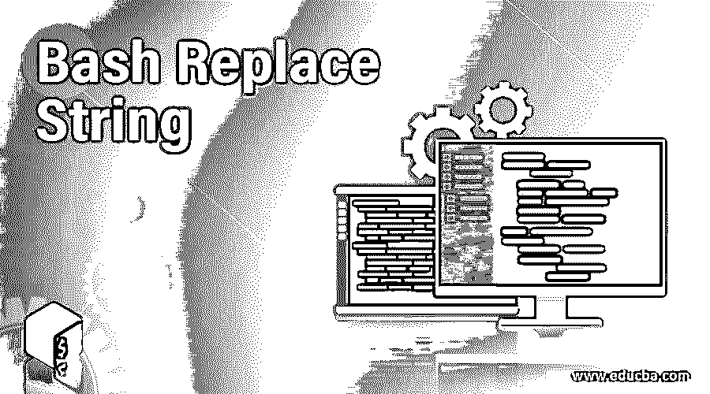
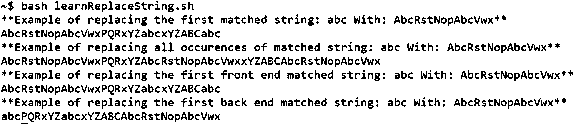

# Bash 替换字符串

> 原文：<https://www.educba.com/bash-replace-string/>

## Bash 替换字符串简介

在 Bash 中，有一种常见的技术，或者说是非常著名的技术，称为字符串操作，或者许多人称之为字符串处理，其中使用了许多进程来获得期望的结果。这些过程包括改变、解析、切片、粘贴或分析或任何组合。在许多较新的编程语言中，我们有专门的函数来处理字符串操作，但不幸的是，bash 中的函数缺乏焦点。因此一些字符串操作属于参数替换，而另一些属于 expr functionality 命令。Expr 命令只不过是一个表达式计算器。这在通用评估中很有用。这些评估与给定的操作一致，可以是从算术运算到字符串比较或连接的任何内容。另一方面，参数替换是抽象地引用一个参数。

现在进入文章的主题，那就是…字符串替换。要记住的一点是，即使替换被命名为字符串替换，这些技术也很容易适用于子字符串。现在，你可能很想知道我们会在哪些地方使用字符串替换。下面是一些应用程序的列表，虽然这个列表并不详尽，但是可以让你理解字符串替换的可用性。在某些情况下，我们希望用另一个模式来替代一个特定的模式，但考虑到手工操作需要的时间，我们并不真的想手工完成。另一个可用性是替换指定目录下所有文件中的字符串或子字符串。这两个例子很好地估计了字符串替换功能的需求，现在让我们看看实现这些结果所采用的不同方法。

<small>网页开发、编程语言、软件测试&其他</small>

### 不同的方法 Bash 代替 String

下面是 Bash 替换 String 的不同方法:

#### 1.替换第一个匹配项

在各种用例中，我们希望只替换第一次出现的字符串。这个结果是通过以下语法实现的:$ { string/string _ to _ replace/replacing _ string }。在上面的语法中，字符串是保存需要对其执行操作的整个字符串的变量。接下来，string_to_replace 是需要替换的字符串或子字符串。最后，replacing_string 是将替换 string_to_replace 中提到的子串的字符串。我们需要确保只替换第一次出现的内容。

#### 2.替换所有匹配项

如果我们想要替换所有匹配项，而不仅仅是第一个匹配项。这个结果是通过以下语法实现的:$ { string//string _ to _ replace/replacing _ string }。这个语法和上面语法的一个显著区别是出现了 2 个反斜杠(/)而不是 1 个。在上面的语法中，字符串是保存需要对其执行操作的整个字符串的变量。接下来，string_to_replace 是需要替换的字符串或子字符串。最后，replacing_string 是将替换 string_to_replace 中提到的子串的字符串。我们需要小心，所有的比赛将被取代。

#### 3.替换第一个前端匹配

在某些情况下，我们希望只替换前面的第一个匹配，以实现我们遵循的语法＄{ string/# string _ to _ replace/replacing _ string }。可用性与更换第一根火柴相同。只有语法不同，我们在反斜杠后面使用#号。其他细节保持不变。

#### 4.替换第一个后端匹配

与前面的 case 实用程序一样，可能需要从后端替换第一个匹配项，为此我们将使用语法:$ { string/% string _ to _ replace/replacing _ string }。唯一的区别还是在于在第三个和第四个中使用了%而不是#。字符串是保存需要执行操作的整个字符串的变量。接下来，string_to_replace 是需要替换的字符串或子字符串。最后，replacing_string 是将替换 string_to_replace 中提到的子串的字符串。

### 实现 Bash 替换字符串的示例

在下面的例子中，我们将涵盖我们上面讨论的所有 4 种方法，因此它在每个用例的使用上都变得很明显，并且将很容易让您比较结果，以便当您必须在实时问题解决中使用它时，它将作为一个照相记忆就在您的眼前！

**代码:**

`#!/bin/bash
string="abcPQRxYZabcxYZABCabc"
string_to_replace="abc"
replacing_string="AbcRstNopAbcVwx"
echo "**Example of replacing the first matched string: $string_to_replace With: $replacing_string**"
echo ${string/abc/AbcRstNopAbcVwx}
echo "**Example of replacing all occurences of matched string: $string_to_replace With: $replacing_string**"
echo ${string//abc/AbcRstNopAbcVwx}
echo "**Example of replacing the first front end matched string: $string_to_replace With: $replacing_string**"
echo ${string/#abc/AbcRstNopAbcVwx}
echo "**Example of replacing the first back end matched string: $string_to_replace With: $replacing_string**"
echo ${string/%abc/AbcRstNopAbcVwx}`

**输出:**

在最后一个中，我们可以很好地看到只有最后一个“abc”被替换！在第一个和第三个中，如果被替换，只有从开始的第一个被替换，而在第二个中，所有出现的“abc”被替换。

### 结论

现在，我们已经到了文章的末尾，在这篇文章中，我们已经涵盖了在 bash 中替换字符串的所有可能的排列和组合。使用 sed 命令替换文件中的字符串的后续主题中包含一些高级概念。我们强烈建议您自己尝试一些例子，以获得 bash 中字符串替换的信心！

### 推荐文章

这是 Bash 替换字符串的指南。在这里，我们讨论 Bash Replace String 的介绍、不同的方法以及要实现的示例。您也可以浏览我们的其他相关文章，了解更多信息——

1.  [Linux 中的 Bash Shell](https://www.educba.com/bash-shell-in-linux/)
2.  [什么是 Bash 脚本？](https://www.educba.com/what-is-bash-scripting/)
3.  [Bash 脚本混合](https://www.educba.com/bash-shell-programming-with-python/)
4.  [Python 字符串替换](https://www.educba.com/python-string-replace/)

