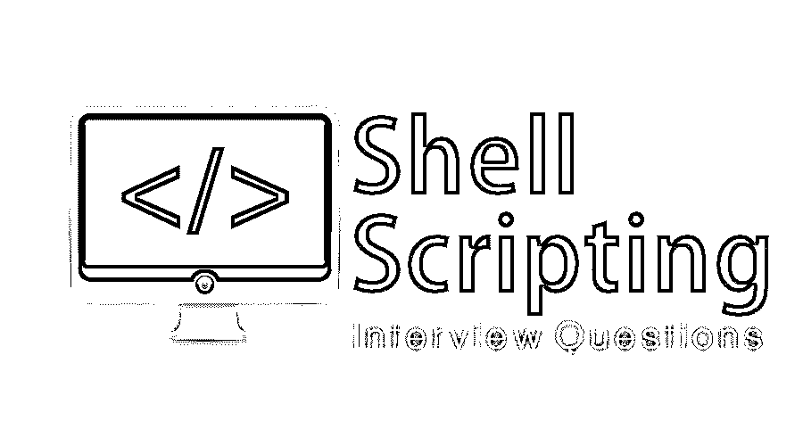

# Shell 脚本面试问题

> 原文：<https://www.educba.com/shell-scripting-interview-questions/>

## Shell 脚本简介面试问答

[Shell 脚本是一种](https://www.educba.com/what-is-shell-scripting/)方式，通过自动化这些命令序列，可以减轻这种必要性，从而使 Shell 工作变得更加轻松和高效。 [Unix/Linux](https://www.educba.com/what-is-unix/) 使用 shells 接受终端用户给出的命令；Shell 脚本面试问题有很多不同的 shell 可供选择。最常用的炮弹是
1。伯恩·谢尔

2.CSH(C 壳)

<small>网页开发、编程语言、软件测试&其他</small>

3.KSH(Korn SHell)

4.TCSH(扩展的 C SHell)基于 CSH。

现在，如果你要找一份与 Shell 脚本相关的工作，那么你需要准备 2022 Shell 脚本面试问题。的确，每个面试都因不同的职位而不同。在这里，我们准备了重要的 Shell 脚本面试问题和答案，将帮助您在面试中获得成功。

以下是 2022 Shell 脚本面试中常见的 10 个重要问题和答案。这些问题分为以下两部分:

### 第 1 部分–Shell 脚本面试问题(基础)

第一部分涵盖了基本的 Shell 脚本面试问题和答案。

#### 1.什么是内核？

**答案:**
内核是计算机程序，是计算机操作系统的接口/资源管理器，对系统中的一切拥有完全的控制权。它负责分配和取消分配内存空间。它管理 Linux 系统的以下资源——
文件管理
进程管理
I/O 管理
内存管理
设备管理等。

#### 2.壳牌是什么？

**答案:**
shell 是一种特殊的用户程序，它向用户提供使用操作系统服务的接口。Shell 接受来自用户的可读命令，并将它们转换成内核可以理解的东西。当用户登录或启动终端时，shell 启动。
它是一个命令语言解释程序，执行从键盘等输入设备或从文件系统读取的命令。

让我们转到下一个 Shell 脚本面试问题。

#### 3.Shell 中文件级的权限类型有哪些？

**答:**
**所有者权限**—授予用户在根级别的所有权限的权限称为所有者权限。

**组权限**—授予用户在特定组中拥有所有权限的权限称为所有者权限。

**其他(全局)权限**—授予对文件系统拥有全局所有权限的用户的权限称为所有者权限。

#### 4.Shell 中的文件访问模式有哪些类型？

**答案:**
关于 Linux 操作系统的权限是非常独特的。文件中 Unix 权限的基本块是读取、写入和执行权限，如下所述

**读取**
它赋予用户读取文件内容的权限。

**写入**
它赋予用户写入文件内容的权限。

**执行**
它赋予用户将文件作为程序执行的权限。

#### 5.Shell 中的目录访问模式有哪些类型？

**答案:**
目录访问模式类似于 shell 中的文件访问模式。下面列出了非常细微的差别——

**Read**
它赋予用户读取该空间内目录和文件内容的权限。

**写入**
它赋予用户写入和删除目录内容的权限。

**执行**
根本没有执行目录这回事。这意味着我们只能在其中穿行。

### 第 2 部分–Shell 脚本面试问题(高级)

现在让我们看看高级 Shell 脚本面试问题。

#### 6.它所经历的 Linux 过程的各个阶段是什么？

**答:**
一般来说，一个 Linux 进程有四个阶段:
**等待:**没有给 Linux 进程资源的时候。
**运行:**当前正在执行 Linux 进程时。
**停止:**当 Linux 进程成功执行后停止。
**僵死:**这个阶段被称为僵死，因为进程已经停止但仍然活动。

#### 7.影子密码是怎么给的？

**答:**
这些是最初可以用来更新阴影文件的程序；pwconv 命令用于给出影子密码。pwconv 命令创建/etc/shadow 文件，并将/etc/password 文件中的所有密码都更改为“x”。首先，删除主文件中不存在的阴影文件中的条目，并且可以手动编辑这些条目。然后，更新主文件中密码不是“x”的隐藏条目。可以同时添加遗漏的阴影条目。最后，主文件中的密码被替换为“x”。影子密码是为了更好的系统安全性。

让我们转到下一个 Shell 脚本面试问题。

#### 8.LILO 是什么？

**答案:**
LILO 是 Linux Loader 是 Linux 的引导加载器。它用于将 Linux 加载到内存中并启动操作系统。LILO 也可以配置为引导其他操作系统。LILO 是可定制的，这意味着如果默认配置不正确，可以进行更改。LILO 的配置文件是 lilo.conf.
LILO 也是在启动计算机系统时将 PC BIOS 加载到主存储器中的代码片段。它处理以下任务:
1 .定位 Linux 内核。
2。识别其他支持程序并将它们加载到内存中。
3。正在启动内核。
LILO 支持各种内核镜像和引导例程的选择。因此，它被称为引导管理器。

#### 9.解释 Linux 目录命令和描述？

**答:**
下面列出的是目录命令及其说明
**pwd:** 这是一个内置命令，代表“打印工作目录”。它显示当前工作位置、以/开头的工作路径和用户的目录。基本上，它显示您当前所在目录的完整路径。

**是:**该命令列出定向文件夹中的所有文件。

**cd:** 这代表‘更改目录’。该命令用于从当前目录切换到您想要工作的目录。我们只需要键入 cd，后跟目录名，就可以访问这个特定的目录。

mkdir: 该命令用于创建一个全新的目录。

**rmdir:** 该命令用于从系统中删除一个目录。

#### 10.列出一些 Linux 网络和故障排除命令？

**答:**
网络管理员是维护系统网络的人，包括网络配置和故障排除。下面是几个命令及其描述:
**主机名:**查看机器的主机名并设置当前主机名。

**Ping** :检查机器是否有响应。

**ifconfig:** 可视化并管理路由和[网络协议](https://www.educba.com/what-is-networking-protocols/)。它显示网络配置。“ip”是 ifconfig 命令的替代。

**netstat:** 显示很多网络连接，路由表，接口统计。目前，“ss”是 netstat 命令的替代品，用于获取更多信息。

**Traceroute:** 这是一个网络故障排除实用程序，用于确定特定数据包到达目的地所需的跳数。

**tracepath:** 它类似于 traceroute，不同之处在于它不需要 root 权限。

**Dig:** 该命令用于查询 DNS 名称服务器，以获得与 DNS 查找服务相关的任何任务/操作。

**nslookup:** 搜索 DNS 相关查询。

**Route:** 显示路由表文件和 IP 路由表的详细信息。

**mtr:** 该命令将 ping 和 track path 合并成一个命令。

**Ifplugstatus:** 该命令用于检查网线是否插上。

### 推荐文章

这是一个 Shell 脚本面试问题和答案列表的指南。这里我们列出了 10 个最佳面试问题，这样求职者就可以轻松地通过面试。你也可以看看下面的文章来了解更多。

1.  [基于信息场景的面试问题](https://www.educba.com/informatica-scenario-based-interview-questions/)
2.  [Java 多线程面试问题](https://www.educba.com/java-multi-threading-interview-questions/)
3.  [云计算面试问题](https://www.educba.com/cloud-computing-interview-questions/)

