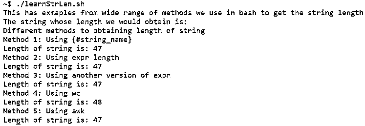

# Bash 字符串长度

> 原文：<https://www.educba.com/bash-string-length/>

## Bash 字符串长度介绍

下面的文章提供了 Bash 字符串长度的概要。对编程感兴趣多年的人可能会发现关于字符串的话题很方便。但对其他人来说，让我们从更小的字符串和它们相应的特征开始，那就是变量。bash 中的变量就像程序中值的临时存储位置。例如，假设我们需要对程序用户发送的值执行一些操作。在这种情况下，我们将需要编写算法来执行带有虚拟值的任务，一旦程序获得该值，这些占位符就可以被替换。现在，你有没有见过 10 的值突然变成 11，并被认为是 11？如果这种情况继续下去，总有一天我们会证明零是无穷大。

我们需要想出一种方法来合并一些值的变化或操作，因此有了变量的概念，它提出了这样的要求，即能够操作它包含在自身中的值，并在变量被访问时描绘或弹出它包含的值。任何编程语言中都存在变量列表，bash 也是如此。在列表之外，有一个在编程中被广泛使用，那就是 string。

<small>网页开发、编程语言、软件测试&其他</small>

现在，来看看在程序运行过程中，用来帮助改变字符串值的方法。在编程语言中，它也被称为字符串操作。在字符串操作中，通常是改变字符串的内容。现在，问题出现在操纵弦的方法上。在 bash 中，字符串操作以两种方式执行。一个是纯 bash 字符串操作，另一个是外部命令字符串操作。一些类型的字符串操作是，字符串的连接，在一个数组中列出字符串，将左边或右边的字符串长度缩短一定数量的字符，将字符串中的一个字符大写，或者与此完全相反，将所有内容都变成小写，等等。

如果你仔细分析，我们会发现在大多数情况下，需要理解字符串的长度。例如，如果一个人需要从一个字符串中获取一个子串，而被请求的子串的长度大于字符串本身，这将导致代码本身出错。有许多类似的实用程序。因此，对我们来说，详细理解字符串长度是绝对必要的，为此，我们将从我们有可能知道字符串长度的许多方法开始。

### Bash 字符串长度的方式列表

下面列出了 bash 字符串长度的几种方法:

#### 1.使用${#string_name}

这里 string_name 是包含要操作的字符串的变量。

**语法:**

`${#string_name}`

#### 2.使用关键字表达式长度

在这里，bash 在计算给定的表达式时保留了一个关键字，即“expr”。

**语法:**

``expr length “$string_name”``

这里，string_name 再次引用要计算其长度的变量。

#### 3.使用另一种形式的关键字 expr

在这种情况下，我们将使用关键字 expr 的另一种形式。

**语法:**

``expr“$string_name” :’.*’``

下面是变量名的显而易见的语法，即 string_name 是需要进行操作的变量。

#### 4.使用厕所

关键字 wc 是 bash 中功能强大的关键字之一，用于计算变量中的字符数。

**语法:**

``echo $string_name | wc -c``

在这个例子中，仔细看看 wc 给出的额外计数，这是因为它把 newline 作为一个额外的字符。

#### 5.使用 awk

awk 是强大的命令之一，甚至能够在 bash 中执行数据科学。但是在这个简单的用法中，我们会计算字符串的长度。

**语法:**

``echo $string_name | awk '{print length}'``

### Bash 字符串长度示例

在这里，我们将看到一个现实生活中的问题陈述，我们将通过展示它作为例子的一部分来解决这个问题。为了简单起见，我们在代码中保持了最少的特性，但是解决问题所需的思维将是现实生活中的思维。

**代码:**

`echo "This has exmaples from wide range of methods we use in bash to get the string length"
string_name="Different methods to obtaining length of string"
echo "The string whose length we would obtain is: "
echo "$string_name"
echo "Method 1: Using {#string_name}"
length=${#string_name}
echo "Length of string is: $length"
echo "Method 2: Using expr length"
length_2=`expr length "$string_name"`
echo "Length of string is: $length_2"
echo "Method 3: Using another version of expr"
length_3=`expr "$string_name" :'.*'`
echo "Length of string is: $length_3"
echo "Method 4: Using wc"
length_4=`echo $string_name | wc -c`
echo "Length of string is: $length_4"
echo "Method 5: Using awk"
length_5=`echo $string_name | awk '{print length}'`
echo "Length of string is: $length_5"`

**输出:**

### 结论

总之，这篇文章提供了当今世界上广泛使用的计算绳子长度的方法。我们现在鼓励你在日常问题解决中使用它们，以便在获取字符串长度的领域中获得充分的信心。

### 推荐文章

这是 Bash 字符串长度的指南。这里我们分别讨论介绍、bash 字符串长度的方法列表和示例。您也可以看看以下文章，了解更多信息–

1.  [什么是 Bash？](https://www.educba.com/what-is-bash/)
2.  [什么是 Bash 脚本？](https://www.educba.com/what-is-bash-scripting/)
3.  [Linux 中的 Bash Shell](https://www.educba.com/bash-shell-in-linux/)
4.  [外壳脚本集](https://www.educba.com/shell-script-set/)

