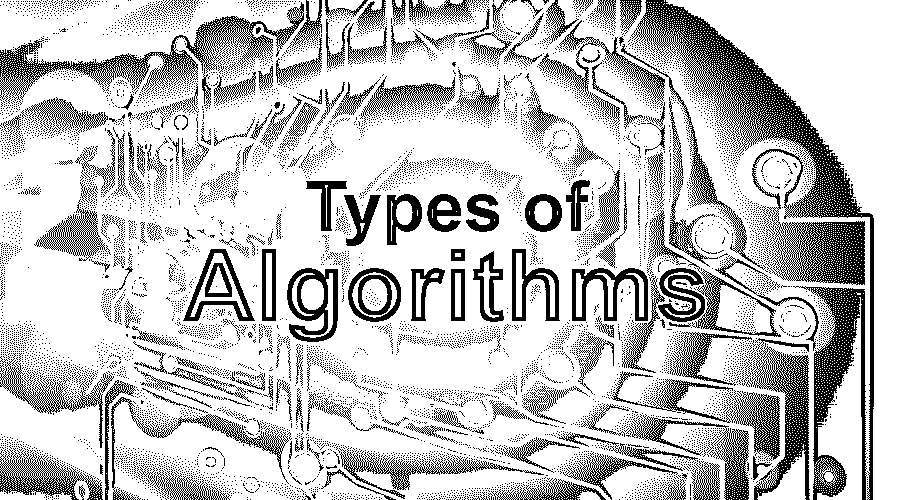
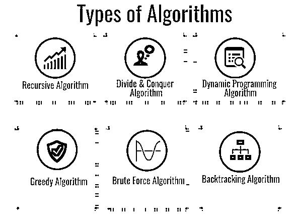

# 算法的类型

> 原文：<https://www.educba.com/types-of-algorithms/>

## 算法简介

算法是描述如何解决问题的一系列步骤。每一个以结果结束的计算机程序，基本上都是[基于一个算法](https://www.educba.com/what-is-an-algorithm/)。然而，算法不仅仅局限于在计算机程序中使用；这些也可以用来解决数学问题和日常生活中的许多问题。根据算法的功能，我们可以将算法分为多种类型。让我们来看看其中一些重要的。

### 算法的类型

有许多类型的算法，但基本的算法类型有:

<small>网页开发、编程语言、软件测试&其他</small>

#### 1.递归算法

这是最有趣的算法之一，因为它用一个较小的值作为输入来调用自己，这个值是在求解当前输入后得到的。用更简单的话来说，就是一个算法反复调用自己，直到问题解决。

使用这些算法可以很容易地解决诸如汉诺塔或图的 DFS 等问题。

例如，下面是使用递归算法查找阶乘的代码:

事实(y)

如果 y 是 0

返回 1

return (y*Fact(y-1)) /*这是递归发生的地方*/

#### 2.分治算法

这是解决许多问题的另一种有效方法。在分治算法中，把算法分成两部分；第一部分将手头的问题分成相同类型的更小的子问题。然后，在第二部分，这些较小的问题被解决，然后加在一起(组合)产生问题的最终解决方案。

合并排序和快速排序可以用分治算法来完成。下面是合并排序算法的伪代码，供您举例说明:

合并排序(ar[]，l，r)

如果 r > l

1.  找到中点，将给定数组分成两半:

中间 m = (l+r)/2

2.  前半段调用 mergeSorting:

调用合并排序(ar，l，m)

3.  下半年调用 mergeSorting:

调用合并排序(ar，m+1，r)

4.  合并步骤 2 和 3 中排序的两半:

呼叫合并(ar，l，m，r)

#### 3.动态规划算法

这些算法的工作原理是记住过去运行的结果，并使用它们来找到新的结果。换句话说，动态规划算法通过将复杂的问题分解成多个简单的子问题来解决它们，然后一次性解决每个子问题，并存储起来以备将来使用。

斐波那契数列是动态编程算法的一个很好的例子，你可以在伪代码中看到它的工作原理:

Fibonacci(N) = 0(对于 n=0)

= 0(对于 n=1)

= Fibonacci(N-1)+Finacchi(N-2)(对于 n>1)

#### 4.贪婪算法

这些算法用于解决优化问题。在这个算法中，我们找到一个局部最优解(不考虑将来的任何后果),并希望找到全局最优解。

该方法并不保证我们能够找到最优解。

该算法有 5 个组成部分:

*   第一个是候选集，我们试图从中找到解决方案。
*   帮助选择最佳候选人的选择功能。
*   一种可行性函数，有助于决定候选对象是否可用于寻找解决方案。
*   为可能的解决方案或部分解决方案赋值的目标函数
*   当我们找到问题的解决方案时，这个函数会告诉我们。

霍夫曼编码和 Dijkstra 算法是使用贪婪算法的两个主要例子。

在霍夫曼编码中，算法遍历一条消息，并根据该消息中字符的频率；它为每个字符分配一个可变长度编码。要进行 Huffman 编码，我们首先需要从输入字符构建一个 Huffman 树，然后遍历该树为字符分配代码。

#### 5.强力算法

这是概念中最简单的算法之一。强力算法盲目地迭代所有可能的解，以搜索可能解决一个函数的一个或多个解。把暴力想象成使用所有可能的数字组合来打开保险箱。

下面是一个使用暴力进行顺序搜索的示例:

算法 S_Search (A[0..n]，X)

一个 X

i ← 0

而 A [i] ≠ X 会

i ← i + 1

如果我< n 返回我

否则返回-1

#### 6.回溯算法

回溯是一种以增量方式寻找问题解决方案的技术。它递归地解决问题，并试图通过一次解决一部分问题来解决问题。如果其中一个解决方案失败了，我们就删除它，然后回溯寻找另一个解决方案。

换句话说，回溯算法解决了一个子问题，如果它不能解决问题，它就撤销最后一步，重新开始寻找问题的解决方案。

n 皇后问题是一个很好的例子来看回溯算法的行动。N 皇后问题是指在一个棋盘上有 N 个皇后，我们必须排列它们，以便一旦组织起来，没有一个皇后可以攻击棋盘上的任何其他皇后。

现在让我们看看 SolveNQ 算法，并检查解决问题的有效函数:

**CheckValid(棋盘，行，列)**

开始

如果当前列的左侧有一个皇后，则返回 false。

如果皇后在左上角，则返回 false

如果皇后在左下角，那么返回 false

返回 true

结束

**SolveNQ(板，列)**

开始

如果所有列都已满，则返回 true

对于棋盘中出现的每一行

做

If，CheckValid( board，x，column)，然后

将皇后放在棋盘上的单元格(x，列)中

如果 SolveNQ(board，column+1) = True，则返回 True。

否则，从棋盘的单元格(x，列)中移除皇后

完成的

返回 false

结束

### 结论

算法是计算机能做的大多数令人印象深刻的事情的背后，并且是大多数计算任务的核心。更好地使用算法会帮助你成功地成为一名成功的程序员，但你会变得更有效率。

### 推荐文章

这是算法类型的指南。在这里，我们详细讨论了 6 种最重要的算法及其功能。您也可以浏览我们推荐的其他文章，以了解更多信息-

1.  [算法介绍](https://www.educba.com/introduction-to-algorithm/)
2.  [编程中的算法](https://www.educba.com/algorithm-in-programming/)
3.  [算法面试问题](https://www.educba.com/algorithm-interview-questions/)
4.  [Java 中的快速排序算法](https://www.educba.com/quick-sorting-algorithms-in-java/)

