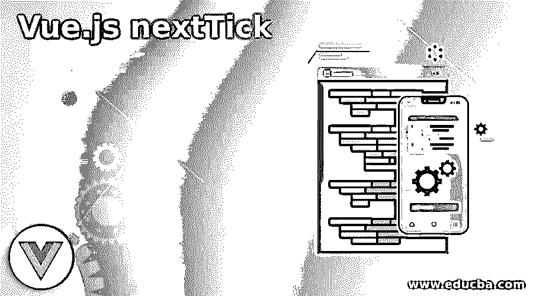
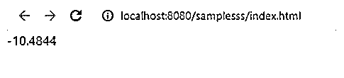
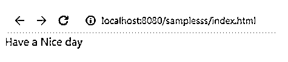

# view . js nextTick-检视. js nexttick

> 原文:# t0]https://www . educba . com/view-js-nexttick/

## vue . js nexttick 介绍

Vue.js nextTick 是 Vue.js 中的一个全局 api，它主要延迟用于执行 javascript 的 dom(文档对象方法)生命周期的回调方法。它连续地一个接一个地执行 dom 方法，因为当我们更改了一些用户定义的数据以等待 dom 模型更新时，它会立即使用。vue javascript 框架以异步方法执行 dom 更新。它可用于保持一些数据更新以用于存储目的，直到它们需要更新和应用。它还将在 dom 升级版本中创建数据队列。

**语法:**

<small>网页开发、编程语言、软件测试&其他</small>

在 vue.js 中有一些默认的方法来实现前端和后端的应用逻辑。dom 元素将使用一些内置方法，如 mounted()和$nextTick()，这两个方法在组件未完成时呈现组件,$nextTick()在方法中运行。

`<html>
<body>

</body></html>`

上面的代码是使用默认方法$nextTick()在 UI 端的脚本中呈现 vue 组件的基本语法，因为它用于在我们更改了 Vue 代码中的一些其他区域后更改 dom 中的数据。

### nextTick 在 Vue.js 中是如何工作的？

我们知道，nextTick()是默认方法之一，它是一个全局 API，用于更改应用程序中的数据元素，而 vue.js 则用于在需要在浏览器上更改数据时更改 DOM 元素中的数据元素，但也要注意，浏览器中呈现的那些元素将在网页上更改。vue 脚本中的文件上传选项也可用于此方法，它可被调用用于直接或间接的 dom 操作，而文本框和其他组件的高度变化可能取决于给予 UI 元素的用户输入。Vue 方法之间的父子关系中的一些默认方法，如 nextTick()。它使用一些内置的子方法，如概念文件、图像上传等。通过使用 isFileUploaded 方法，将对语句进行验证，并将值赋给该方法所遵循的变量。值应包含布尔数据类型。它将为“真”或“假”。当我们采取另一个场景，如上传的图像，它将是 gif，jpg 等。我们还应该确认每当图像上传时，它没有抛出任何错误，如“无效的图像或一些 UX 问题等”,因为它冻结了网页。还注意到它不能影响页面的 UI 组件，但时间应该像毫秒(ms)一样多几秒钟，因为它改变了状态，如冻结到网页控制台的开始部分。

Vue 通常创建队列，如果数据被改变，则在所有相关数据中为其创建缓冲存储，这将被应用于在代码中构造的相同循环结构中。如果假设我们使用 for 循环来迭代和存储、检索代码中的用户输入，数据更改有时还没有应用到 DOM 中，而它应用了它们。事件循环现在是“滴答”,数据队列更改在数据简化中被刷新。因为在 DOM 操作中还没有应用数据更改队列，所以最终用户看不到反映的更改。

### Vue.js nextTick 示例

下面是一些例子:

#### 示例#1

**代码:**

`<html>
<head>
<title>Example</title>

<link rel="stylesheet" type="text/css" href="//unpkg.com/vue-form-generator@2.0.0/dist/vfg.css">
<link rel="stylesheet" type="text/css" href="style.css">

<link rel="stylesheet" type="text/css" href="//maxcdn.bootstrapcdn.com/bootstrap/4.0.0-alpha.6/css/bootstrap.min.css">
</head>
<body>

{{ output }}

</body>
</html>`

**输出:**

#### 实施例 2

**代码:**

`<html>
<head>
<title>Example</title>

<link rel="stylesheet" type="text/css" href="//unpkg.com/vue-form-generator@2.0.0/dist/vfg.css">
<link rel="stylesheet" type="text/css" href="style.css">

<link rel="stylesheet" type="text/css" href="//maxcdn.bootstrapcdn.com/bootstrap/4.0.0-alpha.6/css/bootstrap.min.css">
</head>
<body>

{{ output }}

</body>
</html>`

**输出:**

#### 实施例 3

**代码:**

`<html>
<head>
<title>Example</title>

<link rel="stylesheet" type="text/css" href="//unpkg.com/vue-form-generator@2.0.0/dist/vfg.css">
<link rel="stylesheet" type="text/css" href="style.css">

<link rel="stylesheet" type="text/css" href="//maxcdn.bootstrapcdn.com/bootstrap/4.0.0-alpha.6/css/bootstrap.min.css">
</head>
<body>

{{ output }}

</body>
</html>`

**输出:**

以上三个例子我们都以不同的方式使用了 nextTick()方法。我们使用了一些数学计算和术语，如圆周率等，它还与其他预定义的方法和用户要求的应用程序功能相关。但是我们使用了 next tick()data，每当它改变时，浏览器中的 html DOM 元素也会改变。

### 结论

当我们在基于 web 的应用程序中使用 vue.js 特别是 nextTick()函数时，它的用法非常罕见，此外，它还为用户提供了一个用户友好的环境。因为 nextTick()和 Vue.js 中的其他方法是一个静态方法，它们与全局 API 相关，所以如果确实需要，我们可以在任何脚本中使用它，并且它们的实例在整个 vue.js 脚本中使用。

### 推荐文章

这是 Vue.js nextTick 的使用指南。这里我们也讨论一下简介，以及 nexttick 在 vue.js 中是如何工作的？以及不同的示例及其代码实现。您也可以看看以下文章，了解更多信息–

1.  [Vue.js 已计算](https://www.educba.com/vue-js-computed/)
2.  角度 2 相对于视图 JS
3.  [视图。JS vs React .js〔t1〕](https://www.educba.com/react-js-vs-vue-js/)
4.  [view . js vs angular](https://www.educba.com/vue-js-vs-angular/)

