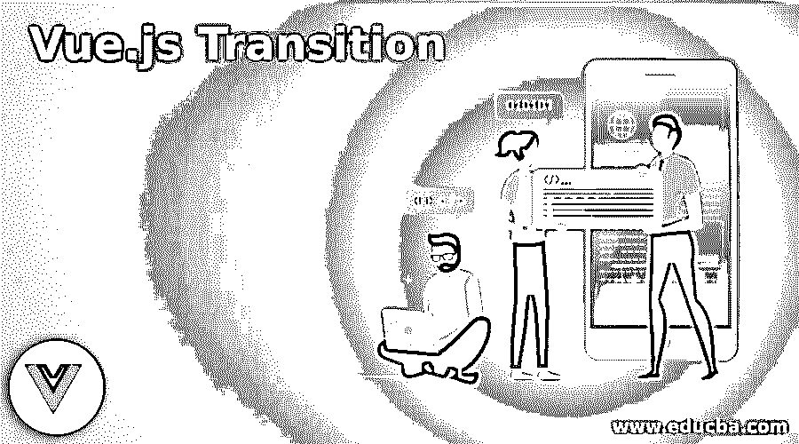
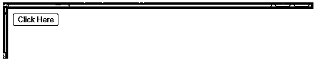
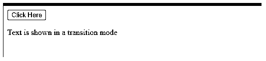
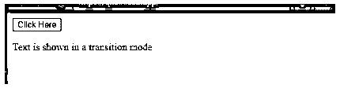
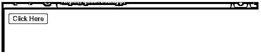
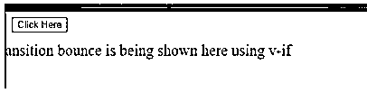
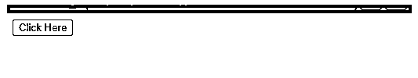
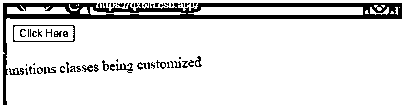
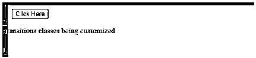

# vue . js transition

> 原文：<https://www.educba.com/vue-js-transition/>

## Vue.js 过渡简介

当在 DOM 中添加或更新元素时，Vue.js transition 有多种方式将转换应用于 HTML 元素。使用这些 Vue.js 转场要容易得多，因为 Vue.js 提供了一个转场组件，它环绕/包装由于动画而产生的元素或组件。顾名思义，过渡是指当事物从一种状态转移到另一种状态时发生的变化。状态在意义上的起点和终点。当在 DOM 中插入、更新或删除元素时，Vue 会应用过渡效果。

### Vue.js 转场是如何工作的？

让我们探索这些 Vue 转换是如何工作的，

<small>网页开发、编程语言、软件测试&其他</small>

在设计一个过渡时，使用 Vue 的“过渡”组件，我们需要检查默认样式，以及元素在不处于过渡状态时实际上是如何出现的。让我用一个简单的例子来解释，我们希望文本在屏幕上和屏幕外过渡，并在过渡时淡化文本，这里默认的样式应该是不透明度:1，因为这将是屏幕上和屏幕外的样式过渡。任何 HTML 元素的默认转换样式都是由浏览器定义的。我们不需要定义默认样式，因为元素以相同的默认样式出现。

**语法:**

`

`

属性' transition '可以与，

*   **v-if:** 块的条件渲染
*   **v-show:** 一个元素的条件显示
*   **v-for:** 渲染用于从 DOM 中插入和移除元素，用于动画更改
*   **动态组件:**用于在多个组件之间切换

**当一个元素被插入或从 DOM 中移除时，Vue 将:**

*   自动检查目标元素是否有 CSS 过渡或动画，从而添加或删除 CSS 类
*   尝试找出一个 JavaScript 转换的钩子对象，它可能通过 Vue.transition(id，hooks)或通过传递 id 'my-transition '来注册。如果找到了，在转换的不同阶段调用适当的转换挂钩。
*   如果没有找到 JavaScript 挂钩，也没有 CSS 过渡/动画，那么插入和删除等 DOM 操作将立即在下一帧执行。

**列出 DOM 元素上的一些过渡效果，**

*   在转换挂钩期间使用 JavaScript 直接操作 DOM 元素
*   整合 3 个第三个派对 CSS 动画
*   用于定位 SVG 节点
*   状态转换有助于设置元素的大小和其他属性
*   集成 3 个第部分 JavaScript 动画库
*   为 CSS 过渡或动画自动应用类
*   动画数字，计算和颜色用于显示

### Vue.js 过渡示例

下面是一些例子:

#### 示例# 1—**简单的淡入淡出过渡**

**代码:**

`<!DOCTYPE html>
<html>
<head>
<title>Vue.js transition</title>

</head>
<body>

<button v-on:click="show = !show">
Click Here
</button>
<transition name="fade">

Text is shown in a transition mode

</transition>

</body>
</html>`

**输出:**

点击按钮时，文本淡入，如下所示。

再次单击时，文本会淡出

文本被淡出。

有 6 个转换类来处理正在显示或删除的元素，当组件正在显示或启用时，输入转换发生。进入过渡状态下的类有 v-enter、v-enter-to 和 v-enter-当组件被移除或禁用时，会发生活动离开过渡。休假过渡下的类别为 v-休假、v-休假-到和 v-休假-活动

前缀 v-在使用过渡元素时是默认值。

设 X 和 Y 是两个独立的转换状态

*   V-enter:它是用来定义转换的 X 部分是什么的类，定义了开始状态，在元素插入之前添加。
*   V-enter-to:这个类用于定义过渡的 Y 部分是什么，定义结束状态，并在过渡或动画完成时删除
*   V-enter-active:该类用于定义如何从 X 移动到 Y，活动状态，在进入阶段适用。它还定义了进入转场的时间长度、缓动曲线和延迟
*   V-leave:它是用来定义离开的起始状态的类。
*   V-leave-to:它是用来定义要离开的结束状态的类。
*   V-leave-active:用于定义离开的活动状态、活动状态以及在离开阶段适用的类。当触发离开转换时应用，当转换完成时删除。它还定义了持续时间、缓动曲线和离开转场的延迟。

#### 示例# 2-**文本的弹跳过渡**

**代码:**

`<!DOCTYPE html>
<html>
<head>
<title>Vue.js bounce transition</title>

</head>
<body>

<button @click="show = !show">Click Here</button>
<transition name="bounce">

Vue.js transition bounce is being shown here using v-if

</transition>

</body>
</html>`

**输出:**

点击按钮上的，文本在控制台上跳动，

同样，再次点击时，弹出控制台。

#### 示例 3–vue . js 中的自定义过渡类

**代码:**

`<!DOCTYPE html>
<html>
<head>
<title>Vue.js customized transition</title>

<link
href="https://cdn.jsdelivr.net/npm/animate.css@3.5.1"
rel="stylesheet"
type="text/css"
/>
</head>
<body>

<button @click="show = !show">
Click Here
</button>
<transition
name="custom-classes-transition"
enter-active-class="animated tada"
leave-active-class="animated bounceOutRight"
>

Transitions classes being customized

</transition>

</body>
</html>`

**输出:**

点击时，

再次点击时，

**注意:**此处显示的所有转场并不能通过截图捕捉到。

“Vue.js 转换”主题到此结束。我们已经看到了 Vue.js 中的过渡及其语法。举例说明了几个例子，通过这些例子我们可以得到简单的过渡。了解 Vue.js 转场是如何工作的，以及转场的所有类别，进入/离开转场。有了这些关于过渡的基础知识，我们就更容易理解 CSS 动画是如何工作的，这也有助于我们理解 JavaScript 动画。

### 推荐文章

这是一个 Vue.js 过渡的指南。在这里，我们还将讨论简介以及 vue.js 过渡是如何工作的？以及不同的示例及其代码实现。您也可以看看以下文章，了解更多信息–

1.  [Vue.js 已计算](https://www.educba.com/vue-js-computed/)
2.  角度 2 相对于视图 JS
3.  [视图。JS vs React .js〔t1〕](https://www.educba.com/react-js-vs-vue-js/)
4.  [view . js vs angular](https://www.educba.com/vue-js-vs-angular/)

