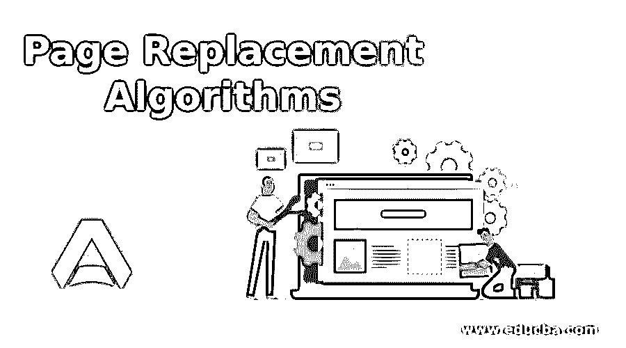

# 页面替换算法

> 原文：<https://www.educba.com/page-replacement-algorithms/>

## 页面替换算法简介

在数字时代之前，随机存取存储器(RAM)或计算机中的主存储器是一种宝贵的资源，存储器管理功能在利用可用存储器有效管理多用户环境方面发挥着重要作用。

在早期版本的计算机中，多个进程被加载到固定的内存分区中，并被允许运行。它有内部和外部的分裂问题。动态分区解决了持续存在的内部碎片和外部碎片问题，通过采用压缩解决了这个问题。这一过程缓解了问题，但也出现了性能故障。

<small>网页开发、编程语言、软件测试&其他</small>

开发分页概念是为了克服内存分区问题，并提供灵活的选项来利用内存，同时为多用户环境提供最佳服务。

在本文中，让我们了解内存分页、虚拟内存、按需分页，以及如何从驻留在硬盘上的虚拟内存中刷新主存中的页面。

### 什么是内存页面？

进程被划分为可管理大小的页面，比如 1MB 或 2MB，计算机的主存被划分为相同大小的帧，任何进程的任何页面都将适合任何帧。操作系统确保用于执行的进程的所有页面在任何帧中都可用，并且优先将它们放入连续可用的帧中以获得更好的性能。进入休眠状态的进程的页面将从主存中移除，队列中等待的新进程的页面将被加载。

OS 通过将所有进程的逻辑地址映射到内存的物理地址来维护页表。这个页表使操作系统能够获得任何进程的任何页的物理地址，访问它存储在内存中的内容，并执行它。页面有助于优化主存储器的利用以及有效地执行多个进程。

### 什么是虚拟内存？

为了执行比内存大的进程和同时处理更多的进程，总是需要增加主内存。在辅助存储器中创建一个大容量的存储器，其容量是主存储器容量的数倍，并作为主存储器虚拟地提供给用户。

所有的进程，包括大型进程，最初都将被移动到虚拟内存中，而不是像早期版本的内存管理那样被移动到主内存中。操作系统将只把需要的页面加载到主存中，这种方法提高了操作系统管理更多进程和 CPU 性能的能力。

*   **按需分页:**在任何给定时间，操作系统只在主内存中加载进程所需的部分(少量页面)。很难决定哪些页面应该在内存中可用以及何时需要？.操作系统的请求分页功能通过首先将所有进程的所有页面加载到虚拟内存中来处理这种情况，并在需要时向内存提供任何进程的任何页面。
*   **页面故障:** CPU 执行一个进程的指令，一页接一页，如在主存及其流程中发现的；如果任何页面在主存储器中不可用，它就向操作系统发出警报，从辅助存储器的虚拟存储器中获取所需的页面。此警报被称为页面错误。

### 页面置换算法

每当 CPU 引发页面错误时，操作系统不会立即从虚拟空间获取所需的页面。如果有空闲帧(主存页面)可用，OS 会用从虚拟内存带来的新页面填充它；否则，它必须清除一个帧(在将它备份到虚拟内存中之后)来容纳新页面。任何页面都不能随机删除，在替换内存中的页面时应该有一些逻辑或算法。

#### 页面替换算法的重要性

页面替换算法处理两个主要方面，即。,

1.  为每个进程分配的帧数
2.  决定应该替换哪个帧的逻辑

如果初始帧分配不足，可能会导致系统颠簸。由于大多数页面驻留在虚拟内存中，将会有更多的页面错误，并且过多的帧分配将会导致内部碎片。因此，为了获得最佳性能，分配的任何帧都不应该是准确的。

同样，如果没有选择正确的算法，将会导致过多的页面错误，从而影响性能。如果 CPU 立即寻找被替换的页面，这将导致不必要的换出、换入和操作系统将做不必要的工作并降低性能。选择正确的算法来减少页面错误是很重要的。

### 页面替换算法的类型

有不同的算法可用，每一个都有自己的方法来决定要替换的页面。

#### 1.先进先出

这种方法是所有逻辑中最简单的一种，在这种逻辑中，系统在一个队列中维护页面从虚拟内存加载到主内存的顺序。每当出现页面错误时，首先出现的页面(位于队列的底部)将被删除，以便为新页面铺平道路。

这种方法有一个缺陷，有可能出现更多的页面错误。最先出现的页面很有可能在不久的将来会被需要，删除它会造成重复工作。

#### 2.最佳页面替换

CPU 将来不会引用的页面将被删除以给出新的页面。这种方法实际上不太可能采用，但可以作为评估其他方法准确性的基准。

#### 3.最近最少使用

不经常引用或最近没有引用的页面将被新页面替换。它是有效的，因为它寻找过去的活动，并决定要删除的页面。这是基于一种概率理论，即被频繁引用的页面在将来也会被继续使用，反之亦然。这是一个有效的算法，因为它被证明具有最少的页面错误。

### 推荐文章

这是一个页面替换算法的指南。在这里，我们还讨论了不同类型的页面替换算法的介绍和重要性。您也可以看看以下文章，了解更多信息–

1.  Django 的应用
2.  [Python Fast 和 python psyco？](https://www.educba.com/python-fast/)
3.  [Python 中的排序算法](https://www.educba.com/sorting-algorithms-in-python/)
4.  [Google Plus 商务页面](https://www.educba.com/google-plus-page-for-business/)

