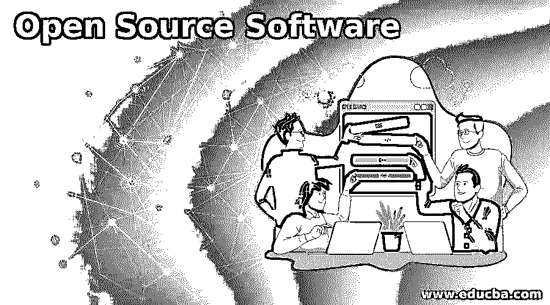
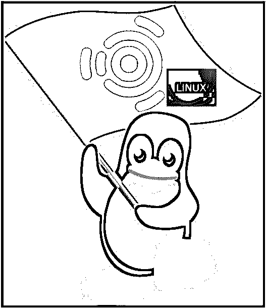
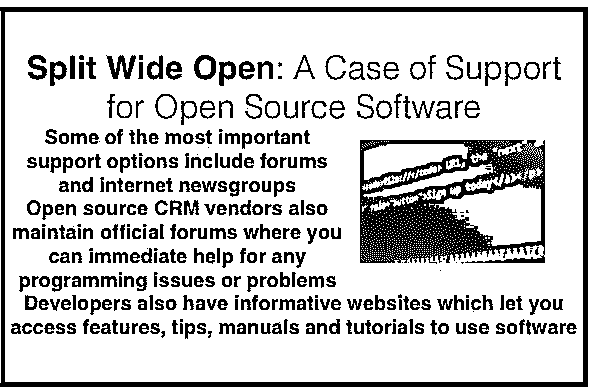
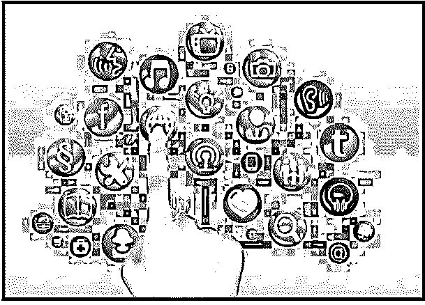
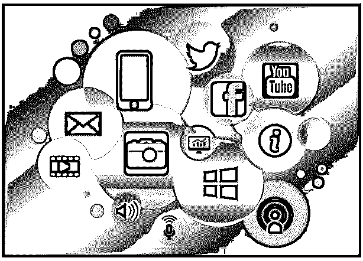

# 开源软件

> 原文：<https://www.educba.com/open-source-software/>

## 开源软件的神话和误解

在本文中，我们将看到一个关于开源软件的概述。它已经存在很长时间了，人们对它有很多想法。但是，这些看法有多现实呢？开源软件是 100%免费的吗？这个软件到底有多可靠？开源软件大规模使用效果好吗？这个软件在当今世界可供用户使用的范围有多广？如果这类问题对你来说是一个封闭的书，欢迎来到开源软件真正知识的来源。

### 开源软件的好处

以下是选择该软件的优势列表。

<small>网页开发、编程语言、软件测试&其他</small>

#### 1.开源软件是免费的

这是对最好的开源软件最常见的误解之一。这个软件是免费的，但是在商业或公司中使用它是有成本的。这里最重要的考虑是它的免费使用程度。这是基于包的大小以及详细的复杂性。

 经验法则是，CRM 解决方案越详细、越复杂，你为开源 CRM 支付的现金就越多。人们需要记住，除了免费版本，开源 CRM 供应商还出售更完整的软件包。当支持和定制需求导致支出时，实际成本开始增加。

想想 MySQLAB，一个开源程序数据库，每年收取 5000 美元的支持费用，或者 Enterprise Linux 每年收取 2500 美元的无限制许可费用。定制需要内部程序员或任何软件的第三方工作人员的成本。

操作系统和数据库是需要大量支持的大型程序。这些软件列表中的用户级还包括使用需要维护费用的相关程序。那么这种认为开源应用软件是免费的误解是如何产生的呢？好吧，7-Zip 和 Joomla 没有帮助的事情，虚拟机管理器只是进一步增加了这一点。这些是少数几个不用花一分钱就能使用的软件。如果考虑到本质，就可以理解定价和分销模式。开源意味着可以修改源代码，这样你就可以使用 Joomla 或 Drupal 来添加你的业务所需要的特性或功能。红帽的源代码是免费的，CentOS 就是这么开发出来的。

#### 2.开源软件 Linux

 

Linus Torvald 提出了革命性的 Linux，但是仅仅将开放软件等同于此是简单化的。

一目了然的是，开源不仅仅是 Linux，尽管许多开源应用程序都是为 Linux 编写的。许多软件也是为 Windows 编写的。有些是 Windows 和 Linux 的混合体。开源不仅仅指 Linux。

#### 3.开源软件没有支持

与这种流行的误解相反，有很多人支持这些软件。只是它的工作方式与支持商业软件不同。事实上，开源程序为您提供了更多的支持选项。

 

#### 4.开源软件在功能性上得分很低

优势在于它不仅仅是一个免费的套装…它还在许多应用程序类别中超过了同等商业软件的功能。

案例 1: Apache 是领先的网络服务器

**案例 2:** MySQL 是许多开源 CRM 程序使用的数据库，也是其他应用程序的常用数据库

案例 3: PostgreSQL 和微软等公司的[数据库管理系统](https://www.educba.com/database-management-tools/ "Best Database Management Tools")一样好用

*图片来源:pixabay.com*

结案了。大多数开源产品因为支持大型复杂的应用程序而非常受欢迎。像 SugarCRM 这样的 CRM 包甚至是针对商业企业的！

#### 5.开源和 Windows 不能很好地融合

微软已经开展了一项稳定的运动，旨在宣传像 Linux 这样的开源软件很难与像 Windows 这样的商业软件相结合。这延续了开源软件和商业软件就像粉笔和奶酪一样的神话。大量开源软件可以与 Windows 及其许多应用程序顺利集成。应该记住，开源作者和那些设计商业软件的人一样努力工作。虽然说集成开放源码和 Windows 是一件轻而易举的事情是不正确的，但是布丁的证明在于演示同样的事情。存在一些不兼容性，例如数据格式或其他方面的差异。但是 Windows 和开源之间的结合很容易实现。

*图片来源:pixabay.com*

#### 6.它更加安全可靠

仅仅因为它是开源的，并不意味着这个包是安全的。认为黑客和病毒只针对像 Windows 这样的“流行”程序是一个普遍的误解。想想网络蝾螈对 Firefox 的攻击，Firefox 是一个与微软 IE 竞争的开源浏览器。无论您使用开源软件还是商业软件，您都必须保护您的数据。一些[攻击，如跨站脚本](https://www.educba.com/what-is-cross-site-scripting/)会损害较新的 CRM 程序使用的 AJAX 架构，不管是否使用了开源应用程序。

然而，这个软件的好处是源代码随应用程序免费分发，因此任何人都可以修复一个 bug。这些第三方修复有时与开发人员提出的修复一样有效。商业软件一旦出现问题，你就会和软件公司发生交易。

*图片来源:pixabay.com*

#### 7.它是不可扩展的

当它还在发展的时候，这可能是真的。现在，开源应用程序在可扩展性方面与商业版本相当。关于从 Linux 到 CRM 的软件，一个有趣的事实是，随着时间的推移，开发人员越来越擅长于修复错误和为更大的企业改造软件。像 Apache 和 Linux 这样的大型开源项目已经受到企业和个人用户的欢迎。开源社区中的开发人员由核心团队和其他专家组成，他们会在遇到故障或需要修复错误时帮助您。开源可以转化为各种意义上的可扩展性。

#### 8.它很难使用

没有什么比这更偏离事实了。最初，这些应用程序肯定是面向程序员和管理员的。但是随着时间的推移，开源社区已经发展起来，使得这种形式的软件和最好的商业程序一样容易安装和选择。Open Office 和 Microsoft Office 之间的接口只是开源软件以及商业软件如何无缝集成的一个例子。

#### 9.开源是一项新的创新

开源软件已经存在很久了。开源是随着[计算机编程](https://www.educba.com/computer-programming-language/ "Fundamentals of Computer Programming")的出现而诞生的。在 20 世纪 60 年代，共享开源软件是必然的，ARPAnet 的早期开源软件开发也得益于这种源代码共享。

#### 10.开源软件是由学生和爱好者开发的

发烧友和学生并不是唯一开发这个软件的人。开发人员和 web 管理员，以及高级测试作者，也对该领域做出了贡献。波士顿咨询公司在一项研究中发现，近一半参与开源项目的人是专业人士，其中许多人是系统管理员、学者或 IT 经理。人们实际上是由 Sun 和 IBM 等 IT 专业人士支付报酬来编写开源代码的。

#### 11.开源质量低

这是人们对开源软件最常见的误解之一。开源代码中的 bug 可能和专有代码一样多，但事实是前者会有更多的开发人员进行调试。开源软件和商业软件一样好，如果不是更好的话。像 BIND 这样的开源代码是 DNS 的症结所在，而 Sendmail 是大多数电子邮件背后看不见的手，Apache 运行在世界上超过 65%的 web 服务器上。像 Linux 这样的开源软件已经被授予了荣誉。就开源软件而言，这不是一个厨师太多会坏汤的问题，而是一个团结的努力，其中从事源代码工作的开发人员的多样性是一个独特的优势。自组织和自发解决问题在开源软件的质量控制过程中起着重要的作用。

#### 12.没有人会因为写开源软件而获得报酬

自由软件并不意味着开发人员编写它不会得到报酬。考虑一下有多少公司从事免费分发或销售的产品？销售软件产生的收入可能不等于其成本，但利润将来自其他活动，如咨询、培训、支持、定制软件等。

*图片来源:pixabay.com*

#### 13.它向免费工作的开发者敞开了大门

通过使[软件开源](https://www.educba.com/android/ "Android and Open Source Security")，你不会让成千上万的开发者在上面免费工作。只有十几个核心开发人员会执行大部分工作，而其他人只会参与修复 bug！惠普和英特尔报告称，开源应用的社区开发者与企业开发者的比例为 5 或 6 比 1。维护基础设施也不是免费的。不劳而获在软件生态系统中是行不通的。

#### 14.开源软件意味着你放弃了专利

仅仅因为一个公司发布了一个源代码并不意味着他们没有专利。该公司仍然拥有版权，因为开源许可证只允许使用源代码。它不影响公司对代码的所有权。源代码不会自动传递给公共领域。就所有权而言，仅仅因为软件是开源的，并不意味着它是一本开放的书。在诸如 Sun Community Source License 这样的许可证下，开源可以像其他软件一样受到专利保护。

#### 15.开源社区是一个开放的社区

社区就像那些致力于商业软件的社区一样封闭，开源社区中的专业人员和开发人员对新成员的加入非常挑剔。开源社区并不意味着“开放”社区。关闭入口或使其具有选择性是开源社区的关键特征之一。

#### 16.开源软件=公共领域软件

公共领域的软件不受版权保护。开源软件并不自动意味着它没有限制。一些软件如 SQLite，Blast，12P 和 UnLicense 是完全免费的。然而，开源软件在公共领域更受限制。一些开源许可证甚至会影响某些应用程序的使用、修改和基于版权等要求的重新分发。

*图片来源:pixabay.com*

#### 17.这是不可靠的

免费不代表品控差。也不代表可靠性低。在软件世界里，肯定有类似免费午餐的东西。或者让您免费访问可靠应用程序的开源软件。一些最可靠的开源软件包括 Apache web server、BIND、PHP 等等。

### 结论

它为更健壮的系统打开了窗口，改变了世界看待编程的方式。开源软件支持商业软件，并在许多方面对其进行了改进。它是通向充满机遇的世界的大门，有巨大的潜力改变人们看待软件的方式。

至少这一次，感知将在虚拟世界中与现实相匹配。当谈到开源软件时，期待意想不到的事情。软件的本质是对开发人员开发更好、更智能的应用程序的挑战。对变化持开放态度；可以修改源代码以产生完美的结果，并以完全可靠的方式工作。这是它最大的优点。

### 推荐文章

这里有一些文章可以帮助你获得更多关于开源软件的细节，所以只要浏览一下链接就可以了。

1.  [多媒体软件](https://www.educba.com/best-free-multimedia-software/)
2.  [CentOS vs Ubuntu](https://www.educba.com/centos-vs-ubuntu/)
3.  [什么是开源？](https://www.educba.com/what-is-open-source/)
4.  [什么是敞车？](https://www.educba.com/what-is-open-cart/)

