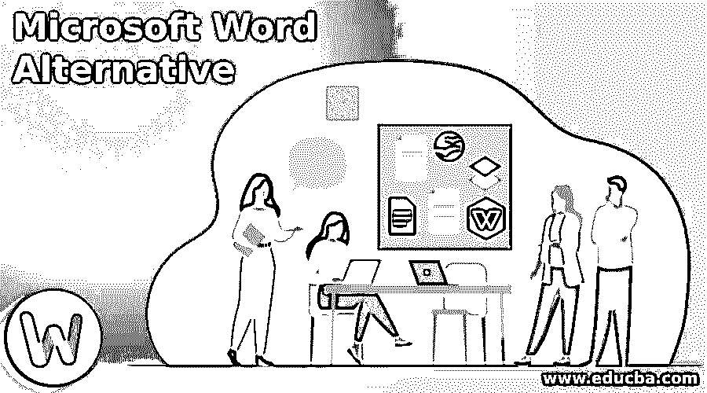

# Microsoft Word 备选方案

> 原文：<https://www.educba.com/microsoft-word-alternative/>

## Microsoft Word 备选方案介绍

以下文章提供了 Microsoft Word Alternative 的概要。微软 Word 确实有爱好者，但你大概会发现一个人爱 Word，一个人不爱。一个简单的文字处理软件有很多值得期待的地方，这是 Microsoft Word 由于其复杂的本质而无法提供的，从隐藏熟悉的菜单项的重新设计到过于复杂且通常无用的特性。而且微软 Word 和微软 Office 的其他部分都很贵。如果你不想要 Microsoft Word 的所有功能，很难证明支付这个价格是合理的，尤其是在小型企业中，你只需要一个文字处理器。所以，不要为你不会使用的东西付费，而是从五个免费的 Microsoft Word 选项中选择一个。

### 微软 Word 的 7 大备选方案

让我们来看看单词替换

<small>网页开发、编程语言、软件测试&其他</small>

#### 1.书店老板

LibreOffice 是微软 Office 的免费开源替代品，于 2011 年作为 OpenOffice.org 分叉首次推出。它包括用于编辑文档、电子表格、演示文稿、矢量图形、数学格式和数据库管理的各种应用程序。writer 是所有 Microsoft Word 用户唯一感兴趣的应用程序。书写工具，如 Microsoft Word，具有广泛的文字处理能力，能够以多种格式打开和保存材料，如. odt、.doc，. xhtml.docx，. rtf。

#### 2.WPS Office Writer

如果你希望使用 WPS Office Writer 作为文字处理器，但你不想支付额外费用。有一段时间，TechRepublichas 的 CNET 姐妹网站长期以来一直称赞 WPS Office Writers:这是一个完整的应用程序系列，具有高级功能。WPS Office Writer 主要类似于 Microsoft Word，支持在线云存储，但缺乏实时协作。查看 WPS office writer 的任何评论，你会发现显示单词量的语句。这可能是一个需要考虑的因素——特别是考虑到你不必付费——通过添加比 OpenOffice 等其他免费套件更多的功能。

#### 3.谷歌文档

谷歌文档是其谷歌驱动服务网络办公套件的一部分。尽管谷歌文档的使用是基于网络的，但它也可以作为手机和谷歌 Chrome 应用程序使用。Google Docs 可以支持协作文档编辑、增强的机器学习搜索和第三方插件，这只是其中几个有趣的功能。Google Docs 开起来很靠谱。doc 和. docx 文档，尽管可能会出现一些视觉错误。当与 Google Docs Offline Chrome 扩展一起使用时，Google Docs 支持离线查看和编辑文档。

#### 4.WPS 办公室

WPS Office 是由总部位于珠海的中国软件开发商金山公司开发的强大办公套件。它包括写作，显示和电子表格，以及 PDF 工具，以满足您所有的文件要求。在本文提到的微软 Word 的所有免费替代品中，WPS Office 对. doc 和. docx 文件的支持最好；因此，我们强烈建议那些不想每月支付 Microsoft Word 下标费，但仍希望以 Microsoft 的文件格式打开和编辑文档的学生。提供法语、葡萄牙语、波兰语、西班牙语、英语、西班牙语和德语版本。

#### 5.记事本++

Notepad++是一个简单的文本编辑器，顾名思义，它是记事本的替代品。然而，鉴于 Notepad++支持选项卡式编辑，许多人使用它来编写第一个绘图和校对，以便在一个窗口中处理多个文件。Notepad++有更多的功能，包括自动设置、通过正则表达式查找和替换文本字符串、宏、行书签和插件支持，这些功能将它提升为普通的文本编辑器，并将其放在自己的位置。

#### 6.AbiWord

AbiWord 是一款免费的 Linux 文字处理软件。这种支持与 Microsoft Word 有许多相似之处，支持基本的文字处理功能，如列表、线索和格式，以及高级功能，如语法控制、多视图、页面栏和模板。AbiWord 之前已经可以在 Windows 上使用，但是开发人员决定放弃对 Windows 版本的支持，因为人们对它普遍缺乏兴趣。

#### 7.代书人

Scrivener 是小说家、作家和学者使用的一种独特的文字处理程序。它旨在从头开始简化想法的收集和组织。Scrivener 的核心是一个简单的环形装订的隐喻，它允许您将您的文本分解成易于管理的部分，并根据您的标准组合它们。如果你很少处理较大的文章，这可能不重要，但是当你处理一篇长文章时，这是绝对重要的。

### 推荐文章

这是一个微软 Word 替代指南。在这里，我们还讨论了微软 word 的简介和 7 大备选方案，以及详细的解释。您也可以看看以下文章，了解更多信息–

1.  [微软 Word 功能](https://www.educba.com/microsoft-word-features/)
2.  [面向学生的微软项目](https://www.educba.com/microsoft-project-for-students/)
3.  [微软项目服务器](https://www.educba.com/microsoft-project-server/)
4.  [微软项目规划器](https://www.educba.com/microsoft-project-planner/)

