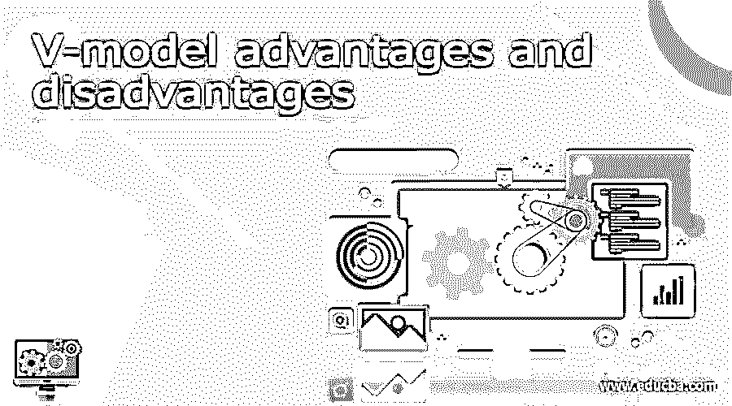

# v-模型的优点和缺点

> 原文：<https://www.educba.com/v-model-advantages-and-disadvantages/>

## V-model 优缺点介绍

V 模型是软件开发生命周期(SDLC)模型之一；看起来主要是流程的执行，顺序步骤必须是 V 形的，以便将数据视为验证和确认模型。V 代表确认区域任何一侧的验证阶段，其他一侧应遵循特定的步骤和阶段，以完成循环。这里的阶段代表阶段。与瀑布模型相比，V 模型的主要优势是节省时间，主动跟踪缺陷。在本主题中，我们将详细了解 V-model 的优点和缺点。

### V-模型的优点和缺点

我们已经知道了 V- model 类型及其用法。但是，与其他 SDLC 循环模型相比，尤其是瀑布模型，它主要被认为可以节省大量时间。这是因为 V 代表验证和确认；它用于验证和检查软件系统是否满足规范和其他要求，从而满足用户的需求和预期目的。因此，它比用于模型的瀑布有更高的成功机会，而且它是主动的度量和缺陷跟踪，将在测试活动的早期阶段发现缺陷。

<small>网页开发、编程语言、软件测试&其他</small>

同样，V-model 是系统的图像和图形表示，它是用于产生严格的开发生命周期模型和其他项目管理工具和模型的开发周期。因此它表示并被称为通用测试模型，主要代表美国政府标准。一般来说，V- model 用于规范标准和联邦(如德国联邦政府)内的软件开发过程，因为德国联邦政府及其国防项目是用每个地区来表示和调用的。与其他 SDLC 模型相比，V-model 更易于管理和在小型行业等项目中使用。它与模型高度一致，并且一次完成一次执行的阶段。这是因为 V-model 适用于小型项目，而项目的需求在生命周期的初始阶段更加清晰。

我们都知道 SDLC 的阶段，因为在需求分析之后，系统设计阶段是应用程序的主要部分。因为由于系统设计的原因，整个系统组件的描述就像产品开发的硬件和其他软件通信设置一样。因此，设备计划主要是建立在系统设计的基础上，由于这个阶段，它将留出更多的时间用于基于测试场景的实际测试执行。在此阶段之后，体系结构设计阶段用于系统设计，并在技术阶段实施应用程序，此外，在此阶段，应用程序模块将被分解为具有不同功能的独立模块，因此它表示高级设计阶段，简称为 HLD。在这个阶段之后，下一个级别是模块设计，它被命名为内部设计，并为系统模块指定，也称为低级别设计模式。该设计阶段将与具有不同架构的其他模块和其他外部系统兼容。

由于项目可交付成果的每个阶段的模型的刚性，它很容易管理，并且审查过程也是为了方便用户而处理的。但是它也有一些缺点，如对不确定性的高风险能力，因此它不是一个好的模型，对于高和大的复杂的面向对象项目，由于这种模型他们很难处理项目数据。此外，与其他模型相比，对于长期和当前正在进行的项目来说，它不是一个好的模型，不适合于对数据更改的高风险有高-中等比率要求的项目。从积极的一面来看，主要工程活动遵循逻辑流程，这种逻辑流程很容易被相应活动的平衡开发活动所涵盖和理解。因此，从测试的角度来看，V-model 不适合捕获开发。该模型关注生命周期早期的验证和确认活动，从而提高了构建错误的概率，并获得高质量的产品。他们可以使项目管理以某种精确的方式跟踪任务进度。缺点是，它有很高的风险，并且不容易处理并发事件。直到生命周期的后期，没有工作软件和应用程序是随着使用而产生的。模块设计是低层次的设计，可以称为 LLD。重要的是，设计要与系统架构和外部系统中的其他设计模块更加兼容。在 V-model 中，即使是其他模型，单元测试也是开发过程中最重要的一个。它有助于在早期阶段消除最大的故障和错误。因此单元测试将被分配到这个阶段，并且它依赖于内部模块设计。

V-模型有一些类型，如单 V-模型、双 V-模型和三 V-模型。从测试者的角度来看，这些类型的模型用于传统测试。主要验证技术旨在利用用户已知的输入来验证产品行为。

### 结论

一般来说，SDLC 模型用于理解项目的工作流程，无论何时我们从我们这边开始项目。基于场景，许多模型是可用的，并且被技术人员所遵循；V-模型中包括预算和其他小规模项目模型。

### 推荐文章

这是一个关于 V-model 优缺点的指南。这里我们详细讨论一下 V 模型的优缺点。您也可以看看以下文章，了解更多信息–

1.  [链表优势](https://www.educba.com/linked-list-advantages/)
2.  [缓存内存优势](https://www.educba.com/cache-memory-advantages/)
3.  [码头工人的优势](https://www.educba.com/advantages-of-docker/)
4.  [比特币的优势](https://www.educba.com/advantages-of-bitcoin/)

