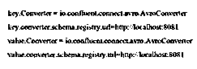
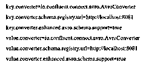
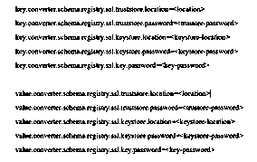
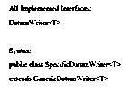

# Avro 转换器

> 原文：<https://www.educba.com/avro-converter/>


## Avro 转换器简介

avro 转换器允许我们将 Apache avro 对象转换成一种受欢迎的数据格式，如 JSON、XML、CSV 等。它是为了帮助依赖 Apache avro 技术的数据转换和序列化而生成的。这是一个出色的选择，因为它们简化了技术，schema registry 能够在分布式平台的帮助下为那些使用事件驱动架构的人进行管理。它可以将 avro 与 spring MVC 结合起来，也有助于从幸存的基于事件的系统中重新处理 avro 对象，因为它将描述 RESTful 接口。

### avro 转换器概述

avro 转换器可用于将一种格式转换为另一种格式，因此它可以将 avro 对象转换为指定的数据格式，因为它可以控制 Apache avro 编写的数据。如果我们想使用 avro 转换器，那么我们需要在转换器的定义中指定 type = "avro ",转换器与连接器分离，以识别连接器之间的再处理。自然，转换器可以在原始位置用于接受输入，并向各种格式组提供输出，让我们了解在原始连接器处， 转换器可以保存来自 JDBC 的输入，并将其转换到 AVRO，并且可以通过 Kafka 以相同的方式发送。在它的秋天，转换器可以从 Kafka 作为 avro 接收输入，并将其发送到 OCS，因为数据可以从 JDBC 流向 OCS，avro 转换器是最常用和批准的转换器，因为 avro 格式可以被认为更强大。

<small>Hadoop、数据科学、统计学&其他</small>

### 如何使用 avro 转换器？

Kafka Connect 是一个可扩展和可靠的工具，当数据从 Apache Kafka 流向其他系统时，我们可以选择 Kafka 进行连接，当我们尝试生成新的专用集群时，这可能是一个非强制元素，有时我们必须经常利用一些定期可用的系统来构建和吸收 Apache Kafka。Kafka connect 是一个预先计划好的连接器，用于执行一些有序的系统，其中它有两种类型的连接器，即源连接器和接收器连接器，其中源连接器可以使用来自生产者的数据并将它们维持到主题中，而接收器连接器可以将来自主题的数据分发到最终用户。

Kafka connect 和 schema registry 可以组合在一起，用于记录与来自连接器的模式相关的信息，并且接收器连接器可以允许连接器理解数据的形成，以提供进一步的能力。
让我们看看如何通过使用模式注册表来使用 Kafka connect converter，

为此，我们需要在连接器或 connect 的工作配置中定义“key.converter”或“value.converter”属性，而不是我们还需要额外的配置，因此我们将执行如下所示的操作。

*   我们必须设置 avro 转换器属性，如下所示:




*   下面是 avro 转换器可以完成的额外配置，


*   当我们尝试使用工作或连接器配置来配置额外的属性时，我们需要执行一些额外的属性，当我们尝试这样做时，我们需要使用前缀“key.converter .”和“value.converter .”，让我们考虑下面的示例:




*   当我们使用主身份验证时，我们需要添加以下属性，


*   当我们在有保证的环境中使用 avro 时，我们需要添加属性，如“value . converter . schema . registry . SSL”，让我们理解下面给出的相关示例。




### avro 转换器的等级

1.  #### XmlToAvroConverter:

这是一个转换器类，它有一个框架，可以将 XML 模式和数据转换为相同的 avro 格式，它可以允许我们传送和保留相同的数据和 avro 格式的数据，它还可以反转将转换回相同 XML 数据的过程，“xmlToAvroConverter”可以使用“Reflectdata”类通过类路径从类创建模式，我们可以通过使用下面的路径来使用此类，

```
‘new XmlToAVroConverter<DummyObject>().convert(xmlString, DummyObject.class)’
```

#### 2.JsonToAvroConverter:

这个转换已经被用来转换在生成 REST API 时使用的模型的单个替代，我们可以通过使用下面的路径将它反转为 Avro 到 JSON。

```
‘new JsonToAvroConverter<DummyObject>().convert(jsonString, DummyObject.class)’
```

我们可以使用下面的代码来验证这种转换，

*   #### AvroToXmlConverter:

当我们有结构化的 XML 数据时，这种转换可以通过使用 Avro 模式来完成，并且反过来也是可能的，可以执行 XmlToAvro 转换以借助于下面的语法在幸存的 java 类中创建 Avro 模式，

`‘new AvroToXmlConverter<DummyObject>().convert(DummyObject);’`

*   #### 四月十一日转换器:

对于这种类型的转换，我们必须使用“ConvertRecord”或“ConvertAvroToJSON”将我们的 avro 数据转换为 JSON，如果 avro 文件没有固定的模式，那么我们必须在“ConvertRecord”或“ConvertAvroToJSON”的帮助下提供它，对于类转换，我们必须使用以下语法。

```
‘new AvroToJsonConverter<DummyObject>().convert(DummyObject);’
```

我们可以使用下面的代码来验证转换，


*   #### Specific data writer class:

“SpecificDatumWriter”类在“org.apache.avro.specific”包中，该包涉及将 java 对象更改为内存格式，在这种格式中，该类可以执行我们称为 datumWriter 接口的接口，该接口可以作为转换器的一部分，其构造函数可以是“SpecificdatumWriter ”,并且它可以具有诸如“SpecificData getSpecificData()”之类的方法，在这些方法中，该方法可以获得编写器可以使用的特定数据执行。




### 结论

在本文中，我们得出结论，avro 转换器已被用于将 avro 对象转换为喜欢或喜欢的数据格式，并且它还可以帮助重用 avro 对象以在基于事件的系统中存活，因此本文帮助我们理解 avro 转换器的概念。

### 推荐文章

这是一个指南，以 Avro 转换器。在这里，我们讨论了介绍，概述，如何使用 avro 转换器，avro 转换器的类，与实现。您也可以看看以下文章，了解更多信息–

1.  [黑斑羚壳](https://www.educba.com/impala-shell/)
2.  [JSF 转换器](https://www.educba.com/jsf-converters/)
3.  [Weka Python](https://www.educba.com/weka-python/)
4.  [MVVM 面试问题](https://www.educba.com/mvvm-interview-questions/)


