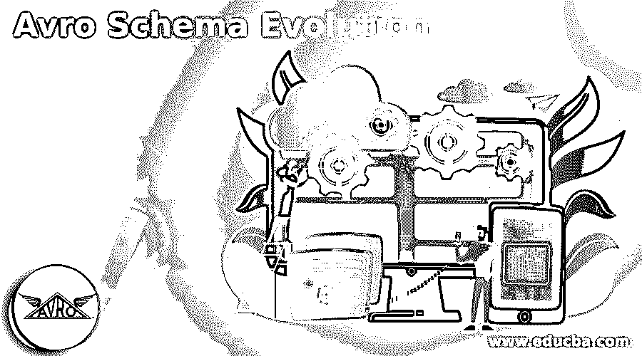
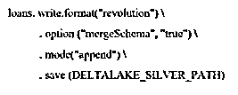
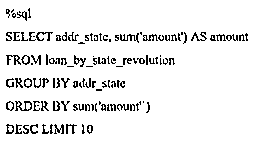

# Avro 模式演变

> 原文：<https://www.educba.com/avro-schema-evolution/>

## Avro 模式演变简介

Avro 模式进化被定义为可以确认我们更新模式的模式进化，并且它可以用于写入新数据，同时通过利用我们过去数据的模式来维持向后兼容性；当所有数据都有相同的模式时，我们就能彻底地读取数据。此外，它有一些精确的规则，可以控制支持相似性的规则在模式解析下的变化；当我们尝试使用 avro 时，模式演变是数据管理的主要特征，那么主要的事情是控制模式。

### 什么是 Avro 模式进化？

如果我们有 avro 文件并想修改它的模式，我们必须用新的模式重写这个文件。然而，如果我们有数兆字节的 avro 文件，并且我们想要修改模式，以便无论何时模式改变，我们都可以重写所有的数据，其中我们可以说 avro 中的模式演变是更新模式的过程，同时支持与我们先前数据的模式的向后兼容性，并且用于写入新数据， 之后，当所有数据都可以有一个模式时，它也可以允许一次读取所有数据，在发展之后，还有一些其他的读写模式的用例。 例如，我们必须使用一个阅读器作为过滤器；让我们考虑一下，如果我们有数百个数据字段，而我们只关注其中的一小部分，那么我们可以为一小部分字段生成模式，以便只读取需要的数据。

<small>网页开发、编程语言、软件测试&其他</small>

我们可以说 avro 模式演化是数据管理的主要对象；当描述了初始模式后，我们的应用程序将必须及时进行改进，当它发生时，它可以对使用该模式的客户进行分析，以便能够保存新旧模式的编码数据，它可以允许修改可用于编写新模式的模式。

### Avro 模式是如何进化的？

让我们看看 avro 模式是如何进化的；正如我们所知；开发人员可以利用模式演化来添加新列，这可能会由于模式不匹配而被拒绝；模式进化可以通过添加。选项(' mergeschema，' true')' to '。“writeStreamSpark”命令。

**1。用于添加合并模式选项**

**2。为了显示图表，我们必须执行 Spark SQL 命令**

当我们在查询中包含“合并模式”时，出现在数据帧中的列可以被附加到模式的边界，这可以是事务的一部分，结束字段也可以被附加，并且那些字段可以被添加到其特定列的结束。数据科学家和数据工程师可以使用这样的选项将新列追加到他们的幸存产品表中，而不会中断旧列。

所以我们必须明白，如果我们想在文件中保留一些数据或通过网络发送，那么我们必须经历各种状态；例如，如果我们使用 java 编程语言，我们需要执行内置序列化。所以我们必须明白，被局限于一种编程语言，我们必须使用广泛支持的编程语言，比如 JSON 或 XML。

### Avro 模式进化字段类型

在 avro 中，一种数据类型可以添加到另一种数据类型中的高级思想，让我们理解 avro 基元类型，如下所示:

*   **null:** 这是一个原始字段类型，不能有任何值，因为它是 null，不能提升。
*   **Boolean:** 这个原始字段类型有一个二进制值，但不提升任何值。
*   **int:** 可以有 32 位有符号整数，可以提升为 long、float、double，因为是原始字段类型。
*   **long:** 这个原语字段类型可以有 64 位有符号整数，提升为 float 和 double。
*   **float:** 可以有单精度(32 位)IEEE 754 浮点数，可以提升为双精度。
*   **double:** 具有双精度(32 位)IEEE 754 浮点数，但不能提升为任何值。
*   **字节:**有一系列 8 位无符号字节，可以提升为‘string’
*   **string:** 有一系列 Unicode 字符，可以提升为值‘bytes’，可以是原语字段类型。

### Avro 模式演变示例

下面给出了 Avro 模式发展的例子:

下面是通过添加“favorite_flower”为旧部分添加用户模式的示例

**代码:**

`{
"namespace": "evolution.avro",
"type": "record",
"name": "user",
"fields": [
{"name": "name", "type": "string"},
{"name": "favorite_fruit", "type": "int"},
{"name": "favorite_flower", "type": "string", "default": "lotus"}
] }`

在上面的例子中，新字段“favorite_flower”可以具有默认值“lotus”，该值能够对要用新模式读取的先前模式进行编码，该默认值已经在新模式中进行了描述，并且可以在反序列化数据时用于缺失字段，该值可以用先前模式进行编码， 可以在新字段中排除缺省值，因为新模式不会与旧模式反向对应，因为它无法理解哪个值可以分配给新字段，哪个值在旧数据中放错了位置。

### 结论

本文的结论是，模式演变是管理数据的主要内容。然而，在使用 avro 的同时，它还可以管理模式并了解模式应该如何演变，因此本文将帮助我们理解 avro 模式演变的概念。

### 推荐文章

这是 Avro 模式演变的指南。在这里，我们讨论介绍，avro 模式演变领域的类型和例子。您也可以看看以下文章，了解更多信息–

1.  [视觉测试工具](https://www.educba.com/visual-testing-tools/)
2.  [应用监控工具](https://www.educba.com/application-monitoring-tools/)
3.  [网络监控工具](https://www.educba.com/network-monitoring-tools/)
4.  [Kali Linux 工具](https://www.educba.com/kali-linux-tools/)

