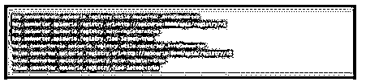
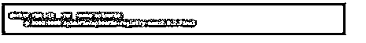

# Avro 序列化

> 原文：<https://www.educba.com/avro-serialization/>

## Avro 序列化简介

Avro 序列化是通过网络有序传输数据的过程。我们可以将数据结构或实体位置解释成二进制或描述性的形式；这样的过程在 avro 中称为序列化，在 avro 中也称为封送和反序列化，我们可以称之为解组。正如我们所知，avro 不依赖于平台；它是基于模式的，可以利用它来执行序列化和反序列化。而且，它可以使用 JSON 和二进制格式进行转换。

### Avro 序列化概述

avro 串行化将二进制或文本格式内的对象的数据结构或状态转换成变换数据以保留在持久存储装置上。如果数据已经通过对象进行了转换，那么必须再次进行反序列化。其中序列化也称为封送处理，反序列化称为解组。avro 序列化是基于架构的数据序列化集合；它还可以执行编码，其中编码器已经被用来描述格式。它有两种类型的编码器，二进制编码和 JSON 编码。

<small>网页开发、编程语言、软件测试&其他</small>

### Avro 序列化步骤

让我们看看如何使用 avro 来序列化数据。

首先，我们必须编写模式并用。avsc '扩展。

**举例:**

**代码:**

`{
"namespace": "avro serialization",
"type": "record",
"name": "stud",
"fields": [
{"name": "name", "type": "string"},
{"name": "id", "type": "int"},
{"name": "marks", "type": "int"},
{"name": "percentage", "type": "int"},
{"name": "subject", "type": "string"}
] }`

之后，我们必须在 avro 实用程序的帮助下编译模式；然后，我们将接收与模式通信的数据，
' Java-jar<path/to/avro-tools-1 . 7 . 7 . jar>编译模式<path/to/schema-file>T5】destination-folder>

之后，终端将在主文件夹中打开，在下面命令的帮助下可以生成一个新目录。

**代码:**

`‘$ mkdir Avro_Work’,`

在新目录中，我们还可以生成子目录，其中有用于保存模式的模式，另一个名称是‘with _ code _ gen ’,用于存储创建的代码。然后我们可以使用名为 schema 的 jar 来存储 jar 文件。

**代码:**

`$ mkdir schema
$ mkdir with_code_gen
$ mkdir jars`

架构已被数据占用。

然后，它可以在 avro 库的帮助下进行序列化。

### Avro 序列化类型

有两种类型的 avro 序列化:

#### 1.二进制编码

二进制编码已经被许多应用程序采用，它比 JSON 快，在 JSON 中，在二进制编码中，原始数据类型被编码为:

*   零字节编码为空。
*   编码为 Boolean 的单字节表示 0 代表假，1 代表真。
*   此外，在可变长度编码的帮助下，int 和 long 值应该被写入。
*   对于 4 字节，我们必须借助于一个相当于 Java 的 floatToIntBits 的方法来编写一个“float”；float 可以转换为 32 位整数，编码为 little-endian 格式。
*   UTF-8 字符数据已经被编码为字符数据，并且字符串也被编码。

#### 2.JSON 编码

这种编码已用于调试和基于 web 的应用程序；这种编码类似，因为我们可以将 encode 字段用于除联合之外的默认值；在 JSON 中，联合的值可以编码为:

*   如果 JSON 值具有 null 类型，则它被编码为 null。
*   如果 union 可以有 value as pair，那么就可以编码成一个 JSON 对象，其中名称是类型名，值会重复编码；我们必须记住，对于 avro 名称，我们需要使用用户指定的名称。

例如，模式的并集是["null "、" string "、" zoo"]，其中 zoo 是记录的名称，它可以编码为:

1.空为空。
2。字符串“b”可以是{“string”:“b”}。
3。动物园可以编码为{"zoo": {…}}，其中{…}可以是 JSON 编码。
4。JSON 编码没有考虑映射和记录之间的不同。

*   如果我们想长期保留单个 avro 序列化值，那么我们必须为不同的 avro 记录保留该记录；我们可以在二进制编码的帮助下对单个值进行编码。

#### 3.部署 Avro 序列化

让我们看看 Debezium 连接器的部署，它可以利用 avro 序列化，因为我们必须执行三项工作。

*   我们必须部署 Apicurio API 和模式注册检查。
*   一个插件目录有一个安装包通过它；我们必须安装 avro 转换器。
*   之后，我们必须通过设置配置属性来配置 debezium 连接器，以使用 avro 序列化，如下所示。

*   在内部，Kafka 每次都可以利用 JSON 值或 JSON 键来保留配置和偏移量。
*   我们也可以使用 Debezium 容器进行部署；我们必须利用 debezium 映像来部署 debezium 连接器，avro 序列化可以利用这一点。

1.我们必须部署 Apicurio 的注册表，其中我们必须利用 Apicurio 注册表的非生产实例:

2.我们必须运行 Debezium 容器映像来连接 Kafka。然后，它将通过启用变量“ENABLE _ Apicurio _ CONVERTERS = true”来授权 API curio，从而给 avro 连接器，该变量可以是环境变量。

### 结论

在本文中，我们得出结论，avro 是一个基于模式的数据序列化应用程序，这是一个快速的过程，它可以允许序列化二进制和 JSON 格式的数据，因此本文包括与 avro 序列化相关的要点，即序列化的类型和 avro 序列化的部署。

### 推荐文章

这是 Avro 序列化的指南。这里我们讨论介绍，概述，avro 序列化步骤，和类型。您也可以看看以下文章，了解更多信息–

1.  [视觉测试工具](https://www.educba.com/visual-testing-tools/)
2.  [应用监控工具](https://www.educba.com/application-monitoring-tools/)
3.  [网络监控工具](https://www.educba.com/network-monitoring-tools/)
4.  [Kali Linux 工具](https://www.educba.com/kali-linux-tools/)

