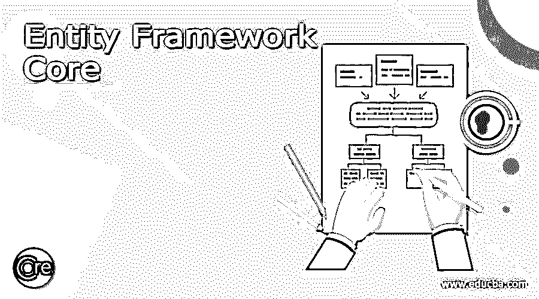
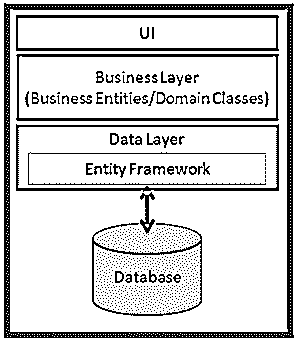
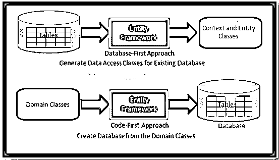
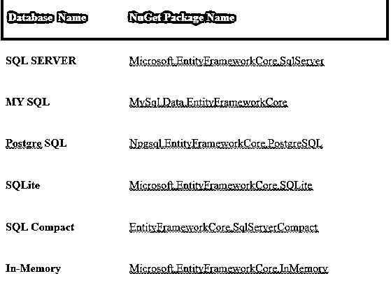

# 实体框架核心

> 原文：<https://www.educba.com/entity-framework-core/>




## 实体框架核心简介

实体框架(EF)核心是一个开源的可扩展版本，广泛用于数据访问技术，是继 EF 6.x 之后的最新版本。实体框架核心作为一个对象关系映射器，是 ADO.NET 的改进版本，为开发人员提供了一个自动机制来检索和存储数据库中的数据。实体框架 EF 与。NET 核心应用程序。

### 概述实体框架核心

在早期版本中，开发人员通常通过 ADO.NET 编写完整的代码，用来存储和检索数据库中的数据。在 ADO.NET，我们需要打开到数据库的连接，我们需要创建数据集来存储和检索数据库中的数据，它会将数据集转换为。NET 对象等等。整个过程是一件繁琐的事情，也是一个容易出错的过程。微软提供的另一个可选方法是称为 EF 的框架，它为应用程序自动化/计算机化数据库的活动。

<small>网页开发、编程语言、软件测试&其他</small>

实体框架(EF)核心是一个基于 ORM 的开源框架。NET 应用程序，它是一个广泛用于数据访问技术的可扩展版本。通过使用这个框架，开发人员可以集中精力使用领域类的对象来处理数据，而无需接近所需的数据库表。与 EF Core 一起使用时，大多数开发人员在处理数据时只专注于高层次的概念，与传统应用程序相比，只使用较少的代码来构建和继续面向数据的应用程序。




在上图中，EF 适用于数据库和业务实体之间，它将数据存储在业务实体的属性中，从数据库中获取数据，并重复传递业务实体对象。

### 实体框架功能

*   实体框架有助于减少编码级别，这有助于开发人员轻松构建任何应用程序，下面我们来看几点
*   EF 可以同时在 Windows、Mac、Linux 上执行，因为实体框架是跨平台的。
*   实体框架(EF)维护用于从数据库中检索数据的 LINQ 查询。实体框架允许直接从数据库执行 SQL 查询来完成查询过程。
*   用于创建实体数据模型(EDM)的 EF 基于具有各种数据类型的 Get 和 Set 属性的实体。框架使用该实体向数据库存储和查询数据。
*   EF 主要基于调用 SaveChanges()方法时实体发生的变化来构建数据库的插入、删除、更新命令。EF 提供了异步的 SaveChangesAsync()方法。
*   EF 主要在存储和查询数据时进行事务管理。它提供了定制事务管理的首选项。
*   EF 提供了开箱即用的第一级缓存，而不是重复查询从缓存中返回数据，作为命中数据库的替代方法。
*   EF 提供使用数据注释属性或 API 来配置实体框架模型，以覆盖默认约定。

### 实体框架核心应用程序类型

实体框架(EF)核心支持两种应用类型

1.  代码 Firts
2.  数据库优先

由于 EF 核心不支持数据库模型的可视化设计器或向导，实体框架核心主要针对代码优先类型，并建议很少支持数据库优先类型。

1.代码优先——在代码优先方法中，实体框架 API 构建数据库，并使用基于领域类提供的约定和配置的迁移将数据制成表格。代码优先的方法在(DDD)领域驱动设计中最有帮助。

2.数据库优先–在数据库优先类型中，实体框架核心 API 通过使用 EF Core 的命令，基于可用的现有数据库构建上下文和域类。这种数据库优先在 EF 核心中只有有限的支持，因为它不支持可视化设计器或向导。




### 实体框架核心模型

使用模型来访问数据。该模型建立在实体类和表示与数据库的会话的上下文对象上。上下文对象支持数据的存储和查询。实体框架支持开发方法模型，它们是

*   从现有的数据库中，它生成模型
*   手工编码模型以匹配数据库。
*   迁移使得数据库能够随着模型的变化而发展，如果模型被创建，那么利用 EF 迁移从模型中创建数据库。

**样本程序**

```
using System.Collections.Generic;
using Microsoft.EntityFrameworkCore;
namespace SampleModel
{
public class BloggingContext : DbContext
{
public DbSet<Blog> Blogs { get; set; }
public DbSet<Post> Posts { get; set; }
protected override void OnConfiguring(DbContextOptionsBuilder optionsBuilder)
{
optionsBuilder.UseSqlServer(
@"Server=(localdb)\mssqllocaldb;Database=Blogging;Trusted_Connection=True");
}
}
public class Blog
{
public int Blog_Id { get; set; }
public string Blog_Url { get; set; }
public int Blog_Rating { get; set; }
public List<Post> Blog_Posts { get; set; }
}
public class Post
{
public int Post_Id { get; set; }
public string Post_Title { get; set; }
public string Post_Content { get; set; }
public int BlogId { get; set; }
public Blog Blog { get; set; }
}
}
```

### 实体框架核心数据库

EF Core 是 ADO.NET 的改进版本，它为开发人员提供了一个自动检索和存储数据库数据的机制。实体框架 EF 与。NET 核心应用程序。实体框架(EF)核心利用提供者模型来授权使用各种数据库。EF 核心包括我们必须安装的 NuGet 包中的提供者。

让我们看看下表，它解释了数据库提供者和实体框架核心的 NuGet 包，

数据库名 nu 获取包名




### 结论

在本文中，我们学习了支持数据库提供商的 EF Core 的各种功能和概述以及特性。它是一个基于开放源码 ORM 的框架。NET 应用程序，它是一个广泛用于数据访问技术的可扩展版本。

### 推荐文章

这是一个实体框架核心指南。这里我们讨论介绍，概述，特点，应用类型，实体框架核心数据库与实现。您也可以看看以下文章，了解更多信息–

1.  [ASP.NET 核心实体框架](https://www.educba.com/asp-dot-net-core-entity-framework/)
2.  [ADO.Net vs 实体框架](https://www.educba.com/ado-net-vs-entity-framework/)
3.  [实体框架面试问题](https://www.educba.com/entity-framework-interview-questions/)
4.  [实体框架插入](https://www.educba.com/entity-framework-insert/)


