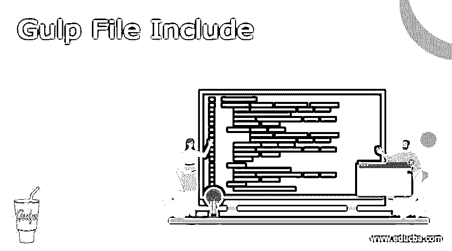
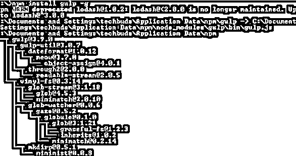
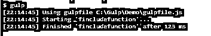

# 吞咽文件包括

> 原文：<https://www.educba.com/gulp-file-include/>




## 吞咽文件的定义包括

我们知道 gulp 基本上是用来按照开发者的要求自动完成网站任务的，比如可以考虑预处理 CSS 代码、缩小 JavaScript 和阅读。它为开发者提供了不同种类的特性；包含的 gulp 文件是用来监控整个过程的特性之一。有时我们需要在 HTML 文件中包含这个块，这样我们就可以很容易地包含它，并且这个文件存在于完成开发的文件夹中。为了实现，我们需要添加使用 npm 包含的文件包。

### Gulp 文件概述包括

Gulp 是一个跨阶段的流任务冲刺器，允许工程师自动完成大量的改进任务。在不可否认的层面上，gulp 细读文件就像细流一样，并把这些细流与各种事业联系起来。这些任务是基于代码的，并且使用模块。企业改变文档，将源记录构建成创建文档，

<small>网页开发、编程语言、软件测试&其他</small>

鉴于给定的 globs，src()同样可以放在管道中，以便向流中添加记录。这些额外的文档可以在流的后面进行修改。假设 globs 交叉，文档将在将来被添加。

总的来说，一个站点或一个 JavaScript 应用程序包含一些 JavaScript 文档。更重要的是，程序应该从服务器获取这些记录来完全堆叠页面。下载更多的记录需要额外的时间，因为程序需要发送更多的 HTTP 请求。

每当我们制作网站时，我们都在不断尝试传达最理想的体验。这包括让我们的网站页面快速显示。一段时间以前，这意味着在一个 CSS 文档中包含我们的所有样式。

所有的 Gulp 设置都记录在一个名为 gulpfile.js 的记录中，该记录位于企业的基础上。编写作业的例子是，你首先负担一个你将要使用的模块，然后描述一个依赖于该模块的任务。

Gulp 是非常模块驱动的；要实现某个目标，您需要知道使用哪个模块。通常，一个单独的模块有一个单独的原因，所有的模块都只是习惯性的 JavaScript。

虽然这使我们的网站页面加载更快，但它使跟上 CSS 文档成为一个夜猫子。现在，我们可以利用大量的 CSS 文档进行更好的关联，然后将记录连接在一起成为一个巨大的记录。假设我们的 construct/CSS 信封中有两个独立的 CSS 文档。我们将利用一个 gulp 模块来连接样式信封中的所有 CSS 文档。

### 如何使用 gulp 文件包含？

现在让我们看看如何使用这个文件，包括如下内容。首先，我们需要借助以下命令来确认 gulp 的所有设置和安装。

**节点 v**

**解释**

通过使用上面的命令，我们可以看到 Node.js 的安装版本，执行后我们可以看到下面命令的结果，如下所示。


在命令行提示符下，输入附带的命令以显示 npm (Node.js bundle chief)的变体，该变体用于引入模块。它将借助下面的命令显示引入的 Node.js 表单。

**npm -v**

**解释**

执行上述命令后，我们可以看到我们机器上当前安装的 npm 版本，如下图所示。


现在我们成功地安装了 Node.js，现在我们需要使用下面的命令安装 gulp，如下所示。

**npm 安装吞咽 g**

**解释**

在上面的命令中，我们使用 g 作为标志，确保 gulp 对所有项目都是全局可用的。输入上述命令后，我们得到如下屏幕截图所示。




为了验证 gulp，我们需要如下运行下面的命令。

**吞咽–v**

**解释**

执行上述命令后，我们得到了当前安装的 gulp 版本，如下图所示。


我们可以通过下面的命令来安装 gulp 文件，如下所示。

**npm i gulp-file-include**

现在我们来看一个如下的例子。

让我们考虑下面的 html，

```
<!DOCTYPE html>

<html>

<body>

@@include('./sample.html')

@@include('./demo.html', {

"studname": "Jenny",

"rollno": 011,

"site": {

"g": "google.com/include",

"sa": "demowebsite.com/include"

}

})

</body>

</html>
```

**解释**

在上面的 html 文件名为**home.html**中，我们用所示的前缀为不同的 html 文件编写代码，例如 sample 和 demo。

现在创建一个. js 文件，并编写如下代码。

```
const file = require('gulp-file-include');

const gulfp = require('gulp');

gulp.task('fincludefunction', function() {

gulp.src(['home.html'])

.pipe(fileinclude({

prefix: '@@',

basepath: '@file'

}))

.pipe(gulp.dest('./'));

});
```

**解释**

现在使用 gulp 命令运行上面的代码。上述实现的最终结果如下图所示。




现在，我们可以看到 home.html 文件的更多细节如下。

```
<!DOCTYPE html>
<html>
<body>
@@include('./sample.html')
@@include('./demo.html', {
"studname": "Jenny",
"rollno": 011,
"site": {
"g": "google.com/include",
"sa": "demowebsite.com/include"
}
})
@@include('./demo.html', {
"studname": "Jenny",
"rollno": 011,
"site": {
"g": "google.com/include",
"sa": "demowebsite.com/include"
}
})
</body>
</html>
```

### 吞咽文件包括一个模块

缓冲模式是默认模式，将记录内容加载到内存中。模块通常在缓冲模式下工作，许多不支持流模式。

流式模式的存在基本上是为了处理无法容纳在内存中的大量记录，类似于怪物图片或电影。这些项目是以小块的形式从文件系统中溢出的，而不是同时堆积。假设你真的想利用流模式，搜索一个支持它的模块或者编写你自己的模块。

Void 模式不包含任何项目，在处理记录元数据时很有价值。允许在发生变化时观看 globs 和执行任务。任务与任务框架的其余部分保持一致。

### 结论

借助上面的文章，我们试着了解一下 Gulp 文件的 include。从这篇文章中，我们知道了关于 Gulp 文件包含的基本知识，我们也看到了 Gulp 文件包含的集成以及我们如何在 Gulp 文件包含中使用它。

### 推荐文章

这是一个指南吞咽文件包括。在这里我们讨论如何使用 gulp 文件的定义，include，用代码实现的例子。您也可以看看以下文章，了解更多信息–

1.  [Gulp vs Webpack](https://www.educba.com/gulp-vs-webpack/)
2.  [大口 vs 咕噜](https://www.educba.com/gulp-vs-grunt/)
3.  [全栈技术](https://www.educba.com/full-stack-technologies/)
4.  [棱角分明的材质版本](https://www.educba.com/angular-material-version/)


