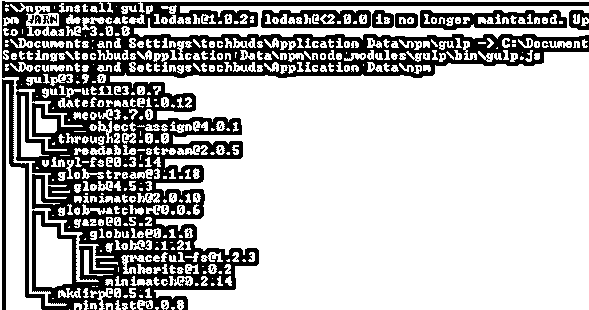
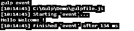

# 黄色自动更正

> 原文：<https://www.educba.com/gulp-autoprefixer/>

## 大口自动预混器的定义

我们知道 gulp 用于管理开发人员的前端任务，这意味着它可以自动化不同的任务。自动前缀器帮助我们管理 CSS 代码；另一方面，在线自动前缀器提供网站的前缀 CSS 代码。通过使用 auto prefixer，我们可以组合与 CSS 相关的不同查询，我们还可以创建不同的 sprint 图像，根据我们的要求美化 CSS 和 JavaScript 文件，根据我们的要求最小化 HTML 文件的大小，以及根据我们的要求随时可以做更多的事情。

### 什么是 Gulp Autoprefixer？

利用 Autoprefixer，你可以避免一些重复的无意义的工作，你可以编写 CSS 代码。这个功能可以帮助我们忘记如何使 CSS 代码交叉编程，简单地编写标准代码，然后，设备可以直接将商家前缀添加到我们的代码中。

<small>网页开发、编程语言、软件测试&其他</small>

当我们编写 CSS 代码时，我们没有意识到如何使它们跨所有程序，所以你查询 Google，仔细阅读 Stackoverflow 使它们工作，这需要一些投资。

假设你还在使用像 WordPress 这样的高级目的地，Joomla 试着不要使用高级形式的设备，例如 Webpack、Gulp 或 Grunt，你可以使用在线 CSS AutoPrefixer 设备，这对我们来说是无可挑剔的。

PostCSS 模块解析 CSS 并将销售者前缀添加到 CSS 规则中。它是一个 CSS 后处理器。在真正查看代码之后，它筛选合并的 CSS 记录，添加或删除像–WebKit 和–Moz 这样的商家前缀。

流形式框架，它构建了计算机化任务的框架:所有 JavaScript 文件的缩小和复制，以及静态图片。更适合观看记录，以便在文档更改时自然地重新运行任务。

### 安装自动修复程序

现在让我们看看如何安装一个 autoprefixer，如下所示。

首先，我们需要借助下面的命令来确认 Node js 的安装。

**节点 v**

**解释**

通过使用上面的命令，我们可以看到 Node.js 的安装版本，执行后我们可以看到下面命令的结果，如下所示。

在命令行提示符下，输入附带的命令以显示 npm (Node.js bundle chief)的变体，该变体用于引入模块。它将借助下面的命令显示引入的 Node.js 表单。

**npm -v**

**解释**

执行上述命令后，我们可以看到我们机器上当前安装的 npm 版本，如下图所示。

现在我们成功地安装了 Node.js，现在我们需要在下面命令的帮助下安装 gulp。

**npm 安装吞咽 g**

**解释**

在上面的命令中，我们使用 g 作为标志，确保 gulp 对所有项目都是全局可用的。输入上述命令后，我们得到如下屏幕截图所示。

为了验证 gulp，我们需要运行如下命令。

**吞咽–v**

**解释**

执行上述命令后，我们得到了当前安装的 gulp 版本，如下图所示。

之后，我们可以在如下命令的帮助下安装 autoprefixer。

**npm 安装–保存–开发补充–自动修复**

成功安装 autoprefixer 后，我们需要在项目目录中创建 gulpfile.js，并编写如下代码。

var gulp = require(' gulp ')；

**gulp.task('event '，function(){**

**console.log('\n 你好欢迎！\ n’)；**

**})；**

这里我们有代码，现在我们需要执行上述代码，或者我们可以说文件的帮助下，以下命令如下。

**大口事件**

**解释**

执行上述命令后，我们可以在命令行上看到如下截图所示的结果。

你可以在 Gulp 网站上观察 Gulp 模块的代码。对于我的情况，我使用 Gulp 来缩小我的 JavaScript 文档，合并 CSS 媒体问题，或者使我的 CSS 记录自然具有商家前缀。

### 海湾自动更正地图

现在我们来看看 autoprefixer 贴图有哪些如下。

不管你是否喜欢某样东西，自动修复在物理上来说确实很沉闷，而且当你非常依赖 mixins 的时候会弄乱我们的代码。此外，我们需要考虑什么应该放在前面，什么可以保持原样。考虑到所有的事情，假设你真的关心一个完美合理的结果，利用前缀混合可以使我们的工作加倍。autoprefixer 通过意识到应该完成什么来提供帮助。这就是计算机化的真实情况。

无论如何，拥有这两个优势——一流的资源地图和通过计算机化设备的一些帮助——你无疑可以结束这个问题。Sourcemaps 描述了结果中的哪一行代码与第一行中的哪一条记录和哪一行代码相关联的指南。假设您正在对结果进行后处理，并添加新的行(或者删除它们，这取决于您如何安排自动前缀),指南通常会变得支离破碎。autoprefixer 本身可以制作 sourcemaps，但是，您需要修改前者，这有点单调。

然而，有一个简单的特技可以让你不费吹灰之力就完成这两件事。简单地说，不要允许产生新的线条。Sass 和 autoprefixer 都非常在意你的编码方式。这意味着无论何时你已经得出了结果是如何产生的，他们都不会远离你的代码。这样，假设您建议 Sass 将每个标准组成一行(减少了产量样式)，autoprefixer 将在一个明确的类似行中添加新的原则，从而保护 sourcemap 数据。

var gulp = require(' gulp ')；
var sass = require(' gulp-ruby-sass ')；
var source maps = require(' gulp-source maps ')；
var prefix = require(' gulp-autoprefixer ')；
gulp.task('event '，function(){
sass(' Gulp/Demo/。scss '，{sourcemap: true，style: 'compact'})

.管道(前缀("最新 2 版"，" > 2% "，" ie 6 "，" ie 5 "))

.管道(sourcemaps.write(' . ')))

.pipe(gulp . dest(' dist '))；

});

### 结论

借助上述文章，我们尝试了解一下 Gulp autoprefixer。从这篇文章中，我们了解了关于 Gulp autoprefixer 的基本知识，我们也看到了 Gulp autoprefixer 的集成以及我们如何在 Gulp autoprefixer 中使用它。

### 推荐文章

这是一个吞咽自动修复程序的指南。这里我们讨论入门，什么是 gulp autoprefixer，如何安装，以及代码实现的例子。您也可以看看以下文章，了解更多信息–

1.  [Gulp vs Webpack](https://www.educba.com/gulp-vs-webpack/)
2.  [大口 vs 咕噜](https://www.educba.com/gulp-vs-grunt/)
3.  [Nodemon 替代方案](https://www.educba.com/nodemon-alternative/)
4.  [鲍尔 vs npm](https://www.educba.com/bower-vs-npm/)

