# 系统软件工具

> 原文：<https://www.educba.com/system-software-tools/>

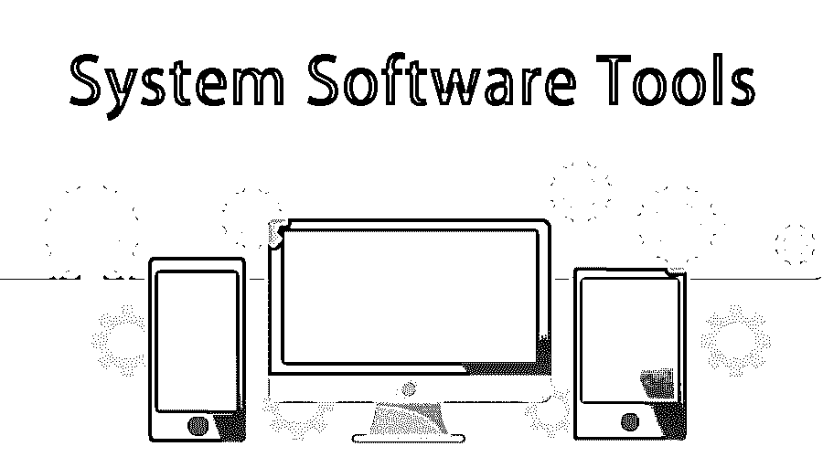

## 系统软件工具介绍

应用软件做所有的艰苦工作。这种类型的软件执行与用户相关的任务，并可进一步分类为通用、专业或定制/定制。系统软件工具包括操作系统和实用程序，而软件应用程序与任务相关。通过这个全面的指南了解更多关于这种类型的软件。

通用应用程序包是一种可以承担不同相关任务的软件。应用程序包的例子包括电子表格、数据库、文字处理器、演示和图形软件。

<small>网页开发、编程语言、软件测试&其他</small>

### 通用系统软件工具:跨代创造奇迹

[应用软件](https://www.educba.com/what-is-application-software-its-types/ "What is Application Software & Its Types")也被称为通用软件，这基本上意味着它执行与其对应物相同种类的通用任务。计算机用户可以购买现成的应用程序。

[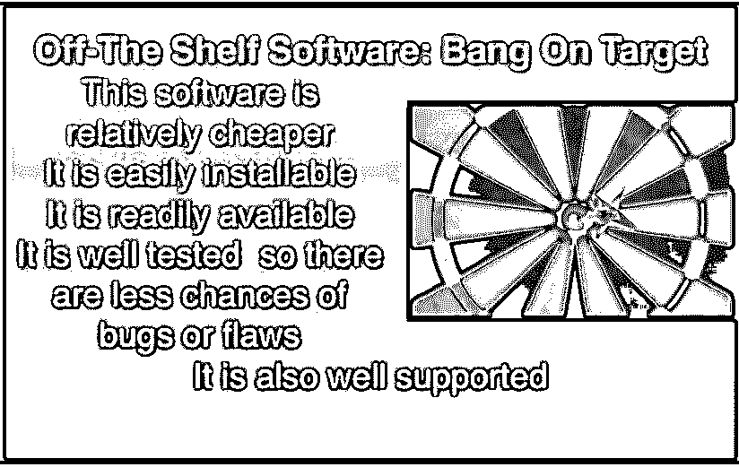

](https://cdn.educba.com/academy/wp-content/uploads/2015/12/image-22.jpg) 

应用软件的另一个名字是通用软件。这包括以下类型的应用软件:

### 数据库包:基础知识

Lotus Approach Paradox、 [MS Access](https://www.educba.com/excel/courses/ms-office-course/ "Comprehensive Microsoft Access 2016") 是存储和检索数据的一些不同的数据库包。

### 桌面出版:编辑的力量

这些软件包，如 [PageMaker](https://www.educba.com/design/courses/design-course/ "Adobe Pagemaker") 和 MS Publisher，可以生成优秀的专业出版物，如时事通讯、书籍、杂志等。

### 电子表格包:用数字拓宽灵活性

其中包括 Lotus 123 和 MS Excel，适用于涉及大量计算或制作[图形或图表的任务。](https://www.educba.com/excel-charts-graphs/ "Excel Charts and Graphs")

### 文字处理包:当文字处理器比笔更强大的时候

这包括 MS Word、WordPerfect 和许多其他软件，它们可以生成基于文本的文档，如备忘录、报告和信件。

### 图片包:价值 1000 字的像素完美图片

不同类型的图形包包括 Corel、Serif Draw、PaintBrush 和 Paint。这些用于创作和重塑艺术品。

### CAD 软件包:敲击计算机进行设计

计算机应用程序辅助设计或 CAD 软件包，如 AutoCAD、TurboCAD 和 2-D Design，非常适合创建和生成建筑平面图和工程设计。

### 通信软件:连接的浏览器

[通信](https://www.educba.com/different-methods-of-communication/ "Different Methods of Communication")软件用于访问在线电子邮件服务和网站以及互联网。不同类型的通信软件包括 Mozilla Firefox、Internet Explorer、Netscape Communicator 等等。

### 演示图形包:留下好印象

演示图形包非常适合创建专业的幻灯片和演示，可以用数据或投影仪在屏幕上观看。

### 网页编辑:用网页编织魔法

网页编辑器如 MSFrontPage、Macromedia 和 Dreamweaver 用于创建网页。使用这些神奇的编辑工具，在几分钟内创建完美的页面。

### 集成套装:多才多艺

*   集成应用程序包将不同的应用程序组合在一个包中，提供出色的图形、通信、演示、文字处理等功能。
*   集成的软件包也大大节省了成本，而且与单个应用程序软件包相比，应用程序的功能更少。
*   Microsoft Works 是集成软件包的一个实例。

### 系统软件工具和应用软件:处理细节

专业应用软件执行单一的特定任务，这种软件的例子包括工资管理和预约安排。

[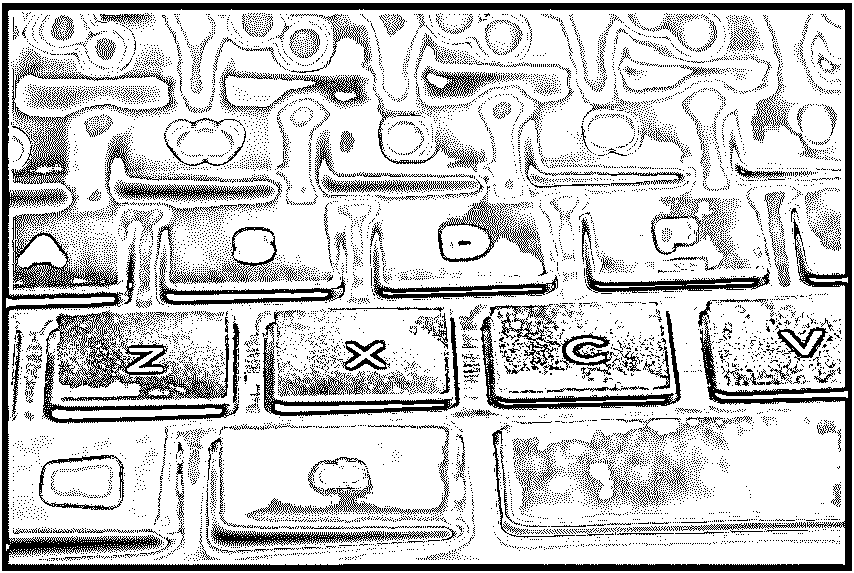

](https://cdn.educba.com/academy/wp-content/uploads/2015/12/image-32.jpg) 

### 定制:定制软件

现成的软件无法满足您的所有需求，尤其是当需要为特定目的专门开发的软件时。每样东西都有自己的缺点和优点，而定制软件的缺点是成本高和开发程序的时间长。

### 买应用软件？应用这些关键指针

[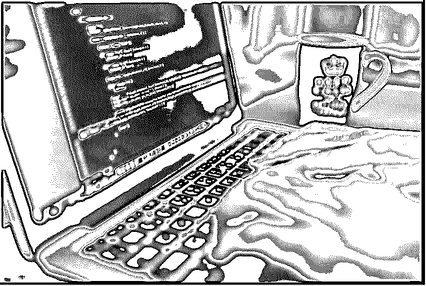

](https://cdn.educba.com/academy/wp-content/uploads/2015/12/image-42.jpg) 

*   使用软件的任务性质是一个重要的考虑因素。
*   考虑成本和所需操作系统的类型也很重要。
*   软件的最低系统要求是另一个重要因素。
*   该软件将在一台计算机上使用，或者网络将决定是否需要一个特殊的版本。
*   以在线社区、支持热线、互联网网站以及手册的形式向用户提供支持的程度是另一个关键的考虑因素。
*   软件安装的难易程度，以及用户是否能够执行或者是否需要专业的 it 专家也是一个需要考虑的因素。

### 有效的类型学:企业与非企业应用软件

应用软件帮助最终用户执行单个或多个任务。应用软件对工作环境也至关重要。这就形成了[企业](https://www.educba.com/enterprise-value-calculation/ "Enterprise Value")和非企业应用软件之间的区别。

### 企业应用软件包括以下内容:

*   企业资源计划
*   供应链管理
*   嵌入式软件
*   [CRM/客户关系管理](https://www.educba.com/customer-relationship-management-tools/ "Top Customer Relationship Management - CRM Software")

#### 非企业应用软件包括以下内容:

*   移动应用:面向移动设备、智能手机或平板电脑的应用软件
*   娱乐:DVD、CD 和媒体(如 Rhapsody 和 Solitaire)的游戏应用
*   图形:用于组织、编辑和共享图像的应用程序，如 Adobe Illustrator、Photosmart Essentials 等
*   安全:检测防火墙和像 QuickHeal 和 Norton 这样的反病毒保护程序对于那些想要好的网络卫士的人来说也是完美的。

### [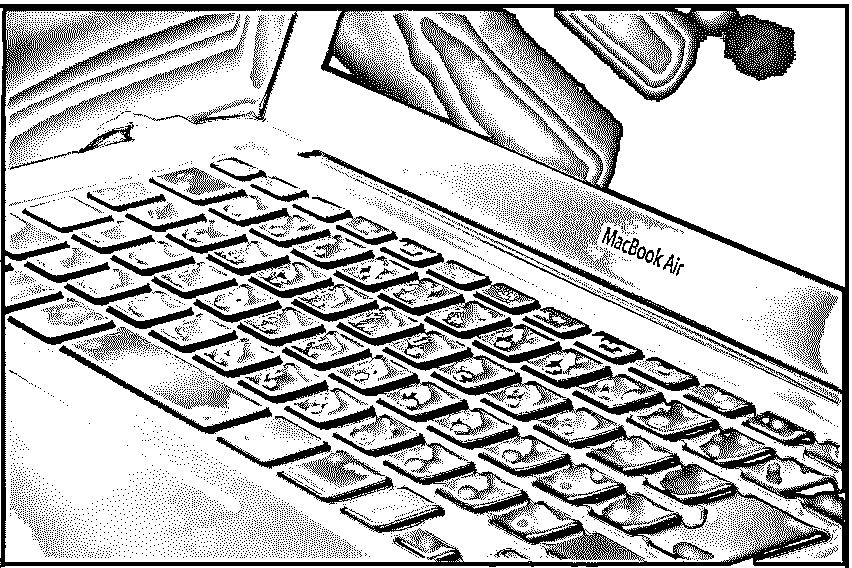

](https://cdn.educba.com/academy/wp-content/uploads/2015/12/image-52.jpg) 

#### ERP:应用软件的生意

[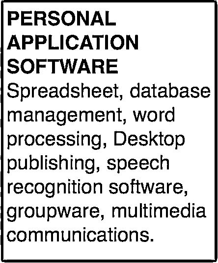

](https://cdn.educba.com/academy/wp-content/uploads/2015/12/image-62.jpg) 

在企业软件中，ERP 是最常用的应用程序。这是世界上最大的应用程序，其次是办公套件和 CRM。ERP 集成了所有的操作和功能，而 Office 套件是一个软件程序的集合，可以很好地相互配合。MS Office 等办公套件程序一起分发。

#### 从奶酪中分离粉笔:应用软件 vs 系统软件工具

系统软件工具提供了运行应用程序或应用软件的平台。它集合了计算机的各种能力。有益于最终用户的任务属于应用软件的范畴。ERP 和[供应链管理包括服务和制造](https://www.educba.com/supply-chain-management-process/ "Supply Chain Management in SME'S")的应用。

CRM 或客户关系管理是企业软件市场的一部分，为企业提供销售、营销、客户服务和支持方面的功能。

应用软件帮助最终用户执行单个或多个任务，有企业版和非企业版。它用于设计和完成特定的任务，如播放视频文件、编辑图像或撰写信件。软件程序及其实现以及计算机平台的能力和能力包含系统软件。

这就是系统软件工具和应用软件的区别。

 

系统程序不同于应用程序。应用软件程序的独特特征之一是图形用户界面在自然界或 GUI/图形用户界面中的普及。这类程序为终端用户提供了编写用户编写的软件的创造力，以及文字处理、会计和过滤数据的能力。文本编辑是许多不同类型的应用软件中的一种，它允许开发更多的软件程序并作为基础。[网络开发人员](https://www.educba.com/website-developer-tools/ "20 Awesome Web Developer Tools")可以使用文本编辑器编写客户端和服务器端脚本，以增加网页的功能。

换句话说，文本编辑器是一种应用软件，用于创建本身就是应用程序的脚本。当应用程序捆绑在一起时，这被称为应用程序套件。应用软件套件包括从文字处理器到电子表格、图像处理和绘图的一切。从将电子表格嵌入文字处理器创建的文档到插入编辑过的图像，可能性是无穷无尽的。应用软件操纵数据或文本来提供信息，而系统程序则参与操纵计算机硬件资源。系统软件是应用软件运行的基础。

#### 个人应用软件:广泛使用的通用应用

通用的、现成的支持一般类型处理的应用程序被称为个人应用软件。

> **个人应用软件=电子表格+数据管理+文字处理+桌面出版+图形+语音识别+多媒体+通信+群件+语音识别软件。**

个人应用软件旨在[提高个人用户的生产力](https://www.educba.com/technology-to-improve-productivity/ "How to Use Technology To Improve Productivity")。

### 许多人使用系统软件工具

计算机电子表格软件包可用于财务信息，如现金流分析或损益表。它们也用于预测销售，分析保险项目，准备所得税信息和投资分析的摘要。电子表格是提供数据管理和图形功能的应用软件。电子表格也可用于需要建模、模拟和假设分析的应用。电子表格可以重新计算，数据管理软件支持数据的存储、检索和操作。

如果你不喜欢数字游戏，而文字是你真正的盟友，那么文字处理软件绝对适合你。这允许用户通过一套集成的程序来处理文本，该程序包括编辑器、格式化、打印、字典、辞典、拼写和语法检查器、邮件列表、绘图、图表和绘图程序。

[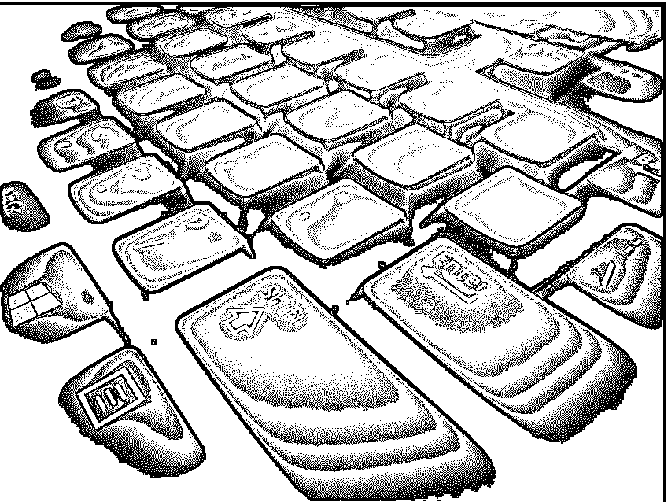

](https://cdn.educba.com/academy/wp-content/uploads/2015/12/image-82.jpg) 

文字处理应用软件创建电子副本，也可以存储在计算机的内存中。

超越常规的文字处理，像时事通讯、杂志和期刊这样的专业文档需要使用[桌面软件](https://www.educba.com/what-is-desktop-software/)。用户可以直接执行任务，将文本与丰富的图像结合起来，创建一个完美的最终产品，而不是手动将文档放在一起并进行排版。

图形软件包，包括演示、分析和 CAD 设计，可用于创建强大的视觉效果。分析图形更进了一步，允许将分析的数据组织成图形格式，例如:

### 条形图

### [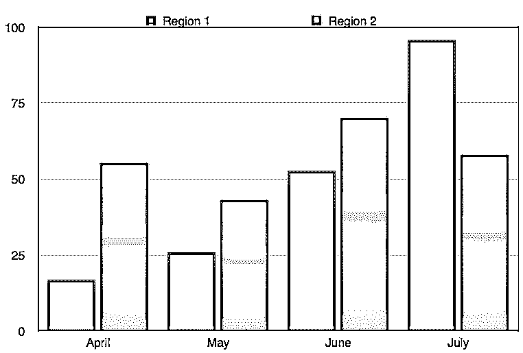

](https://cdn.educba.com/academy/wp-content/uploads/2015/12/image-91.jpg) 

### 饼图

### [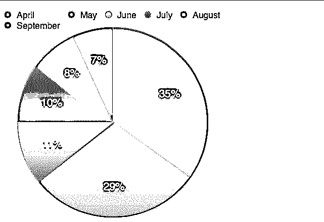

](https://cdn.educba.com/academy/wp-content/uploads/2015/12/image-101.jpg) 

### 折线图

### [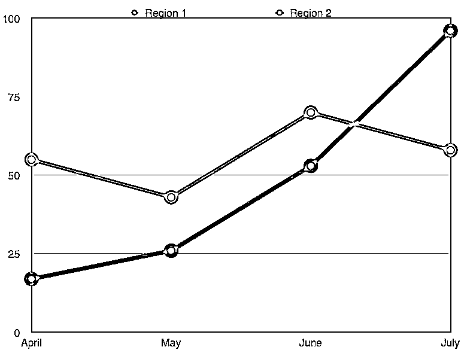

](https://cdn.educba.com/academy/wp-content/uploads/2015/12/image-111.jpg) 

### 系统软件工具销售结果散点图

### [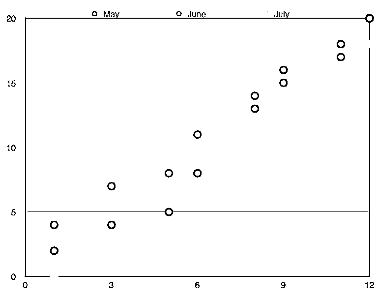

](https://cdn.educba.com/academy/wp-content/uploads/2015/12/image-121.jpg) 

从销售结果到市场调研数据，[演示文稿](https://www.educba.com/presentation-skills-training/ "How to Develop Effective Presentation Skills")图形和图形分析被证明非常适合这项工作。

CAD 软件用于设计制造项目。这款应用软件非常适用于编制工程量清单、构建生产原型以及根据原型传输最终设计。CAD 用于控制单个 CIM 或单个机器内的计算机集成制造软件。

多媒体软件将两种或两种以上的媒体结合起来用于信息的输入或输出。多媒体是大量的媒体，包括音频、声音、动画、文本、视频、图像和图形。可以把它想象成空间媒体和时间媒体的结合，即文本和图像与声音和视频的结合。

电脑相当健谈…相互交流信息；他们使用通信软件，这种软件允许计算机交换信息，而不管它们之间的距离。信息通过专用公共电缆、电话线、卫星中继系统或微波电路进行交换。该软件的 USP 通过建立和放弃电子链接以及编码和解码数据，在 ISP 的功能中起着关键作用。

语音识别是应用软件的一种形式，可以进一步分为两种类型——离散型和连续型。前者一次只能识别一个单词，而后者可以识别多个单词。这种软件对那些处理残疾或受伤的人来说是极好的。想想一家公司通过语音识别软件处理的大量电话，就可以了解语音识别软件的应用有多广泛。

群件是一类计算机软件应用程序，它促进人与人之间的协调与合作。它允许工作组远距离交流和共享信息，是从项目管理到位置独立的完美选择。信息的增加和工作流程的改进是群件创造的电子网络的直接结果。从备忘录到报告，一切都可以通过群件共享。它让商业艺术变得简单，让商业科学变得容易。

### 应用软件:程序+实现

应用软件与其实现一起被认为是软件。从会计软件到媒体播放器，应用领域非常广泛。应用软件就像计算机硬件中的微芯片…它是整体的一部分。系统软件工具帮助操作硬件，并为运行应用软件提供基础。应用软件在由系统软件工具创建的环境中执行。系统软件工具本身在自己创建的环境中执行。系统软件工具需要复杂的编程，而应用软件需要更简单的版本。与系统软件程序相比，有更多不同类型的应用软件。系统软件程序在后台运行，应用软件在前台运行，用户与之交互。系统软件程序独立工作，而应用软件依赖于它。两者一起工作，使计算机作为一个整体运行。

系统软件程序作为通用软件被广泛使用，具有共同的任务，而专用应用程序在其方法上更为狭窄，并且与特定的任务相关联。应用软件的另一种分类是水平的或垂直的。横向项目是针对消费者的一般用途，而纵向项目是为特殊用途而设计的。横向应用包括[多媒体](https://www.educba.com/best-free-multimedia-software/ "6 Best Free Multimedia Software")和图形，互联网程序等等。受版权保护的软件包括共享软件和商业程序以及免费软件。要熟练有效地使用计算机，掌握应用软件是必须的。

### 结论–系统软件工具

[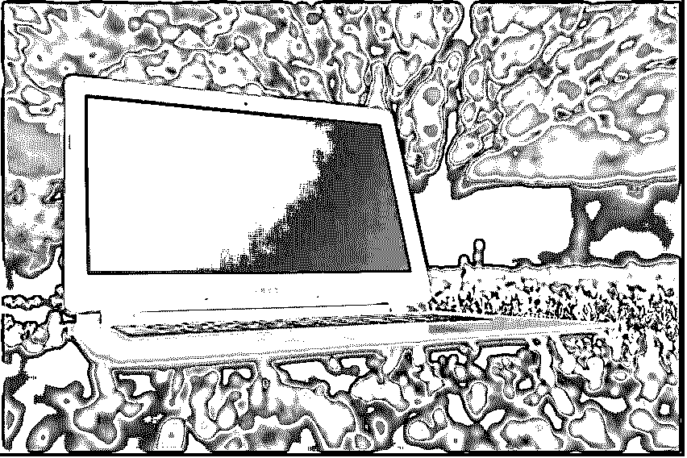

](https://cdn.educba.com/academy/wp-content/uploads/2015/12/image-131.jpg) 

应用软件对计算机的功能和硬件一样重要。应用软件种类繁多，是充分利用计算机的完美工具。这种类型的软件不同于系统或操作软件，但它也与它们相关联。计算包括使用相关的软件来完成所有困难的任务。应用软件是计算不可或缺的一部分。

### 推荐文章

通过这篇关于什么是应用软件的文章，这已经成为应用软件和系统软件工具的指南。以下是与系统软件工具相关的外部链接。

1.  [软件可靠性](https://www.educba.com/software-reliability/)
2.  [系统软件功能](https://www.educba.com/system-software-features/)
3.  软件开发人员的职业
4.  [软件系统架构](https://www.educba.com/software-system-architecture/)

