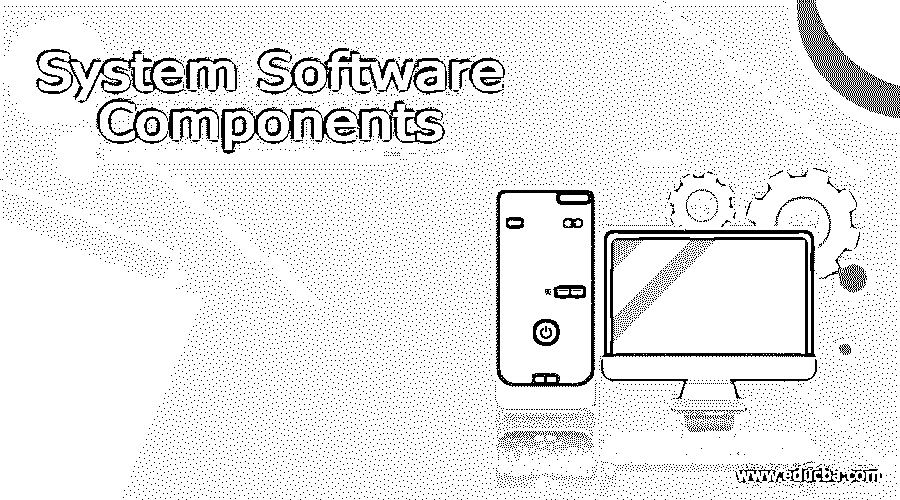

# 系统软件组件

> 原文：<https://www.educba.com/system-software-components/>

## 系统软件组件介绍

系统软件组件被定义为设计用于操作计算机硬件的软件系统；它提供了一个运行应用软件和计算机基本功能的平台。它保护应用程序员免受所使用的特定计算机的复杂性和具体细节的影响，尤其是内存和硬件特性。软件组件是一个独立的系统，具有一个或多个输入和输出通道；没有输入，它什么也做不了；没有输出，它什么也做不了。

### 系统软件组件

让我们讨论系统软件组件。

<small>网页开发、编程语言、软件测试&其他</small>

*   #### Device driver

这是一个系统程序，用于控制连接到计算机的设备数量；它充当用户和硬件设备使用的应用程序之间的翻译器。设备驱动程序告诉操作系统设备如何执行用户生成的某些命令。在该设备的帮助下，驱动程序计算机硬件可以与高级系统程序交互。比如 Wi-Fi 驱动，蓝牙驱动等。

*   #### Operating system

操作系统是计算机系统的主要部分，它管理计算机的硬件，包括程序和数据。这些服务由操作系统提供，以便我们能够执行应用软件。操作系统是使用户能够与计算机通信的系统程序。它帮助其他程序运行和控制它们。

计算机操作系统的例子有 Linux、微软视窗、OS X 和 UNIX。

*   #### Computer network server

它是一个程序；它的工作原理类似于计算机操作系统中的套接字监听器。服务器是一系列连接到其他计算机的计算机。网络中有私人用户和公共用户访问互联网，服务器提供基本服务。

*   #### Practical software

它用于管理硬件和应用软件，也执行小任务。例如，系统实用程序和病毒扫描程序等。

*   #### Window system

这个图形用户界面组件支持窗口管理器的实现，提供像键盘和鼠标这样的定点设备，并支持图形硬件。

*   #### application

这是最上面的软件层；通过使用它，我们可以执行任务，如使用文字处理器编写电子表格进行记账；它有两个支持层:设备驱动程序和操作系统。

*   #### Root user process

这些是拥有根权限的用户可以运行的程序。在所有过程中，管理员都被授予根权限。

*   #### Assembler

汇编语言程序中通常使用的汇编程序是将汇编语言转换成机器代码的程序。它对基本命令和代码进行操作，并转换成二进制代码。

*   #### Compiler

编译器将高级编程语言转换成机器语言。例如，在 C 或 C++语言中，我们应该以用户可理解的格式 printf、scanf、cout 实现特定的源代码，这种类型的语句将在用户语言中生成。因此，编译器将源代码转换成机器语言格式；机器语言代码是指目标代码；这就是我们使用编译器进行转换的原因。

*   #### Interpreter

解释器也用于将源代码转换成目标代码，但解释器一次检查一条指令，这意味着它逐行检查代码；它检查第一行，然后将其转换为目标代码，再次检查其他编程行，然后转换为目标代码。

*   #### Editor

编辑器是用来编辑文件中文本的系统程序。例如，我们都熟悉微软的文字处理器，它的主要任务是编辑、遍历、查看和显示文本。编辑器是指根据用户的要求编辑特定的文本或文件。此外，它链接额外的文件额外的库文件。编辑器的类型有行编辑器、屏幕编辑器、字处理器和结构编辑器。

*   #### Loading equipment

加载程序将完整的程序加载到内存中。当我们当时保存一个特定的程序时，该程序将被存储在二级存储器中。尽管如此，当我们编译一个程序并执行一个特定的程序时，该程序将被执行到主内存中，因此加载程序将该程序的二级内存转换为主内存。它将一个特定的程序加载到主存储器的二级存储器中。

*   #### connector

它是将用户程序链接到另一个程序或库的程序。它将两个或多个模块链接到内存中，并准备执行。它集成了程序所需的必要功能。一些编程文件使用不同库中的一些导入函数；例如，如果我们想在代码中使用平方根函数，那么我们必须导入' math。h '库在我们的编程中，所以这些库是和我们的编程文件链接的；这个概念是通过链接器产生的。

*   #### Debugger

调试器是一种发现错误的计算机程序，也称为源代码中的 bug。它提供了在任何时候暂停并检查程序中所做更改的功能。

*   #### Macro instruction

它是一组被宏处理器调用时可以替换的指令。用于更快的执行，代码可以重用；此外，它还用于汇编语言程序。

### 结论

在本文中，我们总结出软件系统中有三个基本组件，应用软件、设备驱动程序和操作系统；这三者一起工作来执行有用的任务，它有一些翻译器，因为它们也是软件系统的组件，并且它们执行完全不同类型的工作。

### 推荐文章

这是系统软件组件指南。这里我们分别讨论系统软件组件的介绍和列表。您也可以看看以下文章，了解更多信息–

1.  [系统软件工具](https://www.educba.com/system-software-tools/)
2.  [社会技术系统](https://www.educba.com/socio-technical-system/)
3.  [软件系统架构](https://www.educba.com/software-system-architecture/)
4.  [嵌入式系统应用](https://www.educba.com/embedded-systems-applications/)

