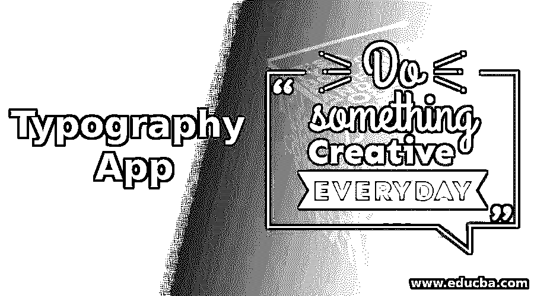
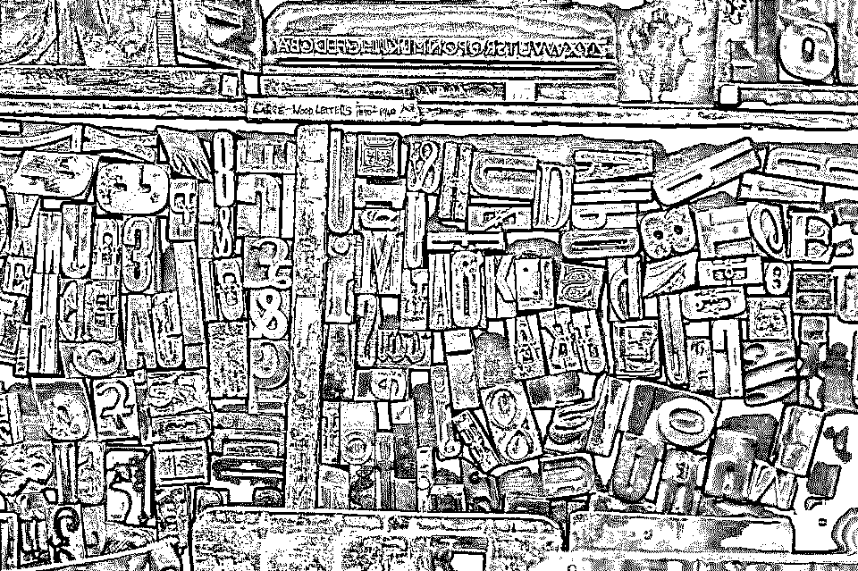

# 排版应用程序

> 原文：<https://www.educba.com/typography-app/>

## **使用出色的排版应用程序进行网页设计**

一个网站是由许多组件组成的，我们中的许多人可能在选择使网站看起来有吸引力的组件方面有所不同。主题、颜色、图片都是起作用的因素，但真正增强网站的感觉并设定网站基调的是排版应用程序。

图片和主题可以说明很多关于我们网站的信息，但是最终，你的网站浏览者依赖于你网站上写的信息来完全理解它的网页设计服务。此外，如果你记住你的网站应该是流行的，也就是说，不管当前的风格是什么，你的[网站](https://www.educba.com/website-design-layout/)应该围绕那个风格设计。现在的趋势是设计应该尽可能的简洁，因此，网页排版应用程序设计现在扮演着至关重要的角色。

<small>网页开发、编程语言、软件测试&其他</small>

它只不过是网页设计中文字显示的方式，文字的意思，无论是什么文字。字体、大小、间距、颜色，一切都属于排版。需要注意的是，无论你网站的主题有多精致，颜色有多吸引人，真正让它独一无二的是排版应用。

但是就像你在使用图片、主题等设计网站时会犯的无数错误一样。，您必须遵循在网站中使用排版应用程序的特定指南，以避免明显的问题。

*   不要尝试做太多。在你的设计中，最多使用 2-4 种字体。过多地使用字体会使你的网站变得杂乱无章，而不是给它一个干净漂亮的外观。

*   保持适当的等级制度。这有助于你的浏览者轻松浏览你的网站。文本和元素是对齐和排列的，以设置使用网站时要遵循的情绪和方向。

重要的规则只有一条:“内容为王！”让内容成为你的首要任务，其他一切都会围绕它展开。网上有很多工具可以帮助你提高排版技巧。Typekit 练习是您应该开始使用的工具之一。这些课程是如此设计的，以至于你很快就会成为一名专业的排版专家。Modular Scale，Wordmark.it，Hoefler&Co .，FontFace Ninja，Google Fonts，还有很多工具可以让你的排版技能体验到最好的效果。

 

<address>Image source: pixabay.com</address>

### 排版精美的网站列表

下面是一些排版很棒的网站。

#### 1.《纽约客》——最佳排版应用启发网站。

实现古老、传统而又美丽的外观和感觉并不是一件容易的事情，但是《纽约客》可以完美地帮助你做到这一点。这是一个在线杂志，很容易获得，非常时尚。红色、黑色和白色等常青色的使用，加上一点灰色，使它看起来像一本印刷的杂志。此外，可读性和优雅的字体与对比背景的颜色的使用使纽约客成为最好的排版技巧启发网站之一。

#### 2.莫尔索达

黑色背景需要一些流行的颜色来使它看起来时髦。Moresoda 通过在背景中使用亮粉色、青色和浅绿色等醒目的颜色来引领潮流，如果你想在页面上写点什么，只有一种颜色可以搭配所有这些颜色，那就是白色。这里的几个句子和那里的几个词让 Moresoda 成为一个整洁的引领潮流的网站。

#### 3.好的

网站的名字本身就很能说明它的风格！一个干净的，可读的字体，伴随着最少的颜色使用，优秀的间距和位置，使网站看起来很好！

黑色、灰色和白色是一个经典的组合，保持事物的简单是一个巨大的风险，优秀网站的创建者们准备好去冒这个风险，并且得到了回报。粗体标题的大字体会吸引你的注意，与之配套的故事，尽管相比之下很小，却非常清晰。所以，很好，在这个意义上已经做得很好了！

#### 4.信息拦路强盗

你可以把最好看的背景图片放在你的网站上来增强它的外观，但有时，一个漂亮的排版应用程序可以增强背景，并为你完成这项工作！

但是如果你有一张空白的画布呢？如何让空白页看起来有吸引力？答案又简单了。在排版应用的艺术中运用你的网页设计技能。信息拦路者在背景中什么也没有。它完全是空的，像一张纸一样白，也没有使用看起来很花哨的字体，但文本中字体和颜色的简单使用使它成为一个非常有吸引力和时尚的网站。信息高速公路的简单是惊人的华丽！

#### 5.黑色地产——最佳排版应用

Black Estate 名副其实地给了它的浏览者一个背景非常暗的网站…黑色的！我们都同意黑色和白色是经典的组合。这是每个人的首选组合，因此不仅安全，而且是明智的选择。

白色的字母将网站提升到一个更高的优雅和美丽的水平。不仅一切都清晰可见，而且，你不需要任何其他东西来使它更加诱人。使用复杂的字体是所有需要的。“黑美人”通常被用来形容肤色较黑的美女。在网站的世界里，黑地产就是“黑美人”。

#### 6.极乐世界燃烧

极乐世界伯恩斯是成熟和时尚的完美典范！这个网站有很多元素在里面，但是每个元素都是鲜明清晰的。它不是很丰富多彩，但不同的功能使用不同的字体风格和字体大小使这个网站看起来很好，而不是一团糟。

公司名称有不同的字体，标题和副标题也有不同的字体，这些标题下的内容也有完全不同的字体。从设计的角度来看，一个页面上有很多内容，但所有这些内容结合在一起，使所有内容都有意义。

#### 7.每日打字

如果 Type Daily 中的 Type 这个词不能使它变得明显，那么它就在这里；Type Daily 是一个网站，它提供了与其他类型相关的在线网站的链接。设计很简单。只有亮绿色的其他网站的链接，当你悬停在上面时，它会在略暗的背景中弹出，变成一种漂亮的橙色。简单却有效！

#### 8.古怪的智慧最佳排版应用

听过“大胆就是美丽”这句话吗嗯，古怪的智慧用这个短语击中了要害。最新的大胆排版技巧贴在黑色背景上，小白点形成一个网格，给这个网站带来了现代气息。而整个网站，恰恰相反，只是颠倒了背景组合。白色页面上有一个由点组成的黑色网格。

古怪的智慧是现代的，我们只能说，它的设计是古怪的。

#### 9.模拟的

这个网站的第一页写着——“Analog 是一家做网站的朋友的公司。这是一个想象力、设计和工程蓬勃发展的合作社:好人做好事。”

是的，确实做得很好。当网站的主题被使用的字体所欣赏时，那么结果就是一个完美的网站。对比鲜明的颜色和美观的文字使 Analog 成为一个智能设计的网站。

#### 10.切换媒体工程

你们都知道“行动胜于语言”这句臭名昭著的话。这个就稍微改一下吧，“设计胜于雄辩”。当几行文字和几张图片就能完成完美的工作时，为什么还要通过插入大量元素来使网页饱和呢？

这是 Switch Mediaworks 为观众提供的视觉享受。经典的颜色组合，现代的排版技巧，以及首页上你梦想中的汽车，这就是这个网站的伟大之处。

#### 11.名单之外

A-List Apart 与许多网站相似但又不同。它的最小设计可能看起来很熟悉，但元素的位置和间距使它成为一个好看的网站。字体大小、颜色和间距的恰当分配让列表与众不同，与众不同！这是最好的设计！

#### 12.杰森·圣玛丽亚最佳排版应用

少即是多！这种说法有多真实？[杰森·圣玛丽亚](https://jasonsantamaria.com/)围绕着这一哲学展开的李是比较多的。元素不多，颜色也不多。只要大胆和有吸引力的文章标题和杰森圣玛丽亚成为一个鼓舞人心的网站。它是独特的，新鲜的，引人注目的设计在它的简单。

#### 13.Helveticons 最佳排版应用

有时候，你看着某样东西，突然，你又回到了童年。有些东西会让你想起童年，就像 Helveticons 的 logo。这就像你过去常常带到数学课或艺术和绘画课上的那个几何盒子上的图像。

有一个亮黄色的页面，就像一张纸被折叠成四份后打开，以浅灰色为背景，用黑白印刷技术。这就像我曾经拥有的一个几何盒子。Helevticons 是一个旨在通过你的眼睛直达你内心的方式与你建立联系的网站！

 

<address>Image source: pixabay.com</address>

喜欢这些设计吗？然后当你设计自己的令人眼花缭乱的网站时要有创意。网页设计就是关于这些小细节和功能。希望这 13 个很棒的网站能启发你用排版技术创建一个看起来很棒的网站，进一步增强它的美感！

### 推荐文章

这是排版应用程序的指南。在这里，我们讨论网页设计与真棒排版应用程序与网站列表与真棒排版。以下是与排版应用程序相关的外部链接。

1.  [AJAX 面试问题](https://www.educba.com/ajax-interview-questions/)
2.  [网站链接建设](https://www.educba.com/link-building-strategies/)
3.  [网页设计趋势](https://www.educba.com/web-design-trends/)
4.  [网站设计布局](https://www.educba.com/website-design-layout/)

