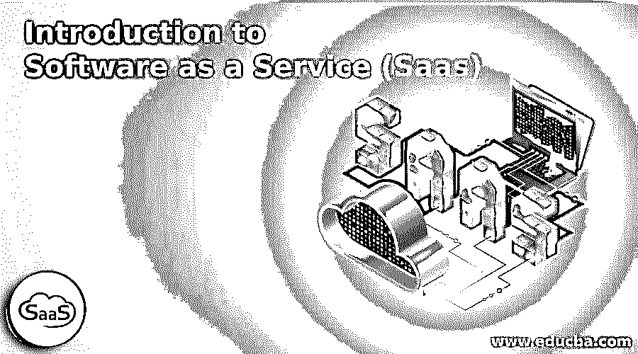
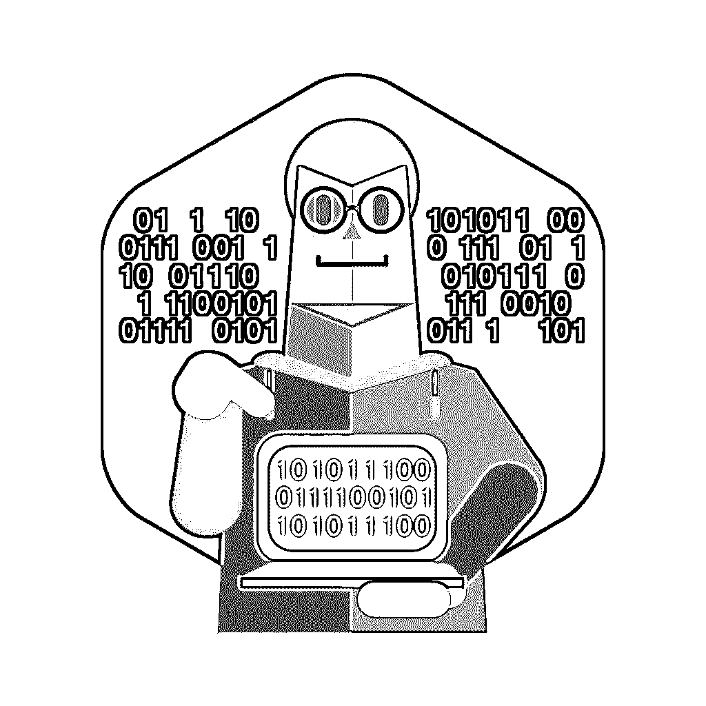

# 软件即服务(Saas)

> 原文：<https://www.educba.com/what-is-software-as-a-service-saas/>

## 软件即服务(Saas)简介

如果你对 SaaS 这个概念不熟悉，那么这篇文章就是为你准备的。您将了解什么是 SaaS，它能为您做什么，SaaS 有什么不同，以及更多关于软件即服务应用程序的信息。

### 什么是 SaaS？

<small>网页开发、编程语言、软件测试&其他</small>

它是一种软件交付方法，允许从任何具有互联网连接和浏览器的设备访问软件及其功能。应用程序托管在云中，可用于个人和组织执行的各种任务。

简而言之，软件即服务意味着一个提供商集中托管一个应用程序，并通过互联网向不同地点的多个用户提供收费访问。

Saas 应用程序被称为基于 Web 的软件或托管软件。SaaS 运行在一家 SaaS 供应商的服务器上。

利用软件即服务(SaaS)类似于租用软件而不是购买软件。以前，您会购买软件并将其安装在您的计算机上。通过软件即服务，您只需按期限(通常是按月)订阅软件。

随着 web 服务凭借其[改进的技术和开发方法](https://www.educba.com/app-development-tool/ "Choose Best Technology for App Development")变得更加流行，软件即服务已经成为一种广泛的软件交付模型。由于越来越多的宽带服务，我们能够轻松地访问世界上不同的地区。

谷歌。脸书和 Twitter 是软件即服务的典型例子，它允许你通过任何支持互联网的设备来访问服务。

### 了解软件即服务(SaaS)

软件即服务经常与[应用服务提供商(ASP)](https://www.lifewire.com/asp-file-4156378) 和按需计算软件模型相比较。早些时候，这些应用程序与传统的内部部署应用程序有许多共同之处。但是现在，[软件作为](https://www.educba.com/mobile-computing-applications-and-services/ "Mobile Computing Applications and Services")服务应用已经在其架构和许可方面有了很大的发展。

如今，软件即服务应用通过多租户架构实现集中化，提供比内部部署应用更好的体验。

内部部署软件使用一次性许可模式，而 SaaS 使用订阅模式，软件访问权限通常由提供商或称为聚合商的代理直接出售。

SaaS 的成本因应用[而异](https://www.educba.com/what-is-application-software-its-types/ "What is Application Software & Its Types")。一些 SaaS 提供商对应用程序的所有功能收取固定的费用，而一些提供商根据应用程序的使用情况收取不同的费用。

您可以根据自己的业务需求定制 SaaS 应用程序，如数据模式、工作流和其他方面。

此类提供商还提供高安全性机制，以在传输和存储时保护客户的数据。

银行就是软件即服务模式的一个很好的例子。它保护了客户的隐私，同时也为他们提供了更可靠的服务。银行的所有客户都使用相同的技术，不用担心任何人在没有适当身份验证的情况下访问他们的个人信息。

### SaaS 的目标

*   通过共享最终用户许可证，减少服务器硬件投资
*   降低软件的租用成本

### SaaS 的模型

Saas 有两种模式。

*   托管应用管理模型
*   软件按需模型

在托管应用程序管理模型中，提供商为客户托管随时可用的软件，并通过网络交付。

在软件的随需应变模式中，提供商只允许其客户基于 web 访问专为 SaaS 发行版创建的应用程序的特定部分。

### SaaS 模式的好处

SaaS 对各种规模和类型的个人和企业更有用，原因有很多。以下是推动客户使用 Saas 的原因。

*   没有初始设置成本-应用程序，一旦您订阅它就可以使用
*   时间管理–SaaS 应用程序只需花费更少的时间进行安装和配置。
*   减少了 it 部门的工作——托管者处理 SaaS 应用程序，因此有助于 IT 部门将更多精力放在有助于实现业务目标的活动上。
*   成本更低——SaaS 在共享环境中运行，与其他软件模式相比，硬件和软件许可成本较低。
*   维护成本低–如果您想要提高存储容量，无需安装任何新的硬件或软件即可实现。
*   可扩展性——SaaS 驻留在可扩展的云环境中。
*   无缝集成–SaaS 可以与许多设备集成，如平板电脑、笔记本电脑、台式机和其他支持互联网的手机。SaaS 可以定制，以满足特定客户的需求。
*   新升级–如果 SaaS 提供商升级了软件，那么您可以免费在线使用。即使有成本，也比传统车型升级成本低。
*   易于访问——可以从任何地方、任何使用互联网的设备访问 SaaS 应用程序

### SaaS 特色

它有几个特点，使其有别于其他服务。下面列出了一些重要的特征。

#### 可配置性

SaaS 提供各种配置选项，如社交网站扩展、博客界面、网络内容访问和定制工具模块。用户可以根据自己对网站的需求随时使用这些选项。

#### 多租户效率

在 SaaS，所有用户共享公共的基础设施和代码，由提供商集中维护。通过这种方式，用户可以节省他们的服务器空间、成本和维护。更新会自动通知给用户，并且免费或有时费用较低。这样也会为你节省很多时间。

#### 轻松定制

SaaS 应用程序可以轻松定制，以适应您的业务目的，而不会影响您的公共基础设施。[软件即服务的设计](https://www.educba.com/top-10-web-design-software/ "Top 10 Web Design Software")使得定制服务对每个公司或个人都是独一无二的。更新的成本和风险也更低。

#### 可量测性

[软件即服务具有](https://www.educba.com/best-free-multimedia-software/ "6 Best Free Multimedia Software")多层结构，可实现负载平衡器。无需修改软件的整体结构，就可以根据您的需求通过添加服务器来调整系统的容量。

#### 容易接近

您可以从任何使用互联网的设备轻松访问这些数据。这将帮助您管理数据，并确保每个人同时看到相同的信息。

### SaaS 和现场应用

软件即服务应用程序和内部部署应用程序在三个主要方面有所不同，即许可、位置和管理。

#### 批准

内部部署应用程序的许可费用对每个用户或站点都是单一的。

SaaS 应用程序的许可基于两种模式——基于使用的交易模式和基于时间的订阅模式。在基于使用的模式中，用户根据使用的服务交易数量付费。在第二种模式中，用户为他订阅的特定时间段付费。

#### 位置

本地应用程序托管在用户的 IT 环境中。应用程序提供商还提供一个名为“[黑色](https://docs.microsoft.com/en-us/)盒子”的硬件或软件部件，它将被安装在用户的位置。

SaaS 应用程序托管在提供商的服务器上。用户处没有安装任何硬件或软件。

#### 管理

在内部应用程序中，全部责任由公司的 IT 部门承担。IT 人员应该熟悉网络、服务器和应用程序功能。他们还应该能够解决问题，并负责应用程序的可靠性和安全性。这是一件大事，一些公司甚至将这项工作外包给专门从事这项工作的第三方。

而使用 SaaS，应用程序完全由 SaaS 提供商或供应商处理。服务水平协议规定了供应商向用户提供的支持和服务。

### 拥抱 SaaS 的考量

在组织中使用 Saas 应用程序之前，有几件事情需要考虑。以下是影响 SaaS 的四个主要因素。

#### 政治的

组织中的一些重要人物会觉得业务的某些功能应该保持在 IT 部门的支持和控制之下。在这种情况下，Saas 和其他应用程序被认为是不重要的。如果供应商在组织中部署了一个测试应用程序，那么经理就有机会批准这样的应用程序。

#### 技术的

SaaS 为它的用户提供了一个定制选项，但是有一些限制。如果运行 SaaS 应用程序需要特定的技术知识，而软件作为服务提供商又负担不起，那么用户就很难运行 SaaS 应用程序。

另一个重要因素是应用程序来回传输的数据量和类型。服务器之间的数据传输应该快速完成。因此，这些公司总是倾向于考虑网络延迟的 SaaS 解决方案。

#### 金融的

SaaS 应用程序通常被认为比本地应用程序低。但是 SaaS 应用的长期成本是不确定的。影响 SaaS 应用程序成本的因素包括许可用户的数量、需要为您的业务进行的定制量以及数据中心的规模经济。

#### 合法的

有些行业在世界不同地区受法律管辖。他们需要维护各种报告和记录。Saas 应用程序无法满足客户的所有需求。SaaS 提供商还应满足您关于数据安全和隐私的内部标准，以避免任何法律问题。

SaaS 应用程序应符合组织运营所在司法管辖区的规则和法规。

### SaaS 适合你的组织吗？

SaaS 并不适合所有的组织，也不是所有的应用程序都适合 SaaS 交付模式。在为你的企业决定 SaaS 申请时，有几个标准需要考虑。下面列出了一些重要因素。

*   您将使用 SaaS 应用程序的流程类型
*   要完成的定制数量
*   SaaS 应用程序与贵公司其他系统的集成，包括内部和外部系统
*   申请的期限

SaaS 应用程序通常最适合简单、标准的流程，并且不太依赖于企业的其他功能和系统。

SaaS 也最适合首次自动化的功能，因为需要做的更改很少。

与您的业务核心相关的功能(如 ERP 和其他功能)不适合软件即服务，因此对于此类功能，您需要使用其他现场解决方案。这将有助于您在应用程序运行时对其进行管理。

如果您需要定制 SaaS 产品，则需要更多时间来实施。定制将大幅提高 SaaS 供应商的成本，而且还涉及很多复杂性。因此，许多供应商拒绝进行定制，即使他们这样做了，他们的成本也很高。

因此，如果你打算定制你的 SaaS 产品，要清楚它的费用，以及它是否是你能负担得起的。

整合得越多，SaaS 实现的时间就越长。因此，SaaS 提供商关注那些简化集成过程的事情。

如果您从某个供应商那里购买新的应用程序，而该供应商会经常更新应用程序以增强功能，那么 SaaS 可以发挥最大的作用。

### 结论

SaaS 有很多优势，因此 Saas 仍然是许多企业的一个迷人选择。通过将 SaaS 加入他们的 IT 服务组合，企业可以做得更好。互联网连接是你在 SaaS 所需要的一切。将 SaaS 应用程序整合到您的组织中只需要考虑两个关键因素——集成和组合。

当您选择一个 Saas 应用程序时，要弄清楚您的公司想从它那里得到什么，然后再继续。

当您选择 Saas 供应商时，请了解该公司、其声誉、可靠性、市场地位、价格及其产品的安全性。

我希望这篇文章能够帮助您了解什么是 Saas。

### 推荐文章

这是软件即服务(Saas)的指南。在这里，我们讨论了基本概念、模型、目标、特征以及在为您的企业决定 SaaS 应用程序时要考虑的一些标准。您也可以看看以下文章，了解更多信息–

1.  [软件可靠性](https://www.educba.com/software-reliability/)
2.  [软件测试面试问题](https://www.educba.com/software-testing-interview-questions/)
3.  [缺陷生命周期](https://www.educba.com/defect-life-cycle/)
4.  [软件测试方法论](https://www.educba.com/software-testing-methodologies/)

