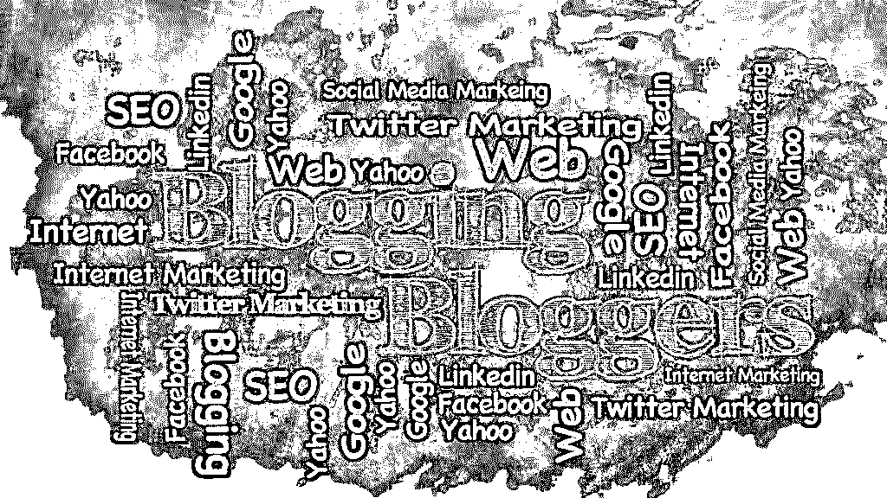

# 博客洞察你的分析可以告诉你

> 原文：<https://www.educba.com/blogging-insights-your-analytics-can-tell-you/>

## 博客见解介绍你的分析可以告诉你

自 20 世纪 90 年代末引入以来，博客已经走过了漫长的道路。它最初被用作一个独特的分析平台，帮助人们分享他们的观点和感受；这只是一个分享这些的媒介。然而，随着时间的推移，博客现在被全球数百万人使用，不再局限于个人。企业和组织中的人们现在已经开始使用博客作为与他们的顾客、客户和利益相关者联系的媒介。博客的简单性使得几乎任何对计算机和互联网有基本了解的人都可以很容易地创建一个博客，并使其成为一种有效的媒介。

已经确定了博客是非常重要的联系媒介，以下是公司必须创建一个好的、有效的和强大的博客的四个原因:

*   #### A good blog can effectively increase the traffic of your website

公司博客是与客户分享相关有趣内容的有效媒介。[一个聪明的营销策略](https://www.educba.com/event-marketing-strategies/ "10 Event Marketing Tactics From Experts")，博客可以[为你的网站带来流量](https://www.educba.com/website-ranking-traffic/ "How to Improve Website Ranking")。此外，品牌将自己的网站与脸书  Twitter、 [Pinterest](https://www.pinterest.com/educorp/) 和 [LinkedIn](https://www.linkedin.com/company/946029) 等社交媒体平台联系起来也很重要。这是因为社交媒体的影响力是无限的，它可以帮助公司以有效的方式接触到他们的受众。每当你在你的博客上发布新的东西时，记得用必要的视觉效果来发布同样的东西，以在你的访问者和追随者中创造必要的参与度。此外，张贴博客文章的入站链接，这样它们可以为您网站的特定页面带来流量。这将有效地增加你网站的访问者数量。

<small>网页开发、编程语言、软件测试&其他</small>

<address>Image source: pixabay.com</address>

*   #### A good website is the medium to improve your search engine optimization strategy

[搜索引擎优化](https://www.educba.com/seo-digital-marketing/ "15 Things to Understand in SEO Marketing")是品牌在数字世界中提高知名度和[影响力的一种方式](https://www.educba.com/seo-in-digital-marketing/ "Importance of SEO in Digital Marketing")。博客是一个重要的媒介，通过它，SEO 策略可以更上一层楼。新鲜和创新的内容永远是行业之王，它将永远有助于品牌与客户建立联系。使用好的关键词，为此，重要的是公司需要找到。请你的作者使用这些关键词，这样当用户搜索这些产品/服务时，你的公司就会与这些关键词联系在一起。此外，重要的是品牌不要在文章中塞满关键词，因为这会降低博文的有效性和原创性。换句话说，你的博客文章的主题和关键词是谷歌跟踪你的网站并帮助它到达你的目标受众的重要方式。

*   #### Blog helps you position your company as an industry leader

一篇包含所需信息和内容的好博文将有助于你的品牌在客户心目中建立可信度和真实性。通过发布处理最新趋势和展示品牌知识的文章，博客是一个重要的信息来源，并以有效的方式展示品牌的营销能力。例如，如果你是一个手机销售商，你的文章应该集中在市场上各种类型的手机以及购买这些手机的最佳地点。这些类型的文章一方面可以帮助客户获取信息，另一方面可以帮助你成为一个知识库。换句话说，精心研究和清晰阐述的文章是一个品牌接触和联系其顾客和客户的最佳方式。

*   #### Blogs can help brands connect with their customers

所有品牌和公司的成功在很大程度上都归功于他们的客户和顾客。博客是优秀的媒介，品牌可以通过创新和成功的方式与客户联系。通过与你的客户直接联系，博客可以帮助品牌与他们的客户联系，不仅在他们的国家，而且在全球范围内。此外，由于客户在他们舒适的家中，这种参与是简单、容易和有效的。品牌还必须在门户网站上响应消费者的需求，因为不响应消费者的需求和关注会降低忠诚度和参与度。即使在博客网站上，持续有效的交流也很重要。

因此，创造有效和有趣的内容是品牌和公司营销活动的最重要的方面之一。根据统计，每月博客超过 20 次的企业比每月博客少于 4 次的品牌产生的流量多 5 倍。这就是为什么博客是一个好的营销活动的关键，反过来，这些内容和线索也可以为公司创造大量有价值的数据。有了这些关于线索和内容的见解，品牌就有可能获得有价值的见解并提高博客的表现。这些是品牌必须跟踪的一些博客指标，这样它们才能产生更好的流量和销售线索:

### 你的分析可以告诉你的博客见解

以下是你的分析中提到的一些博客见解。

1.  #### What page views and traffic on the blog can you tell the brand

虽然一般的博客指标可以让你了解博客的整体情况，但你也可以从中获得其他见解。单个博客帖子的浏览量可以让博客用户更深入地了解他们的目标受众是如何与他们的帖子联系起来的。在博客中，有些帖子会比其他的做得更好。这是因为有些帖子与目标受众的联系更好。这些见解可以帮助品牌决定哪些话题要多贴，哪些话题要少贴。个人博客帖子视图可以帮助所有者理解其博客内容的模式和线索。什么样的标题结构比较好？有问题的帖子比没有问题的帖子效果更好吗？利用这些见解，品牌可以创建更多的博客帖子，更好地与目标受众联系起来。

2.  #### What recommended source can you tell the blog owner

你的博客的推荐来源可以告诉你哪些网站和博客正在向你的网站推荐流量。这可以帮助你发现人们是如何访问你的网站的。此外，该信息可用于识别博客网站中的缺点，并为所有者提供一种解决其博客流量低的方式。大部分流量是来自社交媒体平台还是有机方法？如何改变这种情况，使两个来源产生相等的流量？获得关于推荐流量的信息可以帮助你制定吸引人的有效计划。总是使用正确的关键词来优化你的博客文章，这样你的目标读者就可以很容易地在他们的搜索引擎上找到它们。在社交媒体渠道上推广好的、有趣的内容，这样你就可以有效地扩大这些文章的覆盖范围。始终跟踪你的推荐来源，因为这可以帮助你有效和成功地接触到你的观众。跟踪推荐来源很重要，因为它可以帮助确定投资物业的回报。了解哪种媒体可以帮助你接触到一大群目标受众是很重要的，尤其是在投入任何资源之前。

 

3.  #### What clues can you tell the blog owner

你的博客产生的潜在客户数量显然是有效接触你的目标受众的标志，以便充分利用潜在客户，尤其是那些来阅读你博客的人。在博客文章中，确保添加相关的行动号召，或者将文章链接到主页，并创建其他文章的链接。所有这些都可以帮助你有效地维持和吸引你的受众，从而确保品牌忠诚度和授权，尤其是在你的目标受众中。

4.  #### What can a call-to-action link tell the blog owner

CTA 或行动号召必须强大而有效，这样才能有最大数量的人点击它。虽然这听起来很简单，但当人们没有点击你的行动号召时，这可能意味着人们没有访问你的博客。这意味着品牌必须创造引人注目的内容，并吸引 CTA，这样才能提高点击率。通过创建吸引人的文案和漂亮的设计，行动号召链接可以成为潜在客户产生和参与的重要来源。

5.  #### What can you tell the blog owner by visiting the prospect conversion

博客对潜在客户转化的访问可以有效地告诉一个品牌他们如何成功地转化他们的潜在客户。转换率越高，他们就能更好地为博客创造商机。有时，客户可能会点击行动号召，但一旦进入网站，他们可能会放弃该页面。这意味着[网站是有效的和吸引人的](https://www.educba.com/web-design-and-development/ "10 Steps to Effective Webdesign")。这也可能意味着行动号召中的信息与登录页面或其他特定页面上的信息不一致。这是一个重要的问题，重要的是品牌要确保他们在所有平台上的信息是一致的，无论是博客、社交媒体还是网站。

6.  #### What causes the customer conversion rate can be told to the blogger

这些见解可以帮助博客所有者了解他们如何有效地将他们的线索转化为客户。这种洞察力对品牌非常有帮助，尤其是当他们不得不发现个别活动或营销渠道的成功和失败时。如果你的博客正在从社交媒体上产生潜在客户，那么投入更多的时间和资源是有意义的，如果它没有产生所需的潜在客户，那么其他一些方法可能会更好。这种理解可以帮助品牌更好地分配资源，从而确保更好的投资回报。

7.  #### The bounce rate is an important insight for blog owners

跳出率的定义是一个网站中一个页面收到的跳出率，但到底什么是跳出率呢？嗯，从视觉上理解跳出率是非常容易和美好的。想象一个球(代表一个访问者)击中一个网站；如果访问者访问另一页，那么球被吸收。另一方面，如果用户没有访问另一个页面就离开了，那么球就会反弹。所以反弹是指访问者访问一个网站，但只访问了一页就离开了。因此，如果有 200 人通过这个页面进入这个网站，100 人点击进入另一个页面，跳出率是 50%，因为 200 人中有 100 人在访问一个页面后离开了该页面。这个跳出率是一个网站内容质量以及网站整体参与度的重要指标。而有时，访问者可能只是到达要求采取行动的页面，因为他们的目的是通过该页面解决的。这可能不是一件坏事。降低跳出率的一个好方法是在侧边栏上给出最近五篇文章的简要介绍，以方便他们选择下一篇想要阅读的文章。

8.  #### What can comments and social sharing tell bloggers

评论和社交分享是很好的补充指标，可以显示你的帖子的影响力和受欢迎程度。这也是一个很好的媒介，一方面可以识别内容的优势和劣势，另一方面可以帮助品牌产生新的想法。品牌必须在所有帖子上安装社交分享按钮，以便读者可以轻松分享他们平台上的内容。社交分享是一种有效的接触目标受众的媒介，它是一种病毒式的内容，能够以快速的方式接触到大量的受众。

9.  #### What can the number of subscribers tell the blog owner

一个上升的和良好的订阅人数是你的博客如何有效地达到其目标受众的标志。成为你的订户的访问者可以有效地帮助你增加内容，因为他们会在他们的平台上分享相同的内容。品牌必须始终在博客页面的顶部以显著的方式显示电子邮件和 RSS 订阅按钮，以便新访问者能够以简单的方式注册。

数据是中性的，因为它是纯粹的事实。博客分析是关于有效使用数据的。它不包含任何个人观点、成见或看法。这就是为什么投资博客分析不仅能让你的博客更强大，还能让你的品牌/公司达到更高的增长和参与水平。

### 推荐文章

这是一个指南，介绍了 14 种简单的方法来延长 iOS 8 的电池寿命。在这里，我们讨论了提高 iOS 8 电池寿命的 14 个技巧和诀窍的基本概念。您也可以浏览我们推荐的其他文章，了解更多信息——

1.  [将谷歌分析添加到 WordPress](https://www.educba.com/add-google-analytics-to-wordpress/)
2.  [如何使用 Google Analytics？](https://www.educba.com/how-to-use-google-analytics/)
3.  [谷歌分析仪表盘](https://www.educba.com/google-analytics-dashboards/)
4.  [什么是谷歌分析？](https://www.educba.com/what-is-google-analytics/)

