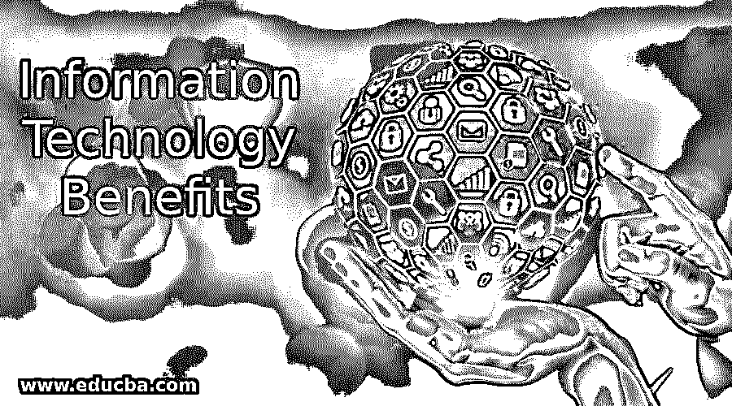
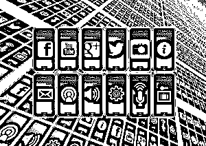
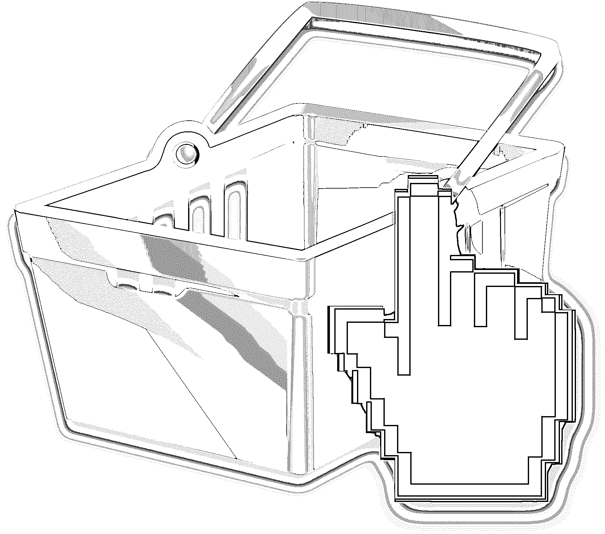
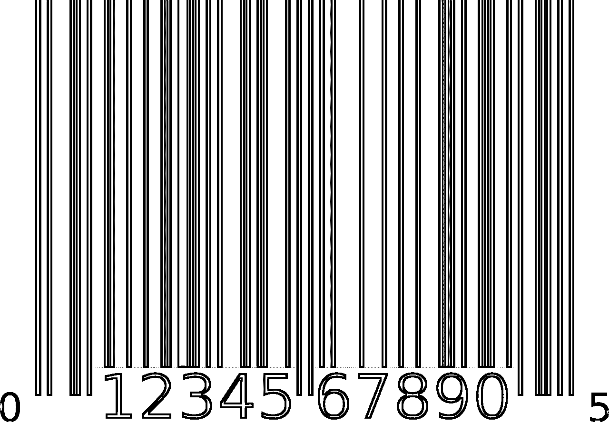

# 信息技术的好处

> 原文：<https://www.educba.com/information-technology-benefits/>

## 信息技术优势介绍

以下文章概述了信息技术的好处。现在的消费者是一键消费。他们已经适应了一种新的生活方式，在这种生活方式中，一切都可以借助信息技术在网上完成。技术每天都在发展，带来了这种愿望的最佳组合，企业和消费者可以在网上见面，并建立关系。

每个部门都接受了信息技术基础的重要性。信息技术基础使生产、推广和转换比以往任何时候都更容易。零售市场特别提到了信息技术基础部分，因为有了信息技术基础，如今购买是没有麻烦的。许多零售企业正转向不断增加的在线业务，而不是开设展厅或经销店。

<small>网页开发、编程语言、软件测试&其他</small>

### 可用于零售业的信息技术优势

以下是可用于零售业的不同信息技术优势:

#### 1.网站(全球资讯网的主机站)

网站是最古老也是最好的信息技术工具之一。每个企业都必须有一个在线存在。全球化是当今市场的需要。你可以在世界的任何角落找到你的观众。不可能每个企业都在每个国家设立办事处。但是，你可以通过互联网接触到全球的观众。在互联网上的存在将有助于你的业务全球化。网站是人们用来与你联系的在线联系方式。

一个网站被称为一个企业的官方地址，作为他们的在线办公室。它提供了一个全球地址，使企业和客户之间的交易变得容易。为你的观众建立一个在线商店。它会增加销售。通过向顾客提供网上购物，这些企业的销售额增加了约 30%。提供优惠券代码、折扣等。，来吸引你的观众。永远记住向你的听众传达紧迫性和稀缺性。你可以使用各种各样的紧急方法，比如提供股票信息，或者在有限的时间内提供大折扣。这将提高你的转化率。

#### 2.移动应用程序

智能手机和平板电脑是世界上最新的计算平台。这些小玩意让人们可以随时随地轻松访问互联网。大约 30%的互联网用户通过手机上网，查看电子邮件更新和其他信息。因此，企业应该有一个移动应用程序来扩大客户网络。最近的一项调查显示，不专注于移动应用的企业正在失去市场份额。

所以，不要丢了生意；继续启动移动应用程序。许多企业，如 Flipkart、亚马逊等。，提供手机应用下载优惠。动机是在他们的设备内固定一个位置。对于应用程序来说，向正确的受众传递消息以增加销售变得很容易。

#### 3.谷歌地图服务

有必要在谷歌地图上提交您的业务。它让客户很容易找到您的企业和位置。此外，提交你的业务在主要的在线业务目录，以获得更好的曝光率。

#### 4.社交媒体联系人

[使用社交媒体](https://www.educba.com/marketing/courses/digital-marketing-course/ "Social Media Marketing Training")总是为你的企业找到合适受众的有效方式。[你必须在各种社交媒体网站上创建社交媒体个人资料页面](https://www.educba.com/social-media-strategy-plan/ "How to Build Social Media Strategy")。与和你的业务相关的团体和社区保持联系。它让客户能够轻松地与您联系，并直接在他们的社交媒体订阅源上获取最新的更新和信息。Pinterest 帮助许多在线商店创造了 22%的销售收入。社交媒体的使用总是有利的一面。社交媒体不仅仅是一个与朋友交流的平台，但你可以与你的观众进行有效的交流。

#### 5.社交媒体促销

社交媒体推广是增加销售额的好方法。你可以在社交媒体网站上做广告，影响客户和新访客。最近的一项调查显示，30%的美国女性通过观看脸书上的广告来购买新产品。

 

*图片来源:www.pixabay.com*

#### 6.搜索引擎营销

[搜索引擎营销](https://www.educba.com/search-engine-marketing-strategies/ "Search Engine Marketing (SEM) & Strategies")也是产生论坛线索的有效途径。做一个关键词研究，并向搜索引擎支付与你的业务相关的关键词。就像你提供域名和主机服务一样，来自世界不同角落的数百万人搜索关键词，比如廉价域名服务、廉价主机提供商等。使用 Google Adwords 的服务，并在搜索结果的顶部显示您的服务。这是为你的企业赢得更多目标受众的最佳方式。

#### 7.(法)离开(our prendre conge)

你可以去为 PPC 运动。你可以向其他每月产生数百万流量的网站付费。所有网站都根据地理位置和 cookie 记录向客户提供有针对性的营销活动。这将有助于您挖掘潜在客户。

 

*图片来源:www.pixabay.com*

#### 8.PBN

利用博主的帮助来推广你的业务。这也是增加销售的最好方法。博客是谷歌的第二选择。付钱给他们，让他们为产品写有吸引力的高质量的评论。许多用户在购买产品之前搜索评论；积极的评论对你有好处。你会体验到销售的提升。

#### 9.附属网络

这个选项是当今每个企业用来促进销售和业务的最佳选择。允许在你的购物商店上进行在线联盟营销。博客作者和普通大众将成为会员，并开始在网络世界推广你的产品。向他们支付每条线索的费用。他们会为你的企业做各种各样的营销工作，最终，你会有所收获。假设一个 20 人的团队一个月能卖出 1000 件产品。但是，想象一下无限会员的力量和他们将销售的产品。你不能用数字来计算这个数字，也不能预测它的威力。

#### 10.数字标牌

数字标牌将有助于[线下推广](https://www.educba.com/marketing/courses/marketing-course/ "Offline Marketing")。您可以通过在拥挤或商业场所放置大屏幕来获得数字标牌服务，以吸引观众的注意力。吸引用户的永远是数字内容，而不是静态内容。数字营销会有更好的效果。你会发现商场和餐馆外面的大屏幕上播放着吸引人的视频和幻灯片。它为您的业务提供了一个现代化的外观。在大屏幕上播放你的服务。

屏幕的位置和广告时间很重要。你必须选择一个人多的地方，并且在最佳时间展示广告，这样大量的观众就会看到你的广告。永远不要忘记附上你的联系方式，包括你的电话号码和网址。始终在广告中放置一个二维码。访问者可能没有时间观看广告，但他们可以保存二维码，稍后通过智能手机查看您的服务。

#### 11.数字屏幕

在店内使用数字屏幕，而不是静态横幅。你会发现酒店里的数字屏幕提供菜单列表，这些数字屏幕提供医院的地图。你会发现银行里的数字屏幕显示等待时间和数字。它使您的业务更新，并为客户提供新的用户体验。顾客喜欢参观更新的地方。你可以使用数字屏幕和海报来提供产品的报价和折扣。数字数据的最大优势是它们是可替换的。

你可以随时随地改变内容。所以，你不需要浪费钱在印刷媒体上印刷静态横幅和其他东西。数字数据是吸引观众的好方法。你可以把互联网上的数据提供给客户。你可以提供 Twitter 更新、脸书页面帖子、最近的帖子等。来吸引你的观众。

#### 12.无现金支付

一个成功的企业知道无现金交易的价值。所以，不要因为现金少而损失任何销售。为你的观众提供多种支付方式。如果你在做线下生意，你必须接受你的观众的信用卡付款。您可以在网上购物商店使用 PayPal、Paytm 和其他在线钱包支付服务。它为客户提供了灵活性。许多网上商店向顾客提供送货上门的支付服务。这也是转化你的观众的好方法。

** 

*图片来源:www.pixabay.com*

#### 13 项在线和移动调查

调查是当今商业的需求。有必要组织调查以获得顾客的反馈。使用移动应用程序和基于网络的应用程序进行调查。你可以在酒店靠近出口房间的地方找到数字键盘，在那里你可以回答问题并对服务进行评分。顾客喜欢使用数字设备并给予反馈。你将从数字调查而不是静态调查中获得更多的转换。你将从顾客那里得到反馈，并能提供更好的服务。您可以从客户那里收集个人信息，如电子邮件地址、电话号码、喜欢、不喜欢和其他信息，并提供相关的产品细节以促进销售。

通过调查和其他技术分析零售商过去几年的数据需要转换成有意义的信息。有必要对记录进行分析，以了解与定价和质量相关的人们的需求。[他们需要优化大数据，以满足客户的需求](https://www.educba.com/customer-analytics-techniques/ "How to get The Most of Customer Analytics")。

#### 14.电子邮件营销

永远不要忘记电子邮件营销。这也是信息技术基础的一个影响。通过数据仓库和调查收集的电子邮件应该真正用于促进销售。始终关注吸引人的邮件主题和能够影响读者的内容。电子邮件营销是一种廉价的在线营销工具，每封邮件只需一美分。一项研究显示，电子邮件营销帮助在线商店每月产生 8%的平均销售额。

#### 15.二维码

二维码也是信息技术基础的有效工具。零售商应该使用二维码。二维码是包含重定向到网页的符号的微小图像。在每个在线推广中使用二维码。将其包括在横幅促销、社交媒体促销、博客发布、电子邮件营销等中。移动受众的崛起提升了二维码的重要性。许多移动用户获取二维码来在线查找产品。这是一张在线名片，可以帮助你的观众接触到你。

#### 16.短信

SMS 也是零售业必须使用的信息技术基础的有效工具。您可以要求您的客户提供他们的手机号码，并通过提供购买奖励积分来吸引他们。你可以有效地进行促销。

#### 17.录像

你必须考虑动态数据。像 Youtube，Dailymotion 这样的网站每月产生数十亿的流量。所以，去做视频推广吧。创建高质量的视频并上传到视频商店。你可以探索你的关系网。不要忘记在视频中提及您的联系方式。没有联系信息，视频对企业来说是一种巨大的浪费。

#### 18.介绍会；展示会

[创建 Word](https://www.educba.com/microsoft-word-features/ "Getting Started With Microsoft Word") 、 [PPT](https://www.educba.com/ms-powerpoint-presentation/ "8 Tips for Creating Amazing PowerPoint Presentations") ，PDf 演示文稿。[展示营销](https://www.educba.com/presentation-skills-training/ "How to Develop Effective Presentation Skills")是向客户提供详细信息的有效方式。许多网站，如 Slideshare 和 Linkedin，提供了一个演示推广平台。演示的目的是阐明产品和服务。

#### 19.Flex，小册子

设计漂亮的薄片和小册子，并在当地分发，以获得当地观众的关注。永远不要忘记当地的观众。全球和本地都导致成功的业务。

#### 20.条形码

条形码是节省时间和金钱的最简单的方法。条形码为消费者和零售商提供了可靠性。通过使用条形码，我们可以降低出错的风险。我们可能会在写作和打字时出错。一次扫描即可完成任务。它节省了我们写作和打字的时间。条形码的使用减少了培训时间和工作量。扫描后，产品价格会自动打印出来。

因此，它为员工提供了便利；他们不需要记住商店里每件商品的价格。条形码设计和印刷服务很便宜。我们可以将产品信息隐藏在单个条形码中，并可以随时访问该信息，包括价格、库存详情和产品信息。我们可以通过添加条形码来跟踪任何设备。条形码提供准确、快速的数据，促进更好的决策。

 

*图片来源:www.pixabay.com*

### 推荐文章

这是一个信息技术优势的指南。在这里，我们讨论介绍，不同的信息技术的好处，可用于零售。您可以阅读以下文章了解更多信息——

1.  [网络营销工具](https://www.educba.com/internet-marketing-tool/)
2.  [移动计算](https://www.educba.com/mobile-computing-applications-and-services/)
3.  [什么是物联网技术？](https://www.educba.com/what-is-iot-technology/)
4.  [人工智能技术](https://www.educba.com/artificial-intelligence-technology/)

