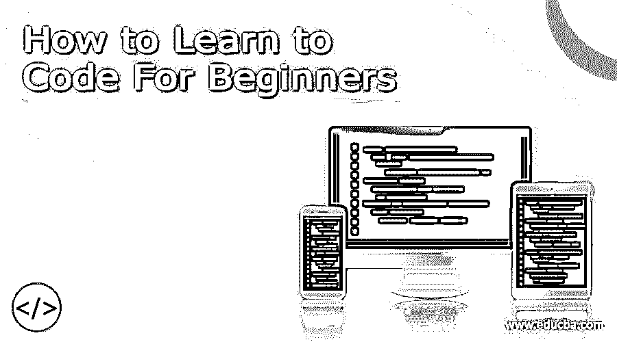

# 初学者如何学习编码

> 原文：<https://www.educba.com/how-to-learn-to-code/>

## 初学者学习编码入门

在这个时代，[学习编码](https://www.educba.com/how-to-learn-to-code/ "How To Learn To Code For Beginners")可以给你巨大的优势。我们生活在一个信息技术无处不在的时代。几乎每个工作和行业领域都已经接受或正在认真考虑纳入像[大数据](https://www.educba.com/courses/all/big-data-hadoop/ "Big Data & Hadoop")、IT、web 开发等概念。一点编码知识可以帮你走很长的路。

谢天谢地，现代编码比以前容易多了。对于非开发人员来说，学习编码可能会让人望而生畏。但是网上有很多工具，有免费的也有付费的，这使得学习编码变得更加容易。根据可用的时间，你可以在八到十周内学会编码。可能需要更长时间，甚至更短时间。一切都取决于你，但是学习编码已经不像以前那么遥不可及，不可能；这肯定是可行的。

<small>网页开发、编程语言、软件测试&其他</small>

下面是学习编码需要遵循和了解的一些步骤和关键事项。在网上探索更多关于它们的信息，你很快就能创造出自己的原型。不过，记得要不断学习和练习。不断的实践是任何开发人员变得更好的原因。

### 初学者如何学习代码？

以下是初学者学习代码的步骤:

#### 1.向自己介绍关键术语和代码术语

对许多人来说，使编码看起来令人困惑的是它的术语。熟悉编码的关键术语。构建原型的关键挑战是需要了解很多组件。这里是对其中一些组件的概述，但是请记住，要完全理解它们可能需要一些时间。在某些情况下，即使在构建了原型之后，您也可能无法完全理解它们。

让我们通过描述一个用户访问一个网站的整个过程来理解这些组件。首先，他们输入你的网址或网址。一旦他们按下 enter 键，[浏览器](https://www.educba.com/tor-browser-anonymity-and-other-browsers/ "Tor Browser, Anonymity and Other Browsers")就会通过互联网向运行网站的机器发送请求。这台机器就是服务器。

*   **服务器:**

服务器本质上是包含所有内容、数据和代码来运行你的网站的计算机。它接收来自其他客户端/用户计算机的请求。您可以购买自己的服务器，这很贵，或者您可以租用存储设备，这是大多数个人或中小型企业的做法。亚马逊网络服务，Slicehost 和其他流行的网络主机都有。服务器包含处理用户请求的软件。这个软件被称为网络服务器，我们的下一个大组件。

*   **网络服务器:**

Web 服务器是服务器上的软件，用于接收和发送来自用户的请求和响应。请求和响应通常采用超文本标记语言(HTML ),这是互联网上的通用语言。Nginx 和 Apache 是流行的 web 服务器。虽然你不需要过多地接触网络服务器，但你需要知道如何重启服务器，因为服务器问题是任何网络开发者或网站运营商面临的最常见的问题。

所以现在我们知道了服务器和 web 服务器是做什么的。用户向服务器发送请求，现在是服务器做出响应的时候了。服务器必须传递特定于客户机请求的数据，并以其 web 浏览器能够理解的格式显示这些数据。它是怎么做到的？它将请求发送给我们的下一个主要组件:web 应用程序框架。

*   **Web 应用框架:**

Web 应用程序框架可能是 web 开发人员最重要的组成部分。它们负责接收请求并生成一个 HTML 页面返回给用户。所有的工作都在这里完成。Ruby on Rails 和内置 Python Django 是流行的例子，也是最好的开始。当我们谈论初学者学习的最佳代码时，你会花费大部分时间，因为所有的编码都会发生。了解你所选择的框架的每一个细节并不重要；随着时间的推移和练习，你会找到窍门的。您需要了解足够的知识来开发数据结构和循环。对于工具，你可以在 Textmate 上完成大部分的[编程](https://www.educba.com/concepts-of-programming-languages/ "Programming Concepts for Beginners")。GitHub 是管理你的修改的好选择。

所以，web 应用程序框架做了所有的艰苦工作，但它实际上并不存储数据。所有的数据基础在哪里？数据库:我们的下一个主要组成部分。

*   **数据库:**

数据库存储您的网站和 web 应用程序的所有数据。它们就像巨大的 Excel 电子表格，有一排又一排的数据。MySQL 是最流行的数据库之一。虽然您应该学习在数据库之外运行基本查询以及如何改变结构，但是您可以使用框架本身来控制如何与数据库进行交互。

因此，您有了 web 应用程序框架来处理 HTML 页面的创建，并将它们发送回 web 服务器。但是您仍然需要开发 HTML 和 CSS 中的模板，它们构成了下一个主要组件。

*   **HTML 和 CSS:**

HTML 是网页的通用格式，级联样式表或 CSS 是用于样式化 HTML 的附加文件。这实际上是学习编码最容易的部分之一。这不是编程，但知道这一点可以给你一个巨大的优势。您可以在几周内准备好编写自己的 HTML 页面。至于工具，火狐上的 Firebug 是学习者最好的工具之一。也推荐 PSD2HTML 把 Photoshop 文件变成 HTML。

*   **JavaScript:**

JavaScript 是第六个也是最后一个组件；它是一种运行在用户浏览器上的编程语言。这意味着它是一种“客户端”编程语言，可以操作网站内容，而无需用户重新加载整个页面。它不是一个必要的组件，但大多数网站使用它来显著改善用户体验。如果您学会了使用 jQuery，这将会有所帮助，jQuery 是一个用 JavaScript 编写的库，它使得在页面上做用户界面的事情变得更加容易。只要学习足够多的 jQuery 知识，就可以实现您想要的改进。

#### 2.熟悉开发和生产环境

当你[推出一个网站](https://www.educba.com/launching-your-website/ "7 Things to Think About Before Launching your Website")时，你将拥有一个开发和生产环境。开发环境基本上是你在原型上工作的地方。普通用户将无法访问您网站的这一部分。它本质上只是你的网站的一个工作版本，代码在本地机器上运行。这在 Mac 上比在 PC 上做得更好。

生产环境是您网站的实时版本所在的位置。这是您的用户能够访问的内容。您在开发环境中工作，然后将最终产品推向生产环境。

#### 3.更多缩略语和术语

在编码时，有许多其他的缩略语和术语被经常使用。现在您已经知道了主要组件，但是，这些缩写应该更容易理解，并适合更大的图片。下面是一些最受欢迎的例子:

Perl、Java、PHP:这些是像 Ruby 和 Python 这样的编程语言

*   XML: 它是一种类似于 HTML 的格式，通常由 API 使用(见下文)
*   **API:**API 本质上是一种网站之间相互交互的方式。例如，如果您想要显示另一个网站的某些内容或元素，您可以使用该网站的 API。因此，您的网站向另一个网站发送对该内容或元素的请求，该网站向您发回一个包含所请求内容的 XML 文件。然后你的网站读取 XML 文件并上传。
*   JSON: 是 JavaScript 对象通知的缩写，JSON 只是另一种比 XML 更容易存放数据的格式。大多数 API 实际上都有一个选项，如果您愿意，可以将 JSON 数据和 XML 格式的数据一起提供给您。
*   **AJAX:** 异步 JavaScript 和 XML 的简称，这是一种无需重新加载整个页面的网站-服务器交互方法。这与你无需重新加载页面就能在脸书或 Twitter 上获得状态更新非常相似。让我们看看脸书。当你点击“喜欢”按钮时，页面上的 JavaScript 会发送一个服务器请求，通知它你的操作，而不需要重新加载页面本身。

#### 4.学习 Python

现在，您已经知道了术语、缩写和主要组件，是时候卷起袖子学习一些编码了。首先介绍 Python 和您选择使用的任何 web 应用程序框架。如果你选择 Python，这里有一些不错的选择:

*   **艰难地学习 Python:**这种格式听起来很难，但实际上可以让你轻松理解基本概念。大多数课程需要 10 分钟或更少。但是一旦你接触到更高级的概念，这可能并不适合你。
*   **Google Python 类:**你会发现这里有很多可用的视频和笔记，以及相关的练习。不参考答案，自己解决这些练习，直到你做对为止。与练习斗争的整个经历可以成为一个巨大的学习工具。

网上还有很多其他资源。建议加入其中的几个，在你选择一个之前，从可用的选项中做前几课。一旦你完成了一个资源，你可以通过其他资源来找到你不完全熟悉的概念，并得到更多的实践。

#### 5.学习姜戈

有一个非常有用的 Django 教程，可以帮助您了解关于该工具的几乎所有知识。完成教程以形成您的代码，然后全部删除并再次完成。记住熟能生巧。当你第一次跟随教程时，你可能只是跟随一步一步的指示，而没有真正理解每一步。随着你做得越来越多，你会习惯这些概念，并更好地关注各部分如何协同工作。

#### 6.了解关于 Python 和一般编程的更多信息

在这个阶段，您已经有了基础，是时候学习更多关于 Python 和一般编程的知识了。再次有很多选择。以下是其中的一些:

Udacity 的 CS 课程简介:这些课程通常有七节课，进度自定，所以不要担心截止日期。CS 入门课程通常需要两个月的时间，强烈建议你在此之后继续学习中级编程课程，或者 web 开发课程。

麻省理工学院的计算机科学导论课程，第一单元:这是一门非常好教的课程，也非常平易近人。在网上搜索更多这样的资源，并尝试找出最适合你的。你甚至可以做不止一件事来强化你的知识。

#### 7.练习，练习，练习

现在你应该拥有所有的技能和知识，至少可以建立自己的原型。但这并不容易。你可能不会马上成功。例如，从 Django 的一些练习开始。它们不像 Django 教程那样手把手，但是对于那些还没有准备好开始训练的人来说，它们仍然提供了足够的指导。

#### 8.构建原型

你有技能、知识和实践。现在是时候实际构建您的原型了。此时，您也可以在一个周末内构建它！请记住，您可能不喜欢最终的结果，但它是一个起点，在结束时，您确实会获得看到自己编码的结果的满足感。

### 结论

到最后，你会从“什么是编码？”建造一个功能性的原型。这是值得称赞的。但请记住，旅程还远未结束。事实上，这才刚刚开始。尽可能地继续构建原型，并尝试不同的原型。坚持下去，你会在几个月内成为一名出色的开发人员。

您还可以进入更复杂的组件，如 web 服务器和数据库。即使你本身没有成为一个核心程序员，你仍然会对开发过程如何工作有一个非常清晰的理解，并且你将能够给一个开发团队提供清晰和相关的输入。此外，你会对什么可以做，什么不可能做，以及完成事情需要多长时间有更好的认识。

### 推荐文章

这是初学者学习编码的指南。这里我们详细讨论了初学者学习编码的基本概念和 8 个不同的步骤。您也可以浏览我们推荐的其他文章，了解更多信息——

1.  [AJAX 面试问题](https://www.educba.com/ajax-interview-questions/)
2.  [编码 vs 编程](https://www.educba.com/coding-vs-programming/)
3.  [Python 面试问题](https://www.educba.com/python-interview-questions/)
4.  用于 Web 开发的 Python 和 Django

