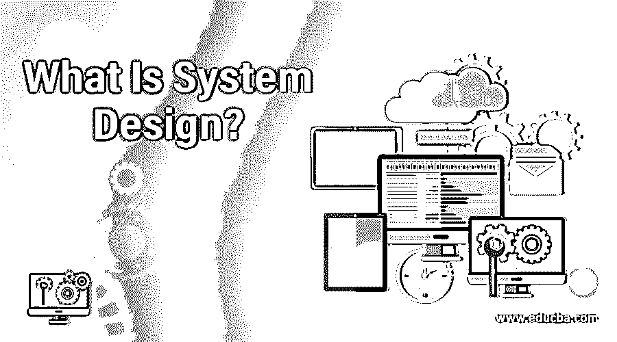

# 什么是系统设计？

> 原文：<https://www.educba.com/what-is-system-design/>

## 系统设计导论

定义系统整体需求的过程，如架构、模块、接口和设计，被称为系统设计。我们可以说系统设计的范围从讨论系统需求到产品开发。系统开发创建或改变系统，从而改变过程、实践和方法来开发系统。因此，需要一个系统的方法来管理系统需求和设计方法。它可以分为逻辑设计和物理设计。逻辑设计代表抽象数据流，而物理设计代表系统的输入和输出过程。

### 理解系统设计

这种方法出现在第二次世界大战之前，当时工程师们需要一个系统来解决复杂的问题和沟通问题。所需的平台将他们的工作标准化为一个框架，具有准确和精确的方法和信息。

<small>网页开发、编程语言、软件测试&其他</small>

基本上，这是一个术语，它以一种实际的、合乎逻辑的方式连接了主体的问题和现存系统之间的空白。一些元素如下所示

1.  业务流程的设计和重新设计。
2.  定义数据模型。
3.  定义事件及其过程。
4.  应用程序设计。
5.  设计不同的服务、流程、事件和数据如何协同工作。
6.  定义如何保护系统
7.  定义将要使用的技术，例如应用程序、组件、工具集、API 和库。

### 系统设计如何让工作变得如此简单？

它专注于通过节省时间和精力来开发伟大的艺术品。这有助于为信息系统制定计划。它用于解决内部问题、提高效率和传播机会。它也是任何企业的基础。它有助于成功实现所需的结果，并使工作变得更加容易和简单。

### 顶级系统设计公司

一些使用这种技术的顶级公司

*   设计更好公司设计系统手册
*   布拉德·弗罗斯特和原子设计
*   Airbnb 设计语言系统系列
*   Shopify Polaris
*   Salesforce 闪电

### 系统设计的各种子集

这其中的不同子集是

#### 1.逻辑设计

它是系统的数据流、输入和输出的抽象表示。它解释了满足用户需求的流程中的源、目的地、数据存储和数据流。在准备系统的逻辑设计时，要考虑到细节的层次，这些细节实际上反映了系统内外的信息流。分别使用了数据流图和 E-R 图。

#### 2.结构设计

系统的实际输入和输出过程与物理设计有关。物理设计的主要标准是管理如何验证、处理和显示数据。它基本上围绕着用户的界面设计、流程设计和数据设计。

#### 3.建筑设计

也称为强调系统架构设计的高层次设计。它解释了系统的本质和根源。

#### 4.详细设计

它遵循建筑设计，强调每个学科的发展。

### 系统设计能做什么？

*   它已经被许多公司和行业证明是奇迹。这可以减少系统停机时间，降低成本并加快维护工作。
*   它有助于培训新用户轻松理解系统流程。
*   它帮助用户解决诸如故障排除等问题，并帮助管理者更好地执行组织系统的最终决策。

### 使用系统设计

使用它很容易，而且它加快了创建应用程序的过程。系统设计有四种主要类型的文档-

**1。程序文档:**它解释了所有程序课程的输入、输出和处理逻辑。

**2。系统文档:**描述系统功能及其实现方式。

**3。操作文档:**它解释了程序、系统分析师、程序员和系统标识。

**4。用户文档:**它包括将与系统通信的用户的步骤和信息。

### 系统设计的优势

使用它的一些主要优点是-

*   它降低了设计成本。
*   它消除了不一致。
*   它加速了这个过程。
*   它让顾客的生活变得更加轻松简单。
*   它提供了大量的资源。

### 所需的系统设计技能

在开始学习之前，用户应该对产品开发和数据处理有很好的了解。对于想学习系统设计的用户来说，对界面、模块和架构的简单理解将是一个附加条件。

### 为什么要用系统设计？

在设计系统时，有三个主要用途应该考虑在内，它们是

#### 1.可靠性

它意味着系统承受故障或问题以防止故障或完全停机的能力。这样做的好处和优势是使用不容错的部件构建容错系统。

#### 2.可量测性

可伸缩性是系统在重负载情况下执行并给出合理性能的能力。当系统的负载参数改变时，性能可以被认为是系统的操作特性。这些用于克服这些问题并减少用户的努力。

#### 3.可维护性

这意味着编写的代码可以被不是代码原作者的人理解和升级。好的代码应该有干净的 API 和接口，以便每次都能构建新的功能。

### 范围

[系统分析和设计](https://www.educba.com/system-analysis-and-design/)无论是用于特定项目还是跨越全球业务运营的全部范围，都会使业务受益。今天，越来越多的企业必须找到全球竞争的方法。在需要大型信息系统参与的情况下，系统分析和设计很重要。因此，范围是非常光明的和有需求的。

### 谁是学习系统设计技术的合适受众？

这是一项强大的技术，任何热衷于研究产品开发和数据管理的人都可以学习。从初学者到有经验的人都可以学习这项技术。

### 这项技术将如何帮助你的职业发展？

通过学习这些，用户不仅学习了为公司和企业设计界面和模块的工具和技术。而且，他获得了有助于他提升职业生涯和未来机会的技能。这项技术通过分析公司的优势和劣势，帮助企业识别机会和问题。

### 结论

商业的目的是赚钱和获利。这样做的好处是提高业务质量，增加利润。一个功能系统的好处包括最大程度的质量控制和通过处理产品和数据降低生产成本。在任何行业和公司都是必须的要求。

### 推荐文章

这是一个什么是系统设计的指南。在这里，我们讨论了系统设计的工作优势和实施这项技术的顶级公司。您也可以浏览我们推荐的其他文章，了解更多信息——

1.  [系统设计面试题](https://www.educba.com/system-design/)
2.  [软件测试方法论](https://www.educba.com/software-testing-methodologies/)
3.  什么是自动化测试？
4.  [硒负荷测试](https://www.educba.com/selenium-load-testing/)

