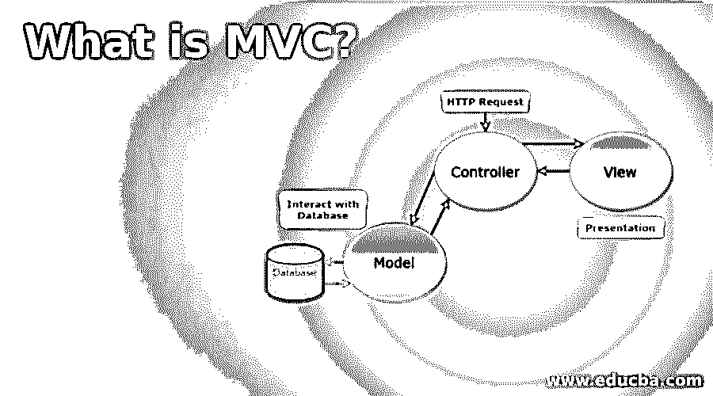
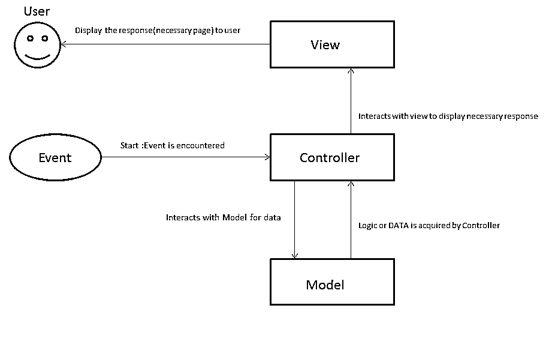

# 什么是 MVC？

> 原文：<https://www.educba.com/what-is-mvc/>

## MVC 简介

MVC 只不过是组件的组合，即模型、视图和控制器。顾名思义，模型由必要的应用数据组成，视图是用来显示和控制活动的组件，控制器是 MVC 模型和视图组件之间的连接组件。对于具有多个数据卷视图的系统来说，这是一个众所周知的选项，可以对其进行高速转换。

### 理解 MVC

MVC 由三个组件组成:

<small>网页开发、编程语言、软件测试&其他</small>

*   模型
*   视角
*   控制器

**1。模型:**简单来说，模型包含了关于应用的数据。所有必须显示的信息、其访问要求和其他验证都在这里指定。

**2。View:** View 显示模型组件中的数据。来自用户的任何响应也被识别并发送到控制器组件。

**3。控制器:**控制器负责向视图组件提供模型中的数据，并解释视图组件识别的用户响应。

### MVC 是如何让工作变得如此简单的？

像 MVC 这样的架构使工作变得更容易，因为

*   它有助于简化和加快开发过程。
*   因为它有一个明确的结构，这个体系结构可以用于一个完善的计划，由团队中的每个成员处理体系结构的一个组件来完成开发过程，从而使过程不那么复杂。
*   曾经非常复杂的过程，现在 MVC 让程序员更容易为同一数据(模型)提供多个视图。
*   与其他架构不同，修改可以更容易地完成。
*   假设业务逻辑中有任何变化，那么只有模型组件可以改变，而组件可以保持不变。
*   假设用户界面有任何变化。在这种情况下，我们可以只更改视图组件中的代码，从而清楚地表明业务逻辑不受影响，因为在这个场景中，模型组件中没有进行任何更改。
*   由于它带来的简单性，许多编程语言框架都遵循这种架构，并提供了对 web 应用程序需要如何开发的良好理解。

### 你能用 MVC 做什么？

*   使用 MVC，我们可以通过简单的设置让 Web 开发过程变得有趣。
*   软件开发生命周期的每一步都变得更加容易，不再那么乏味。
*   在开发过程中，这种体系结构有助于每个组件都由一个人来负责，从而减少时间消耗。
*   开发代码变得不那么复杂，因为当使用 MVC 时，我们可以很容易地理解代码功能的流程。

### 使用 MVC

*   控制器可能是架构中最重要的组件，因为它负责模型和视图之间的交互。
*   模型和视图是相互独立的，控制器因此成为中介，其中从模型到视图的任何交互都将由控制器完成，反之亦然。
*   模型组件的重要性不可低估，因为它是应用程序所代表的业务逻辑的来源。
*   视图负责显示在屏幕上的数据，并且如果遇到任何用户输入或响应，则视图负责使响应引起控制器的注意，然后控制器通过交互从视图到模型的相同通信来决定所需的确切响应，并因此向视图提供信息以显示伴随有来自模型的必要数据的响应的相关屏幕。

*   以 ATM 机为例，这对于理解体系结构很有用。
*   通常的程序如下。
*   顾客插入卡，输入他的密码和必要的金额，然后他就能得到他想要的钱。
*   现在，我们可以理解的是，客户只与应用程序的视图进行交互。
*   一旦卡被输入，事件被识别，提示控制器开始程序。
*   控制器立即将事件与包含业务逻辑和数据的模型组件进行交互。
*   模型传递必要的数据以保持动作流，控制器迅速与视图交互以向客户显示必要的数据。
*   客户选择所需的动作，客户的响应从视图传送到控制器。控制器将情况与模型交互，模型提供与当前响应相关的数据。控制器再次返回视图，以便视图可以向客户显示响应。
*   就像这样，客户通过输入告诉视图他/她需要多少钱。视图告诉控制器客户需要的数量，控制器转到模型。
*   我们称之为业务逻辑的模型提示控制器询问密码，控制器告诉视图从客户那里获取密码。当客户输入密码时，模型组件处理验证和其他访问要求。如果来自顾客的所有反应都与数据的必要性和准确性相匹配，那么模型告诉控制器允许机器提供控制器容易做到的指定量，从而结束任务。

### 优势

它具有以下优点:

*   它具有提供多种视图的架构。
*   它有助于开发加载速度极快的应用程序。
*   用户界面的修改不会影响业务逻辑。
*   它有助于开发具有明确结构的大型应用程序。

### 所需技能

*   完全理解架构模式。
*   了解如何使用框架。
*   面向对象编程语言的基础知识。
*   能够分离逻辑和显示内容，确保模型和视图相互独立。

### 为什么要用 MVC？

我们应该使用 MVC，因为:

*   不需要再次键入代码。因此，它支持可重用性。
*   它有助于在测试阶段有效地测试应用程序。
*   如果有任何修改，那么没有必要编辑应用程序的整个代码。
*   它有助于更好地维护应用程序。
*   它减少了模糊性和不确定性。
*   我们可以用 MVC 做的最重要的事情是从视图中抽象出逻辑。

### 范围

*   MVC 总会有未来。
*   编程语言或框架可能会改变，但架构仍然会被使用。
*   你可以停止使用. net MVC，但是仍然可以使用 Python 和使用 MVC 原则的 Django 框架。

### 我们为什么需要 MVC？

*   这可能很复杂，但它有助于提供明确和清晰的代码。
*   我们需要 MVC 来以更快的速度同时开发一个或多个应用程序。
*   它帮助组织更好地维护和支持应用程序。

### 谁是学习 MVC 技术的合适受众？

任何人都渴望成为具有良好控制能力的开发人员，并编写复杂而干净的代码。

### 这项技术将如何帮助你的职业发展？

*   基于需求，你使用的编程语言和框架对你的职业发展有更大的依赖性，但是 MVC 架构将永远是你职业发展的可行选择。因此 MVC 对你的职业生涯是必要和有用的。
*   比如，人们已经开始从点网 MVC 转向点网核心，但是对 Django 有需求，Django 使用 MVC。

### 结论

模型-视图-控制器架构是由 Trygve Reenskaug 在 20 世纪 70 年代提出的。流行程度在 1996 年达到顶峰，从那时起，它就被用于开发用户界面和应用程序。它也可以与 [JavaScript 和 Jquery](https://www.educba.com/javascript-vs-jquery/) 集成。重要的是要知道，任何从事 MVC 工作的人都必须跟上当前的技术趋势，因为该架构肯定会嵌入到未来的语言中，这些语言将会在行业中蓬勃发展。

### 推荐文章

这是什么是 MVC 的指南？在这里，我们讨论了 MVC 的工作原理、范围、优点，以及它如何以及在哪里帮助职业发展。您也可以浏览我们推荐的其他文章，了解更多信息——

1.  [什么是大数据技术？](https://www.educba.com/what-is-big-data-technology/)
2.  [MVC 视图数据](https://www.educba.com/mvc-viewdata/)
3.  [MVC 面试问题](https://www.educba.com/mvc-interview-questions/)
4.  [什么是 HTML](https://www.educba.com/what-is-html/)

